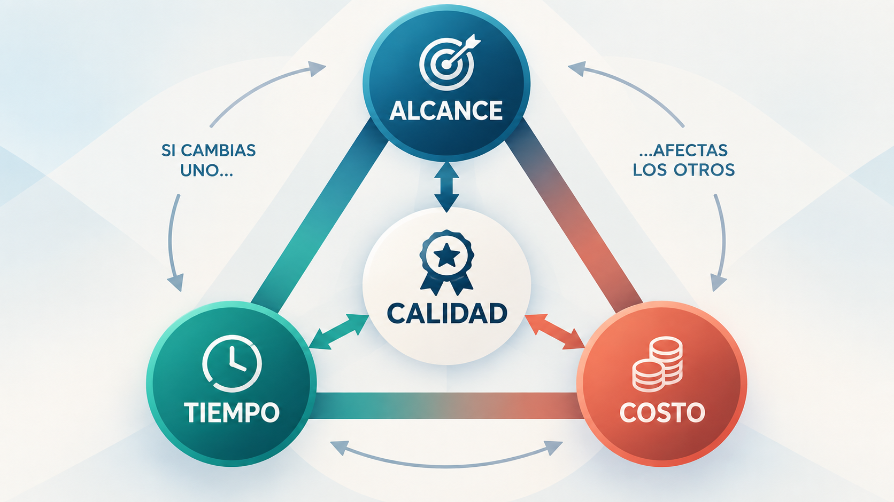
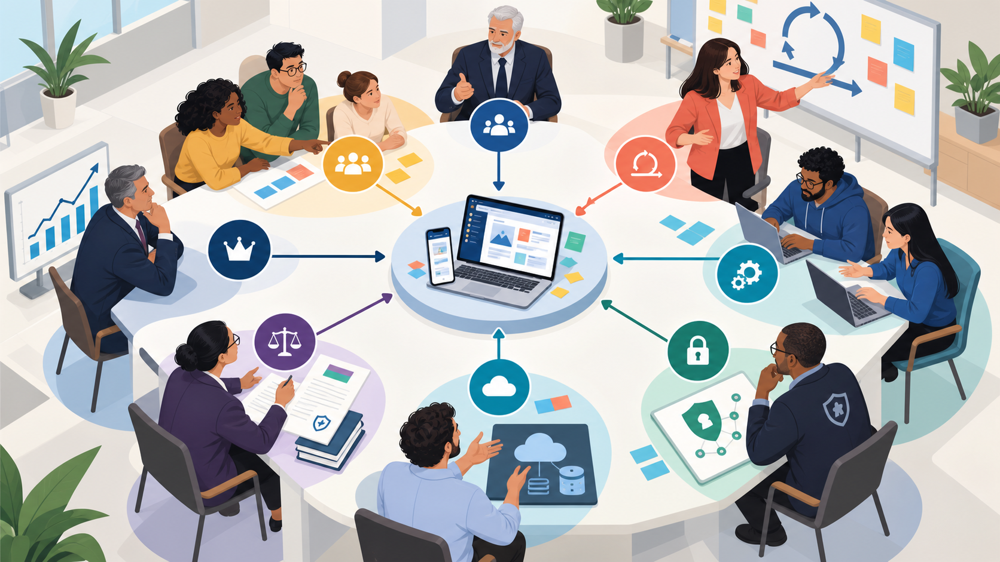
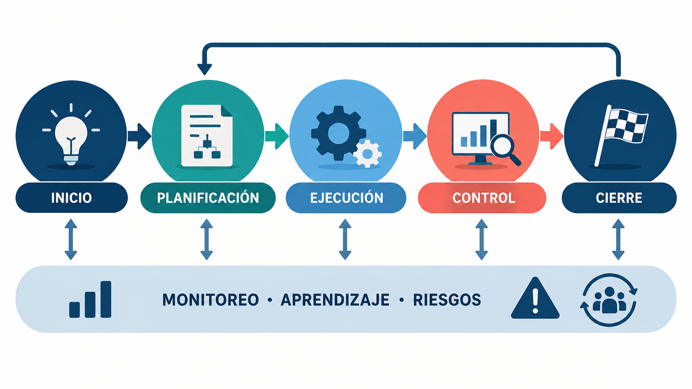
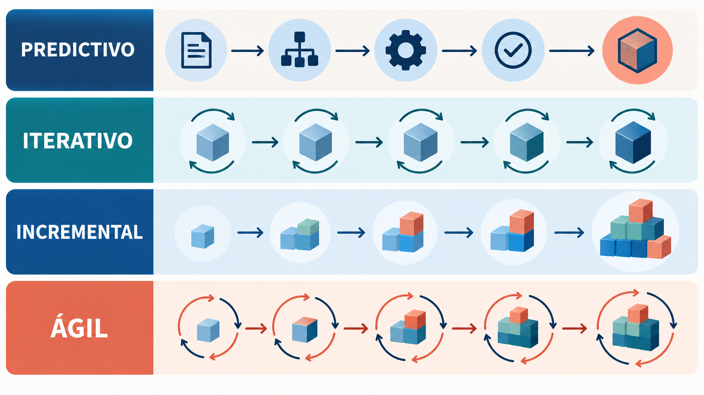

Pensá en la última vez que organizaste algo importante: un viaje con amigos, una mudanza, un cumpleaños sorpresa. Había un objetivo, una fecha, un presupuesto y varias personas con opiniones distintas. Seguramente algo no salió como estaba previsto y tuviste que cambiar el plan sobre la marcha. Sin saberlo, estabas gestionando un proyecto.

En este módulo vamos a ponerles nombre a esas situaciones. Vas a entender qué es un proyecto, qué es exactamente lo que se gestiona (el alcance, el tiempo, el costo, la calidad, los riesgos y las personas) y por qué, cuando hay mucha incertidumbre, conviene avanzar de a pasos cortos y comprobar. Esa idea es el corazón de la **agilidad**.

:::clave El caso que nos acompaña en toda la materia: el asistente universitario
Una universidad quiere un **asistente con inteligencia artificial** que responda consultas de estudiantes sobre inscripciones, horarios y trámites, desde la web de la universidad. Parece sencillo: cargar información y abrir un chat. Pero cuando se prueba aparecen preguntas ambiguas, documentos desactualizados y respuestas que suenan muy convincentes aunque sean incorrectas.

¿Cómo se organiza un trabajo así para entregar algo útil? Vamos a volver a este caso en cada tema. No necesitás saber de modelos de IA para seguirlo: sirve para aprender a gestionar.
:::

:::clave Al terminar este módulo vas a poder
- Reconocer un proyecto y distinguirlo de un producto y de una operación.
- Definir el alcance de un proyecto: qué entra, qué queda afuera y cómo se acepta.
- Explicar la relación entre alcance, tiempo, costo y calidad, y reconocer riesgos.
- Diferenciar trabajo predictivo, iterativo e incremental con ejemplos.
- Explicar qué es la agilidad, de dónde viene, su Manifiesto y sus principios.
- Elegir un enfoque de trabajo según la incertidumbre del proyecto.
:::

## 1. ¿Qué es un proyecto?

Organizar el cumpleaños de un familiar y cocinar la cena todas las noches tienen algo en común: las dos cosas requieren planificar, comprar y coordinar. Sin embargo, son trabajos muy distintos. El cumpleaños ocurre una vez, tiene una fecha y termina. La cena se repite todos los días y no termina nunca.

:::clave Proyecto
Un **proyecto** es un esfuerzo **temporal** que se realiza para crear un **resultado único**. Tiene un inicio, un final y un objetivo concreto.
:::

Las dos palabras clave de la definición son:

- **Temporal:** tiene un principio y un fin. Temporal no quiere decir corto: un proyecto puede durar dos semanas o cinco años.
- **Único:** el resultado responde a una necesidad particular. Otras personas ya organizaron cumpleaños, pero nadie organizó *este* cumpleaños, con estos invitados, este presupuesto y esta fecha.

:::ejemplo ¿Es un proyecto o no?
- Organizar el casamiento de tu hermana: **sí**. Tiene fecha, objetivo y termina.
- Preparar el desayuno cada mañana: **no**. Es una tarea repetitiva.
- Desarrollar la app de la facultad: **sí**. Tiene un objetivo y un momento en que se entrega.
- Responder las consultas de los alumnos todos los días: **no**. Es trabajo continuo.
- Mudar una empresa a una oficina nueva: **sí**. Una vez instalados, el proyecto terminó.
:::

### 1.1 Qué significa gestionar un proyecto

**Gestionar un proyecto** es coordinar personas, tiempo, dinero y decisiones para alcanzar el objetivo. Incluye planificar, prever problemas, comunicar avances y revisar resultados.

Gestionar no es solo repartir tareas. Un equipo puede completar muchísimas tareas y aun así entregar algo que no sirve. En el asistente universitario, "cargar veinte documentos" es una tarea terminada. "Responder correctamente las consultas de inscripción con información vigente" es el resultado que realmente buscamos. La gestión mira las dos cosas, pero nunca pierde de vista la segunda.

### 1.2 Proyecto, producto y operación

Estos tres conceptos suelen mezclarse y conviene separarlos desde el principio, porque cada uno se gestiona y se mide de forma distinta.

Tomemos una app bancaria. Desarrollar su primera versión y lanzarla es un **proyecto**: tiene fecha de lanzamiento y termina. La app, que durante años recibe nuevas funciones según lo que piden los clientes, es el **producto**. La mesa de ayuda que atiende incidentes y el equipo que mantiene los servidores funcionando las 24 horas son la **operación**: su trabajo se repite todos los días y se mide en que nada falle.

| Dimensión | Proyecto | Producto | Operación |
|---|---|---|---|
| Duración | Temporal, con inicio y fin | Años, mientras sea útil | Continua |
| Objetivo | Crear un resultado único | Generar valor a lo largo del tiempo | Que todo funcione cada día |
| Cómo se mide el éxito | Entregar lo acordado, en tiempo, costo y calidad | Uso, satisfacción, ingresos | Disponibilidad, rapidez, pocos errores |
| Ejemplo | Desarrollar la app de pagos | La app evolucionando con nuevas funciones | Soporte que resuelve incidentes |
Tabla: Proyecto, producto y operación

, hacerla evolucionar (producto) y mantenerla funcionando (operación).")

En el software moderno esta distinción tiene una consecuencia importante: el software casi nunca "termina". Se lanza una versión, los usuarios opinan, se ajusta y el ciclo sigue. Por eso muchas organizaciones trabajan con **equipos de producto** estables en lugar de armar un equipo nuevo para cada proyecto. Esa forma de pensar es la que vamos a encontrar en los marcos ágiles.

:::ensimple
El proyecto **crea** algo, el producto **evoluciona** y la operación **lo mantiene funcionando**. Terminar el proyecto no garantiza que el producto sea útil.
:::

## 2. El alcance: qué entra y qué no

Un comerciante te pide "una página web para el negocio". Vos imaginás cinco páginas con fotos y un formulario de contacto. Él imagina una tienda online con carrito, pagos con tarjeta, envíos y un blog. Ninguno de los dos está equivocado: simplemente nunca definieron el **alcance**. Dentro de tres meses, esa diferencia se va a convertir en una discusión, en trabajo rehecho y en un cliente insatisfecho.

Definir el alcance es probablemente la tarea más importante al comenzar un proyecto. Casi todos los problemas graves de un proyecto tienen algo que ver con un alcance mal entendido.

:::clave Alcance
El **alcance** es el conjunto de resultados, características y trabajo que el proyecto se compromete a entregar. Define **qué está adentro** y, con la misma importancia, **qué queda afuera**.
:::

### 2.1 Alcance del producto y alcance del proyecto

El alcance tiene dos caras que conviene distinguir:

- **Alcance del producto:** qué características tendrá el resultado. Qué va a poder hacer, cómo va a funcionar.
- **Alcance del proyecto:** qué trabajo hay que hacer para lograr ese resultado.

Volvamos a la página web del comerciante. El **alcance del producto** sería, por ejemplo: catálogo con fotos, formulario de contacto y carrito de compras con pago con tarjeta. El **alcance del proyecto** es todo el trabajo para lograrlo: diseñar las pantallas, programar, cargar los productos, configurar los pagos, probar y enseñarle al dueño a actualizar el catálogo.

### 2.2 Qué incluye el proyecto y qué no

Escribir lo que queda **fuera del alcance** parece innecesario, pero evita la mayoría de los malentendidos. Si algo no se aclara, cada persona completa el vacío con sus propias expectativas. Así podría quedar acordada la página web del comerciante:

| Incluido en el proyecto | No incluido (por ahora) |
|---|---|
| Catálogo con fotos y precios de hasta 100 productos | Carga de productos nuevos después del lanzamiento (la hace el dueño) |
| Carrito de compras y pago con tarjeta | Pago en cuotas y otros medios de pago |
| Formulario de contacto | Chat en vivo con clientes |
| Diseño adaptado a celulares | Aplicación móvil propia |
| Una capacitación para actualizar el catálogo | Redacción de textos y fotografía de productos |
Tabla: Alcance acordado para la página web del comerciante

Fijate en el "por ahora". Que algo quede afuera no significa que nunca se vaya a hacer. Significa que no forma parte de este compromiso y que, si se quiere sumar, habrá que decidirlo con sus consecuencias en tiempo y costo.

Lo mismo vale para el **asistente universitario** que presentamos al comienzo del módulo. Su primer piloto incluye responder consultas de inscripción y horarios con documentos oficiales, y derivar a una persona cuando no sabe la respuesta. Queda afuera, por ahora, inscribir automáticamente a los estudiantes. Ese pedido va a aparecer más adelante, en la sección 13.

### 2.3 Entregables y criterios de aceptación

Un **entregable** es un resultado concreto y verificable que el proyecto produce: un documento, una pantalla, un sistema funcionando, un informe. Para cada entregable necesitamos acordar sus **criterios de aceptación**: las condiciones que tiene que cumplir para considerarlo terminado y correcto.

:::ejemplo Imaginate que encargás una torta
"Una torta" no alcanza. "Una torta de chocolate para 30 personas, sin TACC, con la inscripción *Feliz cumple Sofi*, lista el sábado a las 18" sí. Con esa descripción, tanto vos como el pastelero saben exactamente cuándo el trabajo está bien hecho. Si falta un detalle, lo van a descubrir el sábado a las 18, cuando ya es tarde.
:::

En el asistente, un criterio de aceptación podría ser: "responde correctamente las consultas del conjunto de prueba acordado con la oficina de alumnos, indica de qué documento oficial sale cada respuesta y deriva a una persona cuando no encuentra la información". Un criterio así se puede comprobar. "Que responda bien" no.

### 2.4 Cómo descubrir el alcance

El alcance casi nunca llega escrito y completo. Hay que descubrirlo conversando, observando y preguntando. Algunas técnicas simples ayudan mucho:

- **Conversar con quienes van a usar el resultado**, no solo con quien lo encarga.
- **Observar cómo se trabaja hoy.** Ver una mañana de atención en la oficina de alumnos enseña más que diez reuniones.
- **Pedir ejemplos concretos:** "mostrame una web que te guste", "contame la última consulta difícil que recibiste".
- **Mostrar bocetos o prototipos** antes de construir. Frente a algo visible, la gente descubre lo que realmente quiere.

:::preguntas Preguntas para definir el alcance
- ¿Qué problema resolvemos y para quién?
- ¿Qué tiene que poder hacer el usuario cuando terminemos?
- ¿Qué queda explícitamente afuera?
- ¿Cuáles son los entregables concretos?
- ¿Cómo vamos a saber que cada entregable está terminado y bien hecho?
- ¿Qué estamos suponiendo sin haberlo comprobado?
- ¿Qué restricciones existen: fecha, presupuesto, normas, tecnología?
- ¿Quién aprueba el resultado y quién puede autorizar cambios?
:::

### 2.5 Dividir el trabajo en partes

Un objetivo grande asusta y es difícil de estimar. La solución clásica es dividirlo en partes cada vez más chicas, hasta llegar a piezas que alguien pueda realizar y controlar. Esa división se llama **estructura de desglose del trabajo** (EDT, o WBS por su sigla en inglés).

:::ejemplo El cumpleaños, desglosado
- **Lugar:** reservar el salón, decorar, armar y desarmar.
- **Comida:** definir el menú, encargar la torta, comprar bebidas.
- **Invitados:** armar la lista, mandar invitaciones, confirmar asistencia.
- **Música:** elegir la lista de canciones, conseguir el parlante.

Ahora cada parte se puede asignar a alguien, estimar cuánto cuesta y controlar si está hecha.
:::

Para el asistente, un primer desglose podría ser: **documentos** (reunir, revisar, actualizar), **asistente** (construir, conectar con los documentos, diseñar las respuestas), **evaluación** (armar consultas de prueba, probar con estudiantes, corregir) y **puesta en marcha** (publicarlo en la web, capacitar al personal, definir quién lo mantiene).

En los enfoques ágiles este desglose toma la forma de una lista ordenada de necesidades que se va refinando con el tiempo. La vas a conocer en detalle en el Módulo 3, con el nombre de *Product Backlog*.

### 2.6 Cuando el alcance se descontrola

Cuando se agrega trabajo sin revisar su impacto en tiempo, costo y calidad, aparece la **expansión descontrolada del alcance**, o *scope creep*. Cada pedido parece pequeño ("ya que estás, agregá esto"), pero sumados pueden hundir un proyecto.

:::real Caso real: el Virtual Case File del FBI (2000 a 2005)
En 2000 el FBI lanzó un programa para modernizar su sistema de expedientes, muy antiguo y difícil de usar, y tras los atentados de septiembre de 2001 la urgencia creció. El proyecto empezó con un objetivo acotado: agregar una interfaz web a los sistemas existentes. Hacia fines de 2001 el alcance cambió a construir un sistema completamente nuevo.

Los requisitos llegaron a un documento de más de **800 páginas**, que en lugar de describir qué necesitaban los agentes especificaba detalles como la ubicación y el color de los botones. Entre diciembre de 2002 y diciembre de 2003 se registraron cerca de **400 pedidos de cambio**. En abril de 2005, con unos **170 millones de dólares gastados**, el FBI abandonó el proyecto: el software entregado era prácticamente inutilizable. La auditoría oficial señaló requisitos mal definidos que evolucionaban sin control.

La historia tiene una segunda parte: el FBI volvió a intentarlo con el proyecto **Sentinel**, que terminó adoptando una forma de trabajo ágil. Lo vas a estudiar en el Módulo 5.

Fuente: [IEEE Spectrum, "Who Killed the Virtual Case File?"](https://spectrum.ieee.org/who-killed-the-virtual-case-file)
:::

Existe también el problema inverso, menos conocido: el **gold plating** (literalmente, "bañar en oro"). Ocurre cuando el propio equipo agrega extras que nadie pidió porque "quedan lindos" o "ya que estamos". Consumen tiempo, agregan errores posibles y no aportan valor para quien usa el resultado.

:::mito
**Mito:** un alcance bien definido no debería cambiar nunca.

**Realidad:** el alcance cambia en casi todos los proyectos, porque se aprende mientras se trabaja. El problema no es el cambio: es el cambio que entra sin que nadie decida conscientemente qué se ajusta para hacerle lugar. Lo vamos a ver en la sección 13.
:::

## 3. Alcance, tiempo y costo: el triángulo del proyecto

Ya sabemos qué es el alcance. Pero el alcance nunca está solo: todo proyecto tiene además una fecha y un presupuesto. Estas tres variables forman una de las ideas más conocidas de la gestión de proyectos, la **triple restricción** o **triángulo de hierro**:

- **Alcance:** qué se entrega.
- **Tiempo:** cuándo se entrega.
- **Costo:** con qué recursos (personas, dinero, herramientas).

Las tres están atadas entre sí. Si una cambia, al menos una de las otras tiene que ajustarse. En el centro del triángulo queda la **calidad**: no es una cuarta punta, sino el resultado de mantener las tres en equilibrio. Cuando se fuerza el triángulo (más alcance, sin más tiempo ni más recursos), lo que se rompe es la calidad.

:::real Caso real: la Ópera de Sídney (1959 a 1973)
En 1957 el arquitecto danés Jørn Utzon ganó el concurso para diseñar la Ópera de Sídney. El gobierno estimó que costaría **7 millones de dólares australianos** y que se construiría en **cuatro años**. Pero la obra empezó antes de que el diseño estuviera resuelto: nadie sabía todavía cómo construir las famosas velas del techo, y ese problema de ingeniería llevó años. A eso se sumaron cambios en lo que el edificio debía incluir.

La Ópera se inauguró en 1973: tardó **14 años** y costó **102 millones**, más de catorce veces lo previsto. Hoy es Patrimonio de la Humanidad, pero como proyecto es el ejemplo clásico del triángulo: un alcance incierto arrastró el tiempo y el costo.

Fuente: [Sydney Opera House, datos del edificio](https://www.sydneyoperahouse.com/building/interesting-facts-about-sydney-opera-house)
:::

En software, forzar el triángulo se ve así: para llegar a la fecha con más funciones, se recortan pruebas y se programa a las apuradas. Los errores aparecen después, en manos de los usuarios. Esa deuda se paga más adelante y con intereses (la vas a encontrar en el Módulo 5 con el nombre de **deuda técnica**).

Con el tiempo, la gestión de proyectos amplió esta idea y hoy suele hablar de más restricciones, como los riesgos y los recursos disponibles. El triángulo sigue siendo la forma más clara de empezar a pensarlas.

### 3.1 Sumar gente no siempre acelera

Frente a un proyecto atrasado, la reacción instintiva es sumar personas. Frederick Brooks dirigió en IBM el desarrollo del OS/360, uno de los sistemas operativos más grandes de los años sesenta, y aprendió de esa experiencia una lección que publicó en 1975 en *The Mythical Man-Month*: **sumar gente a un proyecto de software atrasado lo atrasa todavía más**. Las personas nuevas necesitan aprender, alguien tiene que enseñarles y la coordinación se complica. Su comparación se hizo famosa: nueve mujeres no pueden tener un bebé en un mes. Hay trabajos que no se aceleran repartiéndolos.

### 3.2 Qué se fija y qué se ajusta

Los enfoques tradicionales y los ágiles usan el mismo triángulo, pero lo leen al revés:

| | Enfoque predictivo (tradicional) | Enfoque ágil |
|---|---|---|
| Qué se fija primero | El **alcance**: se define en detalle al principio | El **tiempo** y el **equipo**: ciclos cortos con un equipo estable |
| Qué se estima o ajusta | Tiempo y costo necesarios para ese alcance | El alcance: qué entra en cada ciclo según su valor |
| Ante un cambio | Se analiza y se aprueba formalmente una modificación del plan | Se reordenan prioridades: si algo entra, otra cosa espera |
| Calidad | No negociable | No negociable |
Tabla: El mismo triángulo, dos lecturas

La diferencia es profunda. En el enfoque ágil la pregunta no es "¿cuánto tardamos en hacer todo?" sino "con este equipo y este tiempo, ¿qué es lo más valioso que podemos entregar?".

:::mito
**Mito:** si el equipo trabaja más horas, puede absorber cualquier pedido nuevo.

**Realidad:** las horas extra sostenidas producen cansancio y errores, no más resultados. Un pedido nuevo exige elegir: ajustar el alcance, mover la fecha, sumar recursos o aceptar un riesgo en forma explícita.
:::

## 4. Riesgo e incertidumbre

Imaginate que viajás en auto de Córdoba a Bariloche. Conocés la ruta y calculaste los tiempos: eso es lo que **sabés**. Sabés también que puede nevar en la cordillera y que quizás corten un paso: es un **riesgo conocido**, y por eso llevás cadenas. Y puede pasar algo que no imaginaste, como que se rompa una pieza que nunca falla. Eso es la **incertidumbre** pura.

Todo proyecto tiene estas tres zonas. Gestionar bien es ampliar la primera, prepararse para la segunda y organizarse para reaccionar rápido ante la tercera.

### 4.1 Riesgos

:::clave Riesgo
Un **riesgo** es un evento incierto que, si ocurre, afecta los objetivos del proyecto. Se evalúa según dos preguntas: qué tan **probable** es y qué tan grave sería su **impacto**.
:::

Frente a un riesgo hay cuatro respuestas clásicas:

- **Evitarlo:** cambiar el plan para que no pueda ocurrir. No viajar por la cordillera en invierno.
- **Reducirlo:** bajar su probabilidad o su impacto. Llevar cadenas, salir temprano.
- **Transferirlo:** que otro asuma las consecuencias. Contratar un seguro con auxilio.
- **Aceptarlo:** asumirlo conscientemente y tener un plan por si ocurre.

En el asistente universitario, un riesgo evidente es que responda con una fecha vieja porque un documento está desactualizado. Probabilidad: alta, porque los calendarios cambian cada cuatrimestre. Impacto: alto, porque un estudiante podría perder una inscripción. Respuesta: reducirlo, con una revisión de documentos antes de cada cuatrimestre y respuestas que siempre citen su fuente.

:::preguntas Preguntas para encontrar riesgos
- ¿Qué podría salir mal?
- ¿Qué estamos dando por cierto sin haberlo comprobado?
- ¿De quién dependemos para avanzar?
- ¿Qué pasaría si la persona clave del equipo se enferma dos semanas?
- ¿Qué es lo que nunca hicimos antes en este proyecto?
:::

### 4.2 Incertidumbre: cuánto sabemos de verdad

Hay proyectos donde sabemos casi todo de antemano y otros donde no sabemos casi nada. La incertidumbre tiene dos dimensiones: **qué** hay que construir y **cómo** construirlo.

| | Sabemos **cómo** hacerlo | No sabemos bien **cómo** hacerlo |
|---|---|---|
| Sabemos **qué** queremos | Instalar el mismo sistema de turnos que el equipo ya implementó en otras tres clínicas. | Migrar un sistema que funciona a una tecnología que el equipo nunca usó. |
| No sabemos bien **qué** queremos | Rediseñar una app conocida para un público nuevo, del que no sabemos qué necesita. | Crear un asistente con IA para un problema que nadie resolvió antes en la organización. |
Tabla: Las dos caras de la incertidumbre

Cuanto más te alejás del primer casillero, menos sirve planificar todo al principio y más conviene **probar, mirar el resultado y ajustar**.

Los proyectos de IA suelen estar lejos del primer casillero. No sabemos de antemano si los datos alcanzan, si el sistema va a responder bien las preguntas reales o si los usuarios van a confiar en él. Esa incertidumbre no se elimina pensando más: se reduce **probando**.

:::ensimple
Con poca incertidumbre, planificá y ejecutá. Con mucha incertidumbre, avanzá en pasos cortos y comprobá cada paso. Esa segunda idea es la semilla de la agilidad.
:::

## 5. Las personas del proyecto

El equipo construye un asistente que responde con claridad y rapidez. El día del lanzamiento, la oficina de alumnos descubre que cita una fecha de inscripción del año anterior. ¿Quién tenía que revisar los documentos? Nadie lo había definido. El problema no fue técnico: fue no haber pensado en todas las personas involucradas.

:::clave Interesado (stakeholder)
Un **interesado** o *stakeholder* es cualquier persona, grupo u organización que puede **afectar** al proyecto o **verse afectado** por él. Un **rol** es la función y las responsabilidades que alguien cumple dentro del proyecto.
:::

### 5.1 Quiénes participan

| Participante | Qué aporta o necesita | En el asistente universitario |
|---|---|---|
| Patrocinador (sponsor) | Respaldo, presupuesto y decisiones de alto nivel | La autoridad que aprueba el piloto y su presupuesto |
| Cliente | La necesidad por la que se encarga el proyecto | La universidad, que quiere mejorar la atención |
| Usuarios | La experiencia real de uso | Los estudiantes que hacen consultas |
| Equipo | El conocimiento para construir la solución | Quienes preparan datos, programan, diseñan y prueban |
| Especialistas del tema | Conocimiento de las reglas del problema | La oficina de alumnos, que conoce fechas y trámites |
| Operación y seguridad | Continuidad y protección de la información | Sistemas, que cuida accesos y resuelve incidentes |
Tabla: Participantes del asistente universitario

Fijate que el **cliente** y el **usuario** no son la misma persona. La universidad encarga y paga el asistente, pero son los estudiantes quienes deciden si les sirve. Un proyecto que solo escucha a quien paga corre el riesgo de entregar algo que nadie usa.

### 5.2 A quién prestarle cuánta atención

No todos los interesados necesitan la misma atención. La **matriz de poder e interés** ayuda a decidir cómo relacionarse con cada uno, según cuánto puede influir en el proyecto (poder) y cuánto le importa (interés).

| | Poco interés | Mucho interés |
|---|---|---|
| **Mucho poder** | **Mantener satisfecho.** Informarlo de lo importante sin saturarlo. *Ej.: el área de finanzas de la universidad.* | **Gestionar de cerca.** Involucrarlo en las decisiones clave. *Ej.: la autoridad que patrocina el piloto.* |
| **Poco poder** | **Monitorear.** Seguir su situación con poco esfuerzo. *Ej.: otras facultades que podrían sumarse en el futuro.* | **Mantener informado.** Escucharlo y darle canales para opinar. *Ej.: los estudiantes y el centro de estudiantes.* |
Tabla: Matriz de poder e interés

Ojo con una trampa: los usuarios suelen caer en "poco poder", pero son los que deciden si el producto sirve. Que tengan poca autoridad formal no significa que se los pueda ignorar.

### 5.3 Quién hace, quién decide

Muchos problemas de un proyecto no son técnicos: son de responsabilidades confusas. Una herramienta sencilla para aclararlas es la **matriz RACI**, que para cada actividad indica:

- **R (Responsable):** quién hace el trabajo.
- **A (Aprobador):** quién responde por el resultado y da el visto bueno final. Hay uno solo por actividad.
- **C (Consultado):** quién aporta su conocimiento antes de decidir.
- **I (Informado):** quién necesita enterarse del resultado.

Para la actividad "revisar los documentos del asistente": una persona del equipo los prepara (R), la responsable de la oficina de alumnos aprueba que estén vigentes (A), otras áreas aclaran dudas puntuales (C) y el equipo de soporte recibe la versión aprobada (I). Con esto, el problema de la fecha vieja no habría pasado: alguien tenía asignado responder por los documentos.

:::real Caso real: la sonda que se perdió por una conversión de unidades (NASA, 1999)
La Mars Climate Orbiter era una sonda de la NASA diseñada para estudiar el clima de Marte. Después de nueve meses de viaje, el 23 de septiembre de 1999, se perdió al llegar al planeta: pasó demasiado cerca de la superficie y se destruyó.

La investigación encontró la causa. Dos organizaciones trabajaban juntas: el equipo de navegación del Jet Propulsion Laboratory (JPL) de la NASA, que usaba el **sistema métrico**, y la empresa Lockheed Martin, que entregó un software que calculaba la fuerza de los propulsores en **unidades inglesas** (libras). Nadie verificó esa interfaz entre equipos. Cada corrección de trayectoria tuvo un error de 4,45 veces, y los errores se acumularon durante todo el viaje.

No fue un problema de talento técnico: los dos equipos eran excelentes. Fue un problema de **acuerdos y responsabilidades entre las partes**: nadie tenía claro quién debía comprobar que los datos que pasaban de un equipo al otro fueran compatibles.

Fuente: [NASA, informe de la junta investigadora](https://llis.nasa.gov/llis_lib/pdf/1009464main1_0641-mr.pdf)
:::

## 6. El ciclo de vida de un proyecto

Organizar un viaje de egresados tiene momentos claros: primero se decide si se va y a dónde; después se planifica; luego se viaja; durante el viaje se va controlando que todo salga bien; y al volver se cierran las cuentas. Todo proyecto recorre un camino parecido, que se conoce como **ciclo de vida**.

La gestión de proyectos agrupa ese recorrido en cinco grupos de actividades:

- **Inicio:** se reconoce la necesidad, se define el objetivo, se identifica a los interesados y se autoriza el proyecto. *En el asistente: acordar qué consultas atender y quién aprueba el piloto.*
- **Planificación:** se decide cómo avanzar, qué recursos se necesitan y qué riesgos hay que atender. *Definir el alcance del piloto, el desglose del trabajo y el calendario.*
- **Ejecución:** se hace el trabajo. *Preparar documentos, construir el asistente, diseñar las respuestas.*
- **Monitoreo y control:** se compara lo que pasa con lo que se esperaba y se corrige. *Detectar que una respuesta usa un documento viejo e investigar por qué.*
- **Cierre:** se acepta el resultado, se registran los aprendizajes y se entrega la responsabilidad a quien sigue. *El piloto termina y el asistente pasa a operación.*

Estas actividades no son cinco etapas que se hacen una sola vez y en orden estricto. El monitoreo acompaña todo el proyecto y, cuando aparece información nueva, se vuelve a planificar. Justamente, la frecuencia con que se hace esa vuelta es una de las grandes diferencias entre los enfoques que vamos a ver ahora.

## 7. Formas de avanzar: predictivo, iterativo e incremental

Hay muchas formas de llegar al mismo resultado. Cada una responde a una situación distinta, y ninguna es mejor en todos los casos.

### 7.1 Predictivo: planificar todo y ejecutar en orden

Pensá en cómo se construye una casa. Antes de poner el primer ladrillo, un arquitecto dibuja los planos completos, se calcula el presupuesto y se arma el cronograma. Después se construye en orden: cimientos, paredes, techo, instalaciones. Tiene sentido: con las paredes levantadas, mover un baño es carísimo.

El **enfoque predictivo** busca definir el alcance, el tiempo y el costo al principio, y luego ejecutar el plan controlando que se cumpla. Funciona muy bien cuando se sabe con claridad qué hay que hacer y cambiar a mitad de camino es muy costoso.

:::real Caso real: el Empire State Building (1930 a 1931)
El rascacielos más famoso de Nueva York se construyó en unos **410 días**, antes de lo previsto y por debajo del presupuesto. ¿Cómo? Porque se sabía exactamente qué había que construir y cómo hacerlo. El diseño estaba cerrado, el trabajo se planificó al detalle y se organizó casi como una línea de montaje: los materiales llegaban justo a tiempo y la estructura crecía varios pisos por semana.

Es el ejemplo perfecto de un proyecto donde el enfoque predictivo brilla: requisitos claros, técnica conocida y un plan que podía cumplirse. Compará con la Ópera de Sídney: allí la obra empezó sin saber cómo construir el techo, y el mismo tipo de planificación fracasó.

Fuente: [History, "How the Empire State Building Was Built in Record Time"](https://www.history.com/articles/empire-state-building-construction)
:::

En software, su versión clásica es el **modelo en cascada**: requisitos, diseño, programación, pruebas y entrega, una etapa después de la otra, como el agua que cae de un escalón al siguiente. Se asocia a un artículo de Winston Royce de 1970, aunque el propio Royce ya advertía los riesgos de no volver atrás a revisar.

El problema aparece cuando se aplica a algo con mucha incertidumbre. Si recién en la etapa de pruebas descubrís que el asistente responde mal porque los documentos se contradicen, ya invertiste meses sobre una base equivocada.

### 7.2 Iterativo: mejorar la misma cosa en vueltas sucesivas

:::ejemplo Grabar una canción
Nadie graba una canción terminada en la primera toma. Primero se hace una maqueta con guitarra y voz. La escuchás, cambiás una parte de la letra. Después se agregan batería y bajo, y te das cuenta de que el estribillo necesita otro ritmo. Luego vienen los arreglos, y al final la mezcla. En cada vuelta tenés **la canción completa**, cada vez mejor.
:::

El **enfoque iterativo** trabaja en ciclos repetidos (**iteraciones**) sobre el mismo resultado. En cada vuelta se construye, se mira qué salió, se aprende y se mejora. Su fuerza es que permite descubrir lo que funciona en lugar de adivinarlo de antemano.

El diseñador Jeff Patton usa un ejemplo famoso: la Mona Lisa. Un pintor no la hace pintando un rincón perfecto y después el siguiente. Empieza con un boceto de toda la figura, lo corrige, agrega color, luces y detalles. Cada versión muestra la obra completa con más definición.

### 7.3 Incremental: agregar partes terminadas

El **enfoque incremental** entrega el resultado por partes. Cada **incremento** agrega algo nuevo que funciona, sobre lo que ya existía. Es como una serie que se estrena capítulo por capítulo: cada uno se puede ver completo aunque la temporada no esté terminada. A diferencia del iterativo, que vuelve sobre lo mismo para mejorarlo, el incremental suma piezas nuevas.

:::real Caso real: Uber, un servicio a la vez
Uber no nació como la aplicación que conocés hoy. En julio de 2010 empezó a funcionar solo en **San Francisco** y con un único servicio: autos negros de alta gama con choferes profesionales. Esa primera versión ya funcionaba y tenía clientes reales. Recién después llegaron nuevas piezas: Nueva York en 2011, la primera ciudad fuera de Estados Unidos (París) ese mismo año, y en 2012 **UberX**, con autos más económicos. Cada incremento sumó algo nuevo sobre un servicio que ya estaba en uso.

Fuente: [Wikipedia, "Timeline of Uber"](https://en.wikipedia.org/wiki/Timeline_of_Uber)
:::

### 7.4 Iterativo e incremental juntos: el corazón de lo ágil

Los enfoques ágiles combinan las dos ideas: entregan partes utilizables (incremental) y aprenden de cada entrega para mejorar lo que ya existe y decidir qué sigue (iterativo).

El ejemplo más conocido es de Henrik Kniberg. Supongamos que un cliente necesita un medio de transporte. Una forma de trabajar sería entregarle primero una rueda, después un chasis, después la carrocería y recién al final un auto. Hasta el último día, el cliente no puede moverse ni opinar sobre nada útil. La alternativa es entregarle primero una **patineta**: rudimentaria, pero ya lo mueve. Con lo que opina, llega un **monopatín**, después una **bicicleta**, una **moto** y quizás un **auto**. Cada versión sirve para moverse y cada una se diseña con lo aprendido de la anterior. A veces el cliente descubre que con la bicicleta le alcanza.

| Enfoque | Cómo avanza | Ejemplo | Ejemplo con el asistente | Cuándo conviene |
|---|---|---|---|---|
| Predictivo | Planifica todo y ejecuta en orden | Empire State Building | Definir todas las respuestas antes de probar con nadie | Se sabe qué hacer y cambiar es muy caro |
| Iterativo | Mejora el mismo resultado en vueltas | Grabar una canción | Mejorar las respuestas sobre inscripción después de cada prueba | Hay que descubrir cómo lograr un buen resultado |
| Incremental | Suma partes terminadas | Uber: una ciudad y un servicio a la vez | Primero inscripciones, después horarios, después becas | Conviene entregar valor temprano y por partes |
| Iterativo e incremental (ágil) | Suma partes y aprende de cada una | De la patineta al auto | Entregar inscripciones, aprender de su uso, mejorar y sumar horarios | Hay mucha incertidumbre y se necesita feedback |
Tabla: Formas de avanzar

:::ensimple
**Iterar** es mejorar lo que ya hay. **Incrementar** es sumar algo nuevo que funciona. Lo ágil hace las dos cosas en ciclos cortos.
:::

## 8. ¿Qué es la agilidad?

:::ejemplo Pensá en un viaje con GPS
Ponés el destino, el GPS calcula una ruta y arrancás. A los diez minutos hay un corte: el GPS recalcula y te propone otro camino. El destino es el mismo; lo que cambia es la ruta, según lo que va pasando. Nadie diría que el GPS "no planificó": planifica todo el tiempo, con la información más nueva.
:::

La **agilidad** es una forma de trabajar que acorta el tiempo entre tomar una decisión y comprobar si fue buena. En lugar de apostar todo a un plan largo, se avanza en ciclos cortos: se construye algo pequeño y útil, se muestra a quienes lo van a usar, se aprende y se ajusta el rumbo.

Ese ciclo tiene cuatro momentos que se repiten una y otra vez:

- **Planificar** un paso corto con un objetivo claro.
- **Construir** algo que se pueda usar o probar.
- **Mostrar y observar:** ¿funciona?, ¿sirve?, ¿qué opinan los usuarios?
- **Ajustar:** mejorar lo construido y decidir qué sigue.

En el asistente universitario, en lugar de pasar seis meses construyendo un asistente para todos los trámites, el equipo dedica dos semanas a las consultas de inscripción, las prueba con veinte estudiantes reales y descubre qué preguntas no entiende. Con eso decide qué corregir y qué hacer después. Si algo estaba mal encaminado, lo supo en dos semanas y no en seis meses.

:::mito
**Mito:** ágil significa trabajar sin plan, sin documentación y más rápido.

**Realidad:** en la agilidad se planifica todo el tiempo, en horizontes más cortos. Se documenta lo que ayuda a coordinar y mantener el trabajo. Y no se trata de hacer todo más rápido, sino de **aprender antes** si vamos por buen camino.
:::

La agilidad no es una única receta. Existen distintos marcos y métodos que la llevan a la práctica, como Scrum y Kanban, que vas a estudiar en el Módulo 2. Todos comparten un origen y unos valores comunes, que son los que vamos a ver ahora.

## 9. De dónde viene la agilidad

:::historia Una reunión en la nieve
En los años noventa, muchos proyectos de software tenían un problema repetido: pasaban meses o años definiendo y construyendo, y cuando finalmente entregaban, el sistema ya no era lo que el cliente necesitaba. El mercado había cambiado, las necesidades también, y corregir era carísimo.

Para esa época, distintos profesionales venían probando formas de trabajo más livianas, con entregas frecuentes y colaboración cercana con los clientes. Cada grupo tenía su propio método y su propio nombre.

En febrero de 2001, diecisiete de esas personas se reunieron en una estación de esquí en Snowbird, Utah, Estados Unidos. Venían de métodos distintos y no esperaban ponerse de acuerdo en mucho. Sin embargo, descubrieron que compartían una forma de pensar. De ese encuentro salió un texto breve que cambió la industria: el **Manifiesto por el Desarrollo Ágil de Software**.
:::

Lo importante no es la anécdota, sino el problema que querían resolver: **obtener información real lo antes posible y poder responder a ella** mientras el proyecto avanza, en lugar de descubrirla al final. Podés leer la [historia contada por sus autores](https://agilemanifesto.org/history.html).

## 10. El Manifiesto Ágil

Si un equipo escribió cien páginas de documentación impecable, pero el asistente responde con información incorrecta, ¿el proyecto avanzó? El Manifiesto Ágil nace para responder preguntas como esa: qué priorizar cuando distintas actividades compiten por el tiempo del equipo.

El texto dice así:

:::clave Los cuatro valores del Manifiesto Ágil
- **Individuos e interacciones** sobre procesos y herramientas.
- **Software funcionando** sobre documentación extensiva.
- **Colaboración con el cliente** sobre negociación contractual.
- **Respuesta ante el cambio** sobre seguir un plan.

*"Esto es, aunque valoramos los elementos de la derecha, valoramos más los de la izquierda."*
:::

La última frase es la más importante y la más olvidada. El Manifiesto no dice que los procesos, la documentación, los contratos o los planes no sirvan. Dice que, cuando hay que elegir, **pesan más** los de la izquierda. Es una balanza, no una prohibición. Podés consultar el [texto original en español](https://agilemanifesto.org/iso/es/manifesto.html).

### 10.1 Individuos e interacciones sobre procesos y herramientas

Cuando aparece una duda, lo que la resuelve es la conversación entre las personas que saben. Un formulario o un tablero pueden registrar el problema, pero no saben cuál es la fecha correcta de inscripción. En el asistente, cinco minutos de charla con la oficina de alumnos resuelven lo que diez correos no aclararon. Después, se registra lo decidido para que no se pierda.

### 10.2 Software funcionando sobre documentación extensiva

El avance real se demuestra con algo que funciona. Un documento de requisitos de ochenta páginas no le responde ninguna consulta a un estudiante; un asistente que responde bien diez consultas reales, sí. La documentación sigue siendo valiosa (qué fuentes se usaron, qué limitaciones tiene, cómo se probó), pero no reemplaza al resultado.

### 10.3 Colaboración con el cliente sobre negociación contractual

Un contrato define responsabilidades y límites, y es necesario. Pero si cliente y equipo solo se hablan para discutir qué dice el contrato, el proyecto está en problemas. Colaborar es revisar juntos, durante todo el trabajo, si lo que se construye resuelve la necesidad. En el asistente, la universidad participa de las pruebas del piloto en lugar de ver el resultado recién al final.

### 10.4 Respuesta ante el cambio sobre seguir un plan

El plan es la mejor hipótesis que tenemos hoy sobre cómo llegar al objetivo. Si las pruebas muestran que los estudiantes preguntan cosas que no habíamos previsto, seguir el plan original al pie de la letra sería absurdo. Responder al cambio no es aceptar cualquier pedido sin pensar: es ajustar el rumbo cuando hay una buena razón.

## 11. Los 12 principios ágiles

Los valores dicen qué priorizar. Los **doce principios** del Manifiesto bajan esos valores a la práctica cotidiana. Para estudiarlos mejor, los agrupamos en tres preguntas. La numeración es la del texto original.

### 11.1 ¿Cómo entregamos y aprendemos?

1. **Satisfacer al cliente con entregas tempranas y continuas** de algo valioso. *Empezar por las consultas de inscripción bien resueltas, en lugar de esperar a cubrir todos los trámites.*
2. **Aceptar cambios**, incluso tarde en el desarrollo, si le dan ventaja al cliente. *Si cambió el calendario académico, actualizar el asistente importa más que defender lo ya hecho.*
3. **Entregar software funcionando con frecuencia**, en plazos de semanas mejor que de meses. *Revisiones cada dos semanas permiten detectar errores antes de ampliar el piloto.*
7. **El software funcionando es la medida principal del progreso.** *Que el chat se abra no alcanza: el progreso es que responda bien.*

### 11.2 ¿Cómo colaboramos?

4. **Negocio y desarrollo trabajan juntos todos los días.** *La oficina de alumnos y el equipo técnico no se ven solo el día de la entrega.*
5. **Construir proyectos con personas motivadas**, darles el entorno y el apoyo que necesitan, y confiar en ellas. *Pedirle al equipo que evalúe respuestas sin darle acceso a los documentos vigentes es impedirle hacer bien su trabajo.*
6. **La conversación cara a cara** es la forma más eficiente de comunicar información. *En equipos remotos, una videollamada resuelve en minutos lo que un hilo de mensajes no aclara en días.*
11. **Los mejores diseños surgen de equipos autoorganizados.** *Quienes hacen el trabajo aportan su conocimiento para decidir cómo hacerlo, dentro de objetivos claros.*

### 11.3 ¿Cómo sostenemos y mejoramos el trabajo?

8. **Ritmo sostenible:** el equipo tiene que poder mantener su ritmo de forma indefinida. *Trabajar de noche todas las semanas termina en errores y personas agotadas.*
9. **Atención continua a la excelencia técnica** y al buen diseño. *Guardar versiones de los documentos y repetir las pruebas permite saber qué cambio causó un error.*
10. **Simplicidad:** maximizar el trabajo que *no* se hace. *Si un buscador de preguntas frecuentes resuelve el problema, un agente de IA complejo necesita una muy buena justificación.*
12. **Reflexionar periódicamente** sobre cómo ser más efectivos y ajustar la forma de trabajar. *Si la revisión de documentos siempre demora las entregas, el equipo prueba revisarlos en tandas más chicas.*

Podés leer los [doce principios en su redacción original](https://agilemanifesto.org/iso/es/principles.html).

:::ensimple
Entregar algo útil pronto, trabajar juntos todos los días, cuidar la calidad y revisar seguido cómo trabajamos. Los doce principios se resumen en esas cuatro ideas.
:::

## 12. Entrega de valor

El equipo del asistente anuncia con orgullo que ahora usa un modelo de IA más grande y que las respuestas son más largas y detalladas. ¿Eso significa que el asistente es más útil? No lo sabemos. Solo podemos responder si sabemos qué problema queríamos resolver y qué cambió para los estudiantes que lo usan.

:::clave Valor
El **valor** es el beneficio real que un resultado produce para quienes lo usan o para la organización que lo impulsa. No se mide en cantidad de funciones, ni en horas trabajadas, ni en lo sofisticada que sea la tecnología.
:::

### 12.1 Hacer cosas no es lo mismo que lograr algo

En gestión se distinguen tres niveles de avance. La **actividad** es el trabajo que se hace. El **resultado entregado** es lo que ese trabajo produce. El **beneficio** es lo que cambia para quien lo usa. Confundirlos es un error muy frecuente: un equipo puede estar muy ocupado y entregar mucho sin generar ningún valor. El Virtual Case File del FBI es un ejemplo extremo: años de actividad, cientos de miles de líneas de código y ningún beneficio para los agentes.

| Nivel | Ejemplo en el asistente | Qué falta comprobar |
|---|---|---|
| Actividad | Cargar los documentos de inscripción | Si son correctos y están vigentes |
| Resultado entregado | El asistente responde consultas citando el documento oficial | Si esas respuestas realmente resuelven la duda |
| Beneficio | Los estudiantes resuelven su inscripción sin hacer fila ni mandar correos | Si ocurre con estudiantes reales y de distintos perfiles |
Tabla: Tres formas de medir el avance

### 12.2 Entregar temprano para aprender antes

¿Te acordás de la patineta de la sección 7? Esa idea es central para entender el valor. Entregar algo pequeño pero utilizable permite **aprender con usuarios reales** antes de invertir todo el esfuerzo. Kniberg explica que la primera versión debería ser lo más chica posible que alguien pueda probar de verdad, y cuenta la historia completa en su artículo [Making sense of MVP](https://blog.crisp.se/2016/01/25/henrikkniberg/making-sense-of-mvp).

Esta es la idea detrás del **producto mínimo viable** (MVP, por su sigla en inglés): la versión más simple que permite comprobar si una idea funciona. En el Módulo 3 vas a ver cómo se diseña y cómo se decide qué construir primero.

:::real Caso real: el video de Dropbox (2007)
Drew Houston quería crear un servicio para sincronizar archivos entre computadoras. Construirlo bien era difícil y caro, y no sabía si la gente lo iba a querer. En lugar de programar meses a ciegas, grabó un **video de tres minutos** que mostraba cómo funcionaría el producto y lo publicó en un foro de tecnología.

La lista de espera para probarlo pasó de unas **5.000 personas a 75.000 en una noche**. Con un video, sin el producto terminado, Dropbox comprobó que había una necesidad real antes de invertir todo el esfuerzo. Eric Ries lo cuenta como un ejemplo de producto mínimo viable en *El método Lean Startup*.

Fuente: [Shortform, "The original Dropbox MVP explainer video"](https://www.shortform.com/blog/dropbox-mvp-explainer-video/)
:::

### 12.3 El ciclo de feedback

El **ciclo de feedback** consiste en construir algo, observar cómo funciona en la realidad, aprender y decidir. Eric Ries lo popularizó en 2011 como el ciclo **construir, medir, aprender**. Cuanto más corto es el ciclo, más rápido se aprende y menos se desperdicia.

:::real Caso real: ChatGPT se lanzó para aprender (2022)
El 30 de noviembre de 2022, OpenAI publicó ChatGPT como una **"vista previa de investigación"**, gratuita y con limitaciones conocidas. El anuncio explicaba el objetivo sin vueltas: lanzarlo *"para obtener el feedback de los usuarios y conocer sus fortalezas y debilidades"*. En cinco días superó el millón de usuarios.

Esas conversaciones reales mostraron errores, usos imprevistos y pedidos que ningún equipo interno habría anticipado, y alimentaron las versiones siguientes. Es el ciclo de feedback aplicado a un producto de IA: no esperar a que el sistema sea perfecto, sino ponerlo en manos reales para aprender qué mejorar.

Fuente: [OpenAI, "Introducing ChatGPT"](https://openai.com/index/chatgpt/)
:::

Para aplicarlo, conviene formular primero una **hipótesis de valor**: qué creemos que va a pasar y cómo lo vamos a comprobar. En el asistente: *"Si ofrecemos respuestas verificadas sobre inscripción, los estudiantes van a resolver esas consultas sin necesitar ayuda de la oficina."* ¿Cómo lo sabremos? Midiendo cuántas respuestas son correctas, cuánto tardan los estudiantes en resolver su duda y cuántas consultas llegan igual a la oficina. Si la hipótesis no se cumple, aprendimos algo valioso antes de ampliar el asistente a todos los trámites.

### 12.4 ¿Qué hacemos primero?

No todo vale lo mismo. Algunas cosas aportan mucho beneficio con poco esfuerzo y otras cuestan muchísimo y aportan poco. Priorizar es ordenar el trabajo para entregar primero lo más valioso.

En el asistente, suele pasar que unas pocas preguntas concentran gran parte de las consultas: cuándo abre la inscripción, cómo me anoto, dónde veo mis horarios. Resolver muy bien esas pocas preguntas genera más valor que cubrir mal cien trámites distintos. En el Módulo 3 vas a aprender técnicas concretas para priorizar.

:::preguntas Preguntas para pensar en valor antes de construir
- ¿Para quién es útil esto?
- ¿Qué va a cambiar para esa persona cuando lo tenga?
- ¿Cómo nos vamos a dar cuenta de que funcionó?
- ¿Cuál es la versión más chica que nos permite comprobarlo?
- ¿Qué pasa si no lo hacemos?
:::

## 13. Gestionar cambios

Durante el piloto, los estudiantes piden algo que parece lógico: "¿Por qué el asistente no me inscribe directamente en la materia?". Suena a agregar un botón. Pero no lo es: el asistente pasaría de **informar** a **actuar** sobre el trámite de una persona. Eso cambia los riesgos, exige permisos de acceso a datos personales, validaciones y acuerdos con otras áreas. Un pedido que parece pequeño puede cambiar la naturaleza del proyecto.

Los cambios van a llegar siempre. La pregunta no es cómo evitarlos, sino **cómo decidirlos**.

### 13.1 Dos formas de gestionar un cambio

**En un enfoque predictivo**, el cambio pasa por un **control de cambios** formal. Alguien presenta una solicitud, se analiza su impacto en alcance, tiempo y costo, y una persona o comité con autoridad lo aprueba o lo rechaza. Es como en una obra: si querés mover una pared, el arquitecto evalúa qué implica, te pasa un presupuesto nuevo y vos firmás antes de que empiecen.

**En un enfoque ágil**, el cambio se trata como una necesidad más. Entra en la lista de trabajo pendiente y se ordena junto con todo lo demás según su valor. La regla de oro es simple: **si algo entra, otra cosa espera**. Lo que no se hace es sumarlo arriba de todo sin sacar nada, porque eso es exactamente el *scope creep* de la sección 2.

En los dos enfoques hay acuerdos, controles y alguien con autoridad para decidir. Lo que cambia es la frecuencia con que se revisan las prioridades y lo liviano del procedimiento.

:::preguntas Pasos para decidir un cambio
1. ¿Qué problema resuelve y para quién?
2. ¿Qué impacto tiene: trabajo, riesgos, dependencias, controles necesarios?
3. ¿Qué otra cosa se desplazaría para hacerle lugar?
4. ¿Se incorpora ahora, se investiga primero, se posterga o se rechaza?
5. ¿Quién tiene autoridad para decidirlo y dónde queda registrado?
:::

Para el pedido de inscripción automática, una decisión razonable sería **investigarlo** sin prometerlo: analizar qué permisos y controles haría falta, mientras el asistente sigue ofreciendo información verificada. Se promete lo que se comprobó que se puede cumplir.

:::caso Caso resuelto: pagos con QR en una app bancaria
**La situación.** Un banco tiene que lanzar una nueva versión de su app en doce semanas, porque lo exige una norma del Banco Central. Trabaja un equipo estable de seis personas que no se puede ampliar. En la semana seis, las pruebas con clientes muestran que **pagar con código QR** sería muy valioso. Pero no estaba en el alcance. (Los datos son un escenario didáctico.)

**Paso 1: separar lo fijo de lo negociable.** La fecha es una obligación normativa: no se mueve. El equipo tampoco. La seguridad y las exigencias regulatorias no se tocan. Lo único que puede ajustarse es el alcance comercial.

**Paso 2: mirar cuánto tiempo queda de verdad.** Quedan seis semanas, es decir, tres ciclos de dos semanas. El equipo estima qué versión simple del pago QR cabe en ese tiempo antes de prometer nada.

**Paso 3: intercambiar alcance.** Quien decide las prioridades compara QR con las funciones que todavía no empezaron. Los cupones de descuento aportan menos valor y demandan un esfuerzo parecido. Decisión: **entra QR, los cupones pasan a la versión siguiente**.

**Paso 4: combinar dos formas de trabajo.** Lo regulatorio sigue un plan con hitos y controles, porque sus requisitos son claros y auditables. El pago QR se desarrolla en ciclos de dos semanas, probándolo con clientes, porque no sabemos si la gente va a entender cómo escanear y confirmar.

**Paso 5: revisar la decisión.** Si después del primer ciclo las pruebas muestran que QR confunde a los usuarios o introduce un riesgo que no se puede controlar, se vuelve a ordenar el trabajo.
:::

| Variable | Decisión | Por qué |
|---|---|---|
| Tiempo | Se mantienen las doce semanas | Es una obligación normativa |
| Costo | Se mantiene el equipo de seis personas | Sumar gente a mitad de camino no acelera (ley de Brooks) |
| Alcance | Entra QR, se posterga cupones | Se intercambia alcance según su valor |
| Calidad | No se negocia | Seguridad y pruebas no son variables de ajuste |
Tabla: Resultado de la decisión

## 14. ¿Qué enfoque conviene?

¿Construirías un puente "de a poquito, probando a ver si aguanta"? Seguramente no. ¿Y pasarías un año planificando en detalle una app que nadie probó todavía? Tampoco parece buena idea. Ningún enfoque es mejor en todos los casos. La elección depende del proyecto.

Dos preguntas ayudan mucho a decidir:

- **¿Cuánto sabemos de lo que hay que hacer?** Si los requisitos son claros y estables, se puede planificar con confianza. Si hay que descubrirlos, conviene avanzar probando.
- **¿Cuánto cuesta cambiar después?** Si corregir más adelante es carísimo (una estructura de hormigón, un dispositivo fabricado), conviene decidir bien al principio. Si cambiar es relativamente barato, como pasa con buena parte del software, conviene aprender construyendo.

| | Predictivo | Ágil | Híbrido |
|---|---|---|---|
| Cuándo conviene | Requisitos claros y estables, cambios muy costosos, fuertes exigencias normativas | Mucha incertidumbre, necesidad de feedback frecuente | Partes del proyecto con naturalezas distintas |
| Cómo se planifica | En detalle al principio | En ciclos cortos, de forma continua | Plan general con hitos y detalle en ciclos cortos |
| Ejemplo cotidiano | Construir una casa | Abrir un food truck y ajustar el menú cada semana | Un casamiento: fecha y salón fijos, detalles que se ajustan sobre la marcha |
| Ejemplo tecnológico | Software de un dispositivo médico certificado | Una app nueva para estudiantes | Implementar un sistema de gestión en una empresa con integraciones a medida |
Tabla: Predictivo, ágil e híbrido

El **enfoque híbrido** combina los dos cuando distintas partes del proyecto lo justifican, como en el caso del banco: plan con hitos para lo regulatorio y ciclos cortos para la experiencia del QR. Lo importante es que la combinación sea una decisión consciente, con reglas claras, y no una mezcla desordenada.

### 14.1 ¿Y el asistente universitario?

El asistente es un buen ejemplo de proyecto que pide agilidad. No sabemos de antemano si los documentos alcanzan, qué preguntarán realmente los estudiantes ni si las respuestas serán confiables. Esa incertidumbre solo se reduce probando. Un plan de trabajo ágil para el piloto podría ser:

1. **Empezar por un problema chico:** solo consultas de inscripción, con documentos oficiales vigentes.
2. **Tener una referencia sencilla:** probar primero un buscador de preguntas frecuentes. Sirve para comparar si el asistente con IA realmente mejora algo. Esa referencia se llama **línea de base**.
3. **Acordar cómo se evalúa:** qué consultas de prueba se usan y qué cuenta como respuesta correcta, junto con la oficina de alumnos.
4. **Probar con personas reales** y registrar los resultados.
5. **Decidir el siguiente paso:** corregir, ampliar a otros trámites o quedarse con la solución simple si resuelve mejor el problema.

Fijate en una diferencia importante: un **experimento** produce aprendizaje; una **entrega** produce algo que la gente puede usar. Si el asistente falla en las pruebas, aprendimos mucho, pero todavía no tenemos algo listo para todos los estudiantes. Las dos cosas son valiosas, y conviene no confundirlas cuando se informa el avance.

:::preguntas Preguntas para elegir un enfoque
- ¿Qué tan claros y estables son los requisitos?
- ¿Cuánto costaría corregir un error descubierto al final?
- ¿Hay exigencias normativas o contractuales que pidan un plan detallado?
- ¿Podemos entregar partes útiles antes del final?
- ¿Tenemos acceso frecuente a usuarios para obtener feedback?
- ¿Hay partes del proyecto con distinto nivel de incertidumbre?
:::

## Recursos audiovisuales sugeridos

- [The Agile Manifesto: 4 Agile Values Explained](https://www.youtube.com/watch?v=8Nrw8pho6cY), de CollabNet VersionOne. Repasa los cuatro valores y ayuda a entender que los elementos de la derecha siguen teniendo valor.
- [Agile vs Waterfall: Waterfall Wins!](https://www.youtube.com/watch?v=rf8Gi2RLKWQ), de Development That Pays. Muestra con un caso concreto que, cuando el contexto es previsible, el enfoque predictivo puede ser la mejor opción.

## Para profundizar

- [Manifiesto por el Desarrollo Ágil de Software](https://agilemanifesto.org/iso/es/manifesto.html) y sus [doce principios](https://agilemanifesto.org/iso/es/principles.html).
- [Historia del Manifiesto Ágil](https://agilemanifesto.org/history.html), contada por sus autores.
- Henrik Kniberg, [Making sense of MVP](https://blog.crisp.se/2016/01/25/henrikkniberg/making-sense-of-mvp): la historia completa de la patineta y el auto.
- Jeff Patton, [Don't know what I want, but I know how to get it](https://jpattonassociates.com/dont_know_what_i_want/): iterar e incrementar explicado con la Mona Lisa.

## Síntesis del módulo

Un proyecto es un esfuerzo temporal para crear un resultado único. Gestionarlo es coordinar personas, tiempo, dinero y decisiones para que ese resultado realmente sirva.

- **Alcance:** qué entra, qué queda afuera y cómo se acepta cada entregable. Definirlo bien evita la mayoría de los problemas.
- **Triángulo del proyecto:** alcance, tiempo y costo se afectan entre sí. La calidad no se sacrifica en silencio.
- **Riesgo e incertidumbre:** cuanto menos sabemos, más conviene avanzar en pasos cortos y comprobar.
- **Personas:** identificar a los interesados y aclarar quién hace, quién decide y quién necesita enterarse.
- **Formas de avanzar:** predictivo planifica todo; iterativo mejora en vueltas; incremental suma partes; lo ágil combina las dos últimas.
- **Agilidad:** acortar el tiempo entre decidir y comprobar. El Manifiesto prioriza personas, software que funciona, colaboración y respuesta al cambio.
- **Valor:** no importa cuánto se hace, sino qué cambia para quien lo usa.
- **Cambios y enfoques:** los cambios se deciden con sus consecuencias, y el enfoque se elige según la incertidumbre y el costo de cambiar.

**Próximo paso.** Ya sabés *por qué* existe la agilidad. En el Módulo 2 vas a ver *cómo* se pone en práctica: Scrum, que organiza el trabajo en ciclos cortos con roles y eventos definidos; Kanban, que se enfoca en que el trabajo fluya sin atascos; y Lean, que busca eliminar todo lo que no aporta valor.
