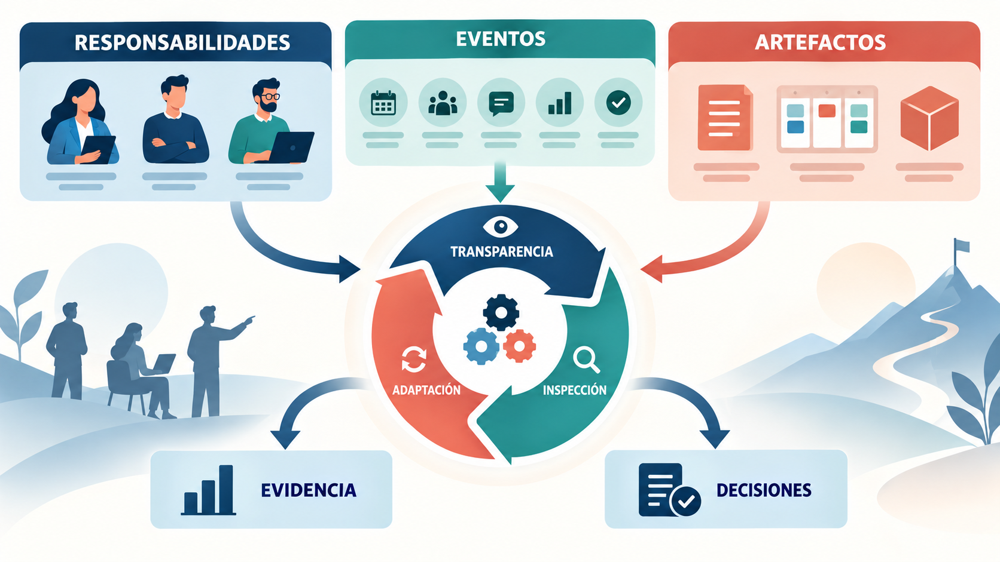
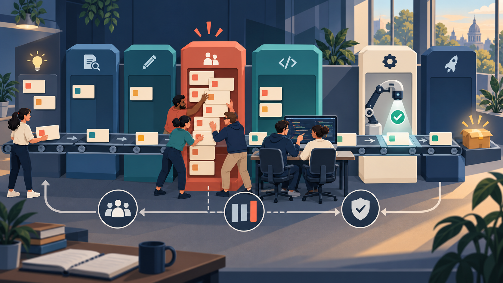
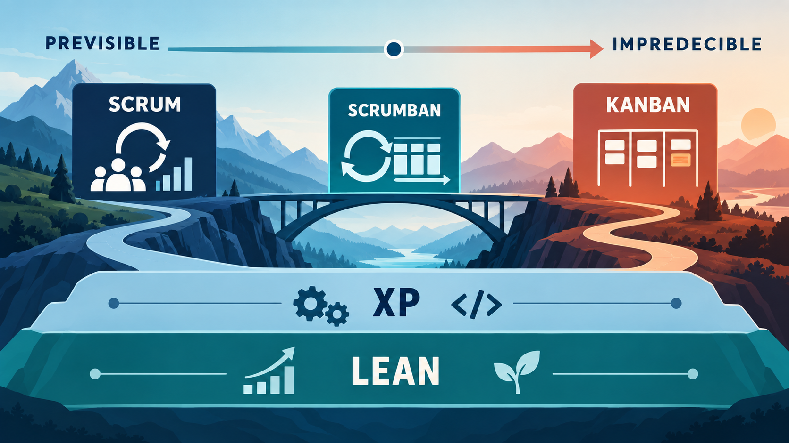

En el Módulo 1 viste *por qué* existe la agilidad: cuando hay incertidumbre, conviene avanzar en ciclos cortos, mostrar resultados y ajustar. Pero esa idea, sola, no le dice a un equipo qué hacer el lunes a la mañana. ¿Quién decide qué se construye primero? ¿Cada cuánto se muestra el avance? ¿Qué pasa si llega un pedido urgente en medio del trabajo? ¿Cómo se evita que cada cambio rompa algo que ya funcionaba?

Para responder esas preguntas existen los **marcos y métodos ágiles**. En este módulo vas a conocer los cuatro más importantes: **Scrum**, que organiza el trabajo en ciclos con objetivos; **Kanban**, que hace fluir el trabajo sin atascos; **Extreme Programming (XP)**, que cuida la calidad técnica; y **Lean**, que busca eliminar todo lo que no aporta valor. Primero vas a estudiar cada uno por separado, desde adentro. Recién al final los vamos a comparar y combinar.

:::clave Seguimos con el asistente universitario
El equipo que construye el **asistente con IA** para consultas de estudiantes (el caso que presentamos en el Módulo 1) ya decidió trabajar de forma ágil. Ahora tiene que elegir *cómo*: qué marco usar, quién ordena las prioridades y cómo organiza cada semana. Lo vamos a acompañar en cada enfoque.
:::

:::clave Al terminar este módulo vas a poder
- Distinguir un marco, un método, una práctica y una herramienta.
- Explicar cómo funciona Scrum: sus fundamentos, responsabilidades, artefactos y eventos.
- Explicar cómo Kanban gestiona el flujo de trabajo y para qué sirven los límites de trabajo en curso.
- Reconocer las prácticas técnicas de XP y los principios y desperdicios de Lean.
- Comparar los enfoques y elegir o combinar el más adecuado para un contexto.
:::

## 1. Un mapa antes de empezar

Cuando alguien dice "en mi empresa usamos ágil", puede estar hablando de cosas muy distintas: de Scrum, de un tablero con tarjetas, de programar en pareja o simplemente de tener reuniones cortas todos los días. Para no confundirnos, primero necesitamos ordenar el vocabulario.

| Concepto | Qué es | Ejemplo |
|---|---|---|
| **Marco de trabajo** (*framework*) | Una estructura mínima de reglas, responsabilidades y momentos, que el equipo completa con sus propias prácticas | Scrum |
| **Método** | Una forma organizada de mejorar cómo se trabaja, que puede aplicarse sobre el proceso que ya existe | Kanban |
| **Práctica** | Una técnica concreta que puede usarse dentro de distintos marcos | Programar en pareja, escribir las pruebas antes que el código |
| **Principios o filosofía** | Ideas que orientan decisiones, sin prescribir reuniones ni roles | Lean |
| **Herramienta** | Un soporte para organizar o automatizar el trabajo | Jira, Trello (los vas a estudiar en el Módulo 4) |
Tabla: El vocabulario de los enfoques ágiles

La distinción importa porque un equipo puede usar Trello sin ser ágil, o tener reuniones diarias sin estar haciendo Scrum. Una herramienta o una reunión no convierten a nadie en ágil: lo que importa es qué problema resuelven.

Cada enfoque de este módulo pone el foco en una pregunta distinta:

| Enfoque | Pregunta que responde |
|---|---|
| Scrum | ¿Cómo organizamos el trabajo en ciclos cortos, con un objetivo claro, para aprender y entregar valor? |
| Kanban | ¿Cómo hacemos visible el trabajo y logramos que fluya sin atascarse? |
| XP | ¿Cómo construimos software que se pueda cambiar con confianza, sin romper lo que ya funciona? |
| Lean | ¿Qué parte del trabajo consume tiempo y recursos sin aportar valor? |
Tabla: Qué pregunta responde cada enfoque

:::real Dato real: cuál se usa más
El informe *State of Agile*, una de las encuestas más conocidas del sector, pregunta cada año a miles de profesionales cómo trabajan sus equipos. En su edición número 17 (2023), **Scrum** apareció como el marco más usado a nivel de equipo: lo utilizaba el **63 %** de quienes trabajan de forma ágil. El mismo informe muestra que muchas organizaciones combinan enfoques: el 42 % declaró usar un modelo híbrido.

Fuente: [Digital.ai, 17th State of Agile Report](https://digital.ai/resource-center/analyst-reports/state-of-agile-report/)
:::

Por eso empezamos por Scrum y le dedicamos el bloque más largo. Después vienen Kanban, XP y Lean.

## 2. Scrum: qué es y de dónde viene

:::contexto Contexto: Scrum
Desde acá hasta la sección 6 trabajamos dentro de Scrum. Sus responsabilidades, artefactos y eventos son propios de este marco: no pertenecen automáticamente a Kanban, XP ni Lean.
:::

:::historia Del rugby al software
En 1986, dos profesores japoneses, **Hirotaka Takeuchi e Ikujiro Nonaka**, publicaron en la *Harvard Business Review* un artículo llamado "The New New Product Development Game". Estudiaron cómo empresas como Honda, Canon y Fuji-Xerox desarrollaban productos nuevos y encontraron un patrón: en lugar de pasarse el trabajo de un departamento a otro como en una carrera de postas, equipos pequeños y multidisciplinarios avanzaban juntos, "como en un *scrum* de rugby", la formación en la que todo el equipo empuja a la vez.

En 1993, **Jeff Sutherland** leyó ese artículo y lo aplicó con su equipo de software en la empresa Easel. En 1995, junto con **Ken Schwaber**, presentó el marco en una conferencia internacional (OOPSLA). Desde 2010, ambos mantienen *La Guía de Scrum*, un documento breve y gratuito que define sus reglas. La versión vigente es de 2020.

Fuente: [HBR, "The New New Product Development Game"](https://hbr.org/1986/01/the-new-new-product-development-game)
:::

La Guía define a Scrum como **un marco liviano que ayuda a personas, equipos y organizaciones a generar valor mediante soluciones adaptativas para problemas complejos**. "Liviano" es la palabra clave: Scrum no te dice cómo programar, cómo diseñar ni qué herramienta usar. Te da una estructura mínima y te deja completarla.

### 2.1 El ciclo de Scrum, en palabras simples

Scrum organiza el trabajo en ciclos de duración fija llamados **Sprints**, de un mes o menos (lo más común son dos semanas). Cada Sprint repite la misma lógica:

1. Hay una lista ordenada de todo lo que podría mejorar el producto.
2. El equipo elige un **objetivo** para el Sprint y el trabajo que necesita para alcanzarlo.
3. Durante el Sprint construye algo **utilizable**.
4. Al final muestra el resultado a las personas interesadas y conversan sobre qué sigue.
5. El equipo revisa también **cómo trabajó** y decide qué mejorar.
6. Arranca el siguiente Sprint.

En el asistente universitario, un primer Sprint de dos semanas podría tener este objetivo: *"Que el asistente responda correctamente las consultas más frecuentes de inscripción, usando solo documentos aprobados por la oficina de alumnos"*. Al final de las dos semanas debería haber algo que estudiantes reales puedan probar, no solo un informe de avance.

## 3. Los fundamentos de Scrum: empirismo y valores

Antes de ver quién hace qué en Scrum, conviene entender la idea que lo sostiene todo. Sin ella, las reuniones de Scrum se vuelven rituales vacíos.

### 3.1 Empirismo: decidir con lo que se observa

Scrum se basa en el **empirismo**: el conocimiento viene de la experiencia, y las decisiones se toman a partir de lo que se observa, no de lo que se supone. La Guía agrega el **pensamiento Lean**, que busca reducir el desperdicio y concentrarse en lo esencial.

El empirismo se apoya en tres pilares:

- **Transparencia:** el trabajo y sus criterios tienen que ser visibles y entendidos por todos. Si "respuesta correcta" significa algo distinto para el equipo y para la oficina de alumnos, cualquier revisión va a engañar.
- **Inspección:** el producto y el avance se revisan con frecuencia, para detectar problemas a tiempo. Inspeccionar el trabajo, no vigilar a las personas.
- **Adaptación:** si lo que se observa contradice el plan, se ajusta el producto o la forma de trabajar. Mirar sin cambiar nada no sirve.

Los tres dependen entre sí. Sin transparencia, la inspección mira datos falsos. Sin inspección, no hay nada que adaptar. Y sin adaptación, inspeccionar es perder el tiempo.

### 3.2 Los cinco valores

La Guía de Scrum pide que el equipo viva cinco valores: **compromiso, foco, apertura, respeto y coraje**. Suenan abstractos, pero se vuelven muy concretos en situaciones difíciles. En el asistente:

- **Coraje** es decir en voz alta que una respuesta que suena muy convincente es incorrecta, aunque la haya diseñado la persona más experimentada del equipo.
- **Apertura** es contar el problema apenas se descubre, sin esperar a tener la solución.
- **Respeto** es discutir la evidencia sin atacar a quien propuso la idea.
- **Foco** es no distraerse con otras mejoras mientras el objetivo del Sprint está en riesgo.
- **Compromiso** es hacer todo lo posible por alcanzar el objetivo acordado.

:::ensimple
Scrum funciona si el trabajo se ve (transparencia), se revisa seguido (inspección) y se corrige cuando hace falta (adaptación). Cada reunión de Scrum existe para servir a una de esas tres cosas.
:::

## 4. El equipo Scrum: tres responsabilidades

Scrum define un único **Scrum Team**, formado habitualmente por **diez personas o menos**, con tres responsabilidades: un **Product Owner**, un **Scrum Master** y los **Developers**. No hay jerarquías ni subequipos dentro del equipo: son tres responsabilidades distintas que trabajan hacia el mismo objetivo. El equipo es **multifuncional** (tiene todas las habilidades necesarias) y **autogestionado** (decide internamente quién hace qué y cómo).

### 4.1 Product Owner: maximizar el valor

El **Product Owner** es responsable de maximizar el valor del producto. Su herramienta principal es el **Product Backlog**, la lista ordenada de todo lo que podría hacerse (lo vemos en la sección 5). Define hacia dónde va el producto, decide qué es más importante y se asegura de que todos entiendan por qué.

Es **una sola persona**, no un comité. Puede escuchar a muchos interesados, pero la decisión final sobre el orden del backlog es suya. En el asistente, el Product Owner conversa con estudiantes, con la oficina de alumnos y con el área de sistemas para decidir si conviene mejorar primero las respuestas sobre inscripciones o sumar consultas sobre becas. Lo que no hace es decirle al equipo cómo programar.

### 4.2 Developers: construir el resultado

Los **Developers** son las personas que construyen el resultado de cada Sprint. El nombre engaña: no son solo programadores. En el asistente, los Developers pueden ser una persona especialista en datos, dos programadores, una diseñadora de experiencia de usuario y alguien que evalúa la calidad de las respuestas. Todos son "Developers" en términos de Scrum.

Juntos arman el plan de cada Sprint, cuidan la calidad del trabajo, ajustan el plan día a día y se hacen responsables profesionalmente del resultado.

### 4.3 Scrum Master: hacer que Scrum funcione

El **Scrum Master** es responsable de que Scrum funcione bien y de que el equipo sea cada vez más efectivo. Enseña cómo funciona el marco, facilita las reuniones cuando hace falta, ayuda a eliminar obstáculos (que en Scrum se llaman **impedimentos**) y trabaja con el resto de la organización para que entienda y apoye esta forma de trabajar.

:::mito
**Mito:** el Scrum Master es el jefe del equipo: reparte tareas y controla que se cumplan.

**Realidad:** el Scrum Master no asigna tareas ni recibe informes de avance. Su rol es de servicio: ayuda a que el equipo se organice solo y remueve lo que le impide avanzar. Si en tu equipo el "Scrum Master" reparte el trabajo, lo que hay es un jefe de proyecto con otro nombre.
:::

| Situación en el asistente | Quién actúa principalmente | Qué hace |
|---|---|---|
| Las respuestas sobre becas son mucho menos confiables que las de inscripción | Product Owner | Decide con los interesados si conviene invertir en mejorarlas ahora o más adelante |
| Hay que mejorar los datos, la interfaz y las pruebas para cumplir el objetivo | Developers | Reorganizan su plan técnico sin bajar la calidad |
| La oficina de alumnos tarda semanas en aprobar cada documento y eso frena todo | Scrum Master | Trabaja con la organización para acortar ese circuito de aprobación |
Tabla: Una situación, tres responsabilidades

## 5. Artefactos y compromisos

¿Cómo sabe el equipo qué podría hacer, qué está intentando lograr ahora y qué resultado ya se puede usar? Para eso Scrum define tres **artefactos**: elementos que hacen visible el trabajo y el valor. Cada uno tiene asociado un **compromiso**, una meta que le da sentido.

| Artefacto | Qué es | Su compromiso |
|---|---|---|
| **Product Backlog** | La lista ordenada de todo lo que podría mejorar el producto | **Product Goal**: el objetivo de producto a largo plazo |
| **Sprint Backlog** | El plan del Sprint actual: objetivo, trabajo elegido y cómo se va a hacer | **Sprint Goal**: el objetivo del Sprint |
| **Incremento** | El resultado utilizable que se construye | **Definition of Done**: los criterios de calidad para considerarlo terminado |
Tabla: Los tres artefactos de Scrum y sus compromisos

### 5.1 Product Backlog y Product Goal

El **Product Backlog** es una lista **ordenada** y **viva** de todo lo que se necesita para mejorar el producto. Es la única fuente de trabajo del equipo: si algo no está en el backlog, no se hace. Los elementos de arriba están más detallados y listos para trabajar; los de abajo son todavía ideas generales, sin detalle. El Product Owner es responsable de mantenerlo, aunque todo el equipo colabora.

Mantenerlo al día es una actividad continua llamada **refinamiento**: dividir elementos grandes, agregar detalle, estimar su tamaño y reordenarlos según lo aprendido. En el Módulo 3 vas a estudiar en profundidad cómo se escribe y se ordena un backlog.

Todo el backlog apunta al **Product Goal**, una descripción del estado futuro que busca el producto. En el asistente podría ser: *"Que los estudiantes resuelvan sus trámites académicos frecuentes sin tener que ir a la oficina"*.

### 5.2 Sprint Backlog y Sprint Goal

El **Sprint Backlog** es el plan del Sprint. Tiene tres partes: el **por qué** (el objetivo del Sprint), el **qué** (los elementos del Product Backlog elegidos) y el **cómo** (el plan de trabajo para lograrlo). Lo arman y lo actualizan los Developers, y cambia durante el Sprint a medida que aprenden.

Su compromiso es el **Sprint Goal**: un único objetivo que da coherencia a todo el trabajo del Sprint. Es lo que el equipo se compromete a lograr. El trabajo elegido es un pronóstico: si a mitad del Sprint descubren que algo es más difícil de lo previsto, pueden renegociar el detalle con el Product Owner, siempre que el objetivo se mantenga.

### 5.3 Incremento y Definition of Done

Un **Incremento** es un paso concreto hacia el Product Goal: algo terminado, que se suma a lo anterior, está verificado y se puede usar. Puede haber varios incrementos en un mismo Sprint, y se pueden entregar a los usuarios antes de que el Sprint termine.

¿Cuándo algo está "terminado"? Lo define la **Definition of Done** (Definición de Terminado): la lista de criterios de calidad que todo incremento tiene que cumplir. Para el asistente podría incluir:

- El código fue revisado por otra persona del equipo.
- Pasa todas las pruebas automáticas.
- Las respuestas superan el conjunto de consultas de prueba acordado con la oficina de alumnos.
- Cada respuesta indica el documento oficial del que sale.
- La documentación para quien lo mantenga está actualizada.

La regla es estricta: **lo que no cumple la Definition of Done no es un incremento**. No se muestra como terminado ni se entrega, y vuelve al Product Backlog. Nadie puede declarar terminado algo que no la cumple, ni siquiera el Product Owner.

## 6. Los eventos de Scrum

Scrum organiza el tiempo con cinco **eventos**. Cada uno es una oportunidad concreta para inspeccionar y adaptar. Todos tienen una duración máxima (en Scrum se dice que están limitados por un *timebox*).

| Evento | Quién participa | Para qué sirve | Duración máxima (Sprint de un mes) |
|---|---|---|---|
| **Sprint** | Todo el Scrum Team | Es el contenedor de todo: el ciclo en el que se crea el incremento | Un mes o menos, siempre la misma duración |
| **Sprint Planning** | Todo el Scrum Team | Acordar por qué el Sprint es valioso, qué se hará y cómo | 8 horas |
| **Daily Scrum** | Developers | Revisar el avance hacia el objetivo y ajustar el plan del día | 15 minutos |
| **Sprint Review** | Scrum Team e interesados | Mostrar el resultado, recibir feedback y decidir qué sigue | 4 horas |
| **Sprint Retrospective** | Todo el Scrum Team | Revisar cómo se trabajó y acordar mejoras | 3 horas |
Tabla: Los cinco eventos de Scrum

Si el Sprint es más corto, los eventos suelen durar menos. Por ejemplo, en un Sprint de dos semanas la planificación suele llevar unas cuatro horas.

### 6.1 Sprint

El **Sprint** es el corazón de Scrum. Tiene una duración fija, que se mantiene estable para dar ritmo al equipo, y el siguiente empieza apenas termina el anterior. Durante el Sprint no se hacen cambios que pongan en riesgo el objetivo ni se baja la calidad. Si el objetivo pierde sentido (por ejemplo, porque la universidad cancela el proyecto), el Product Owner puede cancelar el Sprint. Es el único que puede hacerlo.

### 6.2 Sprint Planning

Todo el equipo se reúne para responder tres preguntas: **¿por qué** este Sprint es valioso?, **¿qué** se puede terminar?, y **¿cómo** se va a hacer? El resultado es el Sprint Backlog. El Product Owner trae las prioridades, pero son los Developers quienes deciden cuánto trabajo pueden asumir.

### 6.3 Daily Scrum

Cada día, a la misma hora y durante quince minutos como máximo, los Developers revisan cómo vienen hacia el objetivo del Sprint y ajustan el plan de las próximas 24 horas. No es un informe al Scrum Master ni al Product Owner: es una conversación de coordinación entre quienes hacen el trabajo. Si aparece un problema que requiere más tiempo, se resuelve después, con las personas involucradas.

### 6.4 Sprint Review

Al final del Sprint, el equipo muestra lo que construyó a los interesados y conversan: ¿esto resuelve lo que se necesitaba?, ¿cambió algo en el contexto?, ¿qué conviene hacer después? Es una sesión de trabajo, no una presentación formal ni una aprobación. En el Módulo 5 vas a ver cómo lograr que sea realmente útil.

### 6.5 Sprint Retrospective

Es el último evento del Sprint. El equipo mira hacia adentro: ¿qué funcionó bien?, ¿qué nos trabó?, ¿qué vamos a cambiar en el próximo Sprint? El resultado son una o dos mejoras concretas. También lo vas a profundizar en el Módulo 5.

:::caso Caso resuelto: un Sprint del asistente universitario
**Objetivo del Sprint.** Que el asistente responda correctamente las consultas frecuentes de inscripción, mostrando el documento oficial del que sale cada respuesta. Sprint de dos semanas.

**Sprint Planning.** El Product Owner explica por qué este objetivo es el más valioso ahora: es la época de mayor volumen de consultas. Los Developers eligen el trabajo: armar veinte consultas de prueba reales con la oficina de alumnos, conectar los documentos vigentes, diseñar las respuestas y registrar los errores.

**Daily Scrum.** Al cuarto día, el equipo descubre que los documentos usan nombres distintos para el mismo trámite ("alta de materia", "inscripción a cursado"). Ajustan el plan: dedican un día a unificar los términos antes de seguir.

**Incremento.** Al final del Sprint, una versión cumple la Definition of Done y responde correctamente el conjunto de consultas de prueba acordado.

**Sprint Review.** Estudiantes y personal de la oficina lo prueban. Aparece un pedido nuevo: que el asistente avise cuando la información puede estar desactualizada. El Product Owner lo agrega al Product Backlog.

**Sprint Retrospective.** El equipo nota que perdió tiempo esperando la validación de documentos. Acuerda sumar a la persona de la oficina de alumnos desde el primer día del próximo Sprint.
:::

Fijate en un detalle importante para proyectos de IA: a veces un Sprint termina con un **experimento** que enseña que un camino no funciona. Es aprendizaje valioso, pero no es un incremento. Para que haya incremento tiene que existir algo utilizable que cumpla la Definition of Done.

## 7. Kanban: hacer visible el trabajo

:::contexto Contexto: Kanban
Cerramos Scrum y cambiamos de reglas. Kanban no tiene Sprints, ni Product Owner, ni Scrum Master, ni eventos obligatorios. Se aplica sobre la forma de trabajo que el equipo ya tiene.
:::

Imaginate el área de soporte del asistente universitario una vez que está funcionando. Llegan reportes de errores, pedidos de corrección de documentos y consultas urgentes de la oficina de alumnos. Nada de eso se puede planificar con dos semanas de anticipación: llega cuando llega. Para este tipo de trabajo, organizar Sprints puede ser forzado. Aquí brilla **Kanban**.

**Kanban** es un método para gestionar y mejorar el flujo de trabajo. Su idea central es simple: hacer visible todo el trabajo, limitar cuánto se hace al mismo tiempo y mejorar el sistema de forma continua.

### 7.1 De la fábrica al software

La palabra *kanban* significa "tarjeta" o "señal" en japonés. En los años cincuenta, Toyota usaba tarjetas para indicar cuándo una estación de trabajo necesitaba más piezas: solo se producía lo que se había consumido. Taiichi Ohno, uno de los creadores del sistema de producción de Toyota, contó que se inspiró en los supermercados estadounidenses, que reponían cada producto recién cuando el cliente lo sacaba de la góndola.

:::real Caso real: el equipo de Microsoft que pasó de cinco meses a dos semanas (2004)
En 2004, **David J. Anderson** trabajaba con un equipo de mantenimiento de sistemas internos de Microsoft. La situación era crítica: los pedidos pendientes superaban cinco veces la capacidad del equipo y seguían creciendo, cada cambio tardaba en promedio **cinco meses** en entregarse y casi ninguno cumplía la fecha prometida.

Anderson no sumó personas ni cambió cómo programaban. Cambió cómo entraba el trabajo: el equipo dejó de aceptar todo lo que llegaba y empezó a tomar un pedido nuevo recién cuando terminaba otro, con límites al trabajo simultáneo. En nueve meses, el tiempo de entrega bajó a unos **14 días**, el equipo **triplicó** la cantidad de pedidos terminados y el 98 % se entregó a tiempo.

Esa experiencia dio origen al **Método Kanban** aplicado al trabajo del conocimiento.

Fuente: [David J. Anderson, "A Brief History of Kanban for Knowledge Work"](https://djaa.com/brief-history-kanban-knowledge-work/)
:::

### 7.2 Las prácticas de Kanban

El Método Kanban, tal como lo formuló Anderson, parte de un principio muy distinto al de Scrum: **empezá con lo que hacés hoy**. No exige roles nuevos ni reorganizar el equipo. Propone seis prácticas:

- **Visualizar el flujo de trabajo** en un tablero, con una columna para cada etapa real.
- **Limitar el trabajo en curso** (lo vemos en la sección 8).
- **Gestionar el flujo:** observar cómo avanza el trabajo y dónde se traba.
- **Hacer explícitas las políticas:** escribir las reglas del juego (cuándo una tarjeta pasa de una columna a otra, qué se considera urgente).
- **Crear ciclos de feedback:** reuniones o revisiones periódicas para mirar el sistema.
- **Mejorar en forma colaborativa**, con pequeños cambios basados en datos.

### 7.3 El tablero Kanban

:::ejemplo Pensá en la cocina de un restaurante
Los pedidos llegan en comandas que se cuelgan en fila. El cocinero toma una, la prepara y la pasa al que emplata; de ahí va al mozo. Todos ven cuántas comandas esperan, cuáles están en preparación y cuáles están listas para salir. Y ningún cocinero toma diez comandas a la vez: termina lo que tiene antes de agarrar otra. Eso es, en esencia, un tablero Kanban.
:::

Un tablero para el soporte del asistente podría tener estas columnas:

| Pendiente | En análisis | En corrección | En validación | Terminado |
|---|---|---|---|---|
| Pedidos que llegaron y todavía nadie tomó | Se está entendiendo el problema | Se está corrigiendo un documento o el asistente | La oficina de alumnos verifica la corrección | Publicado y funcionando |
Tabla: Un tablero Kanban para el soporte del asistente

Cada tarjeta representa un pedido. Las columnas tienen que reflejar las etapas reales del trabajo, y cada una necesita una **política** clara: por ejemplo, una tarjeta pasa a "En validación" solo cuando la corrección está probada. Un tablero sin reglas explícitas es solo una lista de tareas con columnas.

## 8. Limitar el trabajo en curso

Parece contradictorio, pero es la idea más poderosa de Kanban: **para terminar más, hay que empezar menos**.

El **trabajo en curso** (en inglés, *Work In Progress* o **WIP**) es todo lo que se empezó y todavía no se terminó. Un **límite WIP** fija cuántos elementos puede haber a la vez en una etapa o en todo el tablero. Si la columna "En corrección" tiene un límite de 3 y ya hay 3 tarjetas, nadie puede empezar una cuarta. ¿Qué hace entonces la persona que se liberó? Ayuda a destrabar lo que está más adelante, por ejemplo acelerando la validación.

¿Por qué funciona? Porque tener muchas cosas empezadas genera problemas que no se ven a simple vista:

- Las personas saltan de una tarea a otra y pierden tiempo en cada cambio.
- El trabajo a medio hacer no le sirve a nadie, pero consume atención.
- Todo avanza un poco y nada termina, así que el usuario espera más por cada pedido.

Los límites también cumplen una función de diagnóstico. Si la columna "En validación" está siempre llena y las anteriores se atascan detrás, el tablero está mostrando un **cuello de botella**: la etapa que frena todo el sistema. En el caso del asistente, probablemente la oficina de alumnos necesite más tiempo o un circuito de aprobación más ágil.

### 8.1 La Ley de Little

Existe una relación matemática que explica por qué limitar el WIP acorta los tiempos. Se llama **Ley de Little** y dice que, en un sistema estable:

**Tiempo promedio de entrega = Trabajo en curso promedio ÷ Cantidad de elementos terminados por día**

Si el soporte del asistente tiene en promedio 6 pedidos en curso y termina 2 por día, cada pedido tarda en promedio 3 días. Si logra trabajar con 4 pedidos en curso terminando la misma cantidad por día, el promedio baja a 2 días. Es una relación entre promedios, no una promesa para cada pedido. En el Módulo 4 vas a medir estos tiempos con datos reales (se llaman *lead time*, *cycle time* y *throughput*).

:::mito
**Mito:** poner límites WIP baja la productividad, porque deja gente sin tareas nuevas.

**Realidad:** los límites cambian el foco de *empezar* a *terminar*. En lugar de abrir una tarea nueva, la persona libre ayuda donde el sistema está trabado. El caso de Microsoft lo muestra: con los mismos recursos y límites al trabajo simultáneo, el equipo triplicó lo que entregaba.
:::

## 9. Extreme Programming: calidad técnica para poder cambiar

:::contexto Contexto: Extreme Programming (XP)
Cambiamos otra vez de enfoque. XP reúne prácticas técnicas de desarrollo. Muchos equipos las usan dentro de Scrum o de Kanban, pero no son parte obligatoria de ninguno de los dos.
:::

¿De qué sirve entregar cada dos semanas si cada cambio rompe algo que ya funcionaba? Scrum y Kanban organizan el trabajo, pero no dicen cómo escribir software que se pueda modificar con confianza. De eso se ocupa **Extreme Programming (XP)**.

:::real Caso real: XP nació en un sistema de sueldos de Chrysler (1996 a 2000)
En 1996, Chrysler tenía un proyecto para unificar sus sistemas de liquidación de sueldos. Llevaba años de desarrollo y todavía no había impreso un solo recibo. **Kent Beck** fue convocado para rescatarlo y, junto con Ron Jeffries, cambió por completo la forma de trabajar del equipo: entregas pequeñas, pruebas automáticas, programación en pareja y conversación diaria con los usuarios.

En 1997 el sistema empezó a liquidar los sueldos de unas **10.000 personas**. Beck formalizó esa forma de trabajar en el libro *Extreme Programming Explained* (1999). La historia tiene un final agridulce: en 2000, después de la fusión con Daimler-Benz, Chrysler canceló el proyecto antes de extenderlo al resto de la empresa. XP sobrevivió a su proyecto de origen y hoy sus prácticas son estándar en la industria.

Fuente: [Wikipedia, "Chrysler Comprehensive Compensation System"](https://en.wikipedia.org/wiki/Chrysler_Comprehensive_Compensation_System)
:::

El nombre "extrema" viene de tomar buenas prácticas conocidas y llevarlas al extremo: si revisar código es bueno, revisémoslo todo el tiempo (programación en pareja); si probar es bueno, probemos antes de programar (TDD); si integrar es bueno, integremos varias veces por día (integración continua). XP se apoya en cinco valores: **comunicación, simplicidad, feedback, coraje y respeto**.

### 9.1 Programación en pareja

Dos personas trabajan juntas en la misma tarea y la misma computadora. Una escribe el código (el "conductor") y la otra revisa cada línea, piensa en la estrategia general y detecta errores (el "navegante"). Cada tanto intercambian los roles.

:::ejemplo Como en un rally
En un rally, el piloto maneja y el copiloto lee la hoja de ruta, anticipa las curvas y avisa los peligros. Ninguno de los dos podría correr igual de bien solo. En la programación en pareja pasa algo parecido: una persona se concentra en el detalle y la otra, en el camino.
:::

Parece que duplica el costo, pero ayuda a detectar errores en el momento, mejora el diseño y distribuye el conocimiento: si una persona se enferma, hay otra que conoce ese código. Es especialmente útil para que alguien que recién se suma aprenda las convenciones del equipo.

### 9.2 Desarrollo guiado por pruebas (TDD)

En el **desarrollo guiado por pruebas** (*Test-Driven Development*, TDD), se escribe primero una prueba automática que describe lo que el código debería hacer, y recién después el código. El ciclo tiene tres pasos, conocidos como **rojo, verde, refactorizar**:

1. **Rojo:** escribís una prueba para algo que todavía no existe. Falla, porque no hay código.
2. **Verde:** escribís el código mínimo para que la prueba pase.
3. **Refactorizar:** mejorás el diseño del código sin cambiar lo que hace, y verificás que las pruebas sigan pasando.

Por ejemplo, antes de programar la función que decide si el asistente debe derivar una consulta a una persona, se escribe una prueba: *"si la consulta menciona datos personales del estudiante, la respuesta debe ser una derivación"*. Con el tiempo, el equipo acumula cientos de pruebas que funcionan como una red de seguridad: si un cambio rompe un comportamiento conocido, las pruebas lo detectan en segundos.

### 9.3 Integración continua

La **integración continua** consiste en unir el código de todo el equipo en un repositorio compartido varias veces por día. Cada vez que alguien sube un cambio, un sistema automático compila el proyecto y ejecuta todas las pruebas. Si algo falla, el equipo se entera en minutos, no semanas después. Herramientas como GitHub Actions o GitLab CI automatizan este proceso. En el Módulo 5 vas a ver cómo esta práctica se extiende hasta la entrega continua.

### 9.4 Refactorización

**Refactorizar** es mejorar la estructura interna del código sin cambiar lo que hace: eliminar duplicaciones, poner nombres más claros, simplificar. Sin refactorización, el código acumula parches y atajos que hacen cada cambio más lento y riesgoso. Ese costo acumulado se llama **deuda técnica**, y lo vas a estudiar en el Módulo 5. Las pruebas automáticas son las que permiten refactorizar con tranquilidad.

### 9.5 Otras prácticas de XP

- **Diseño simple:** construir la solución más simple que resuelva lo que se necesita hoy, sin anticipar funciones que quizás nunca se usen.
- **Propiedad colectiva del código:** cualquier persona del equipo puede mejorar cualquier parte del código.
- **Estándares de código compartidos:** el código se escribe de manera uniforme, como si lo hubiera escrito una sola persona.
- **Entregas pequeñas y frecuentes:** poner software funcionando en manos de los usuarios lo antes posible.
- **Ritmo sostenible:** evitar las horas extra permanentes, que deterioran la calidad.

### 9.6 XP en proyectos de IA

En un sistema con IA conviven dos tipos de verificación. Una **prueba automática** comprueba algo que tiene una única respuesta correcta: por ejemplo, que el asistente nunca muestre datos personales de otro estudiante. Una **evaluación** mide la calidad de las respuestas sobre un conjunto de consultas conocidas, y da un porcentaje, no un sí o un no. Las dos son necesarias y ninguna garantiza que el sistema responda bien cualquier consulta futura.

Los asistentes de programación con IA pueden proponer pruebas o revisar código, pero el equipo sigue siendo responsable de verificar lo que producen.

## 10. Lean: eliminar lo que no aporta valor

:::contexto Contexto: Lean
Último enfoque. Lean no es un marco con reglas: es una forma de pensar la gestión, centrada en el valor y en eliminar el desperdicio de todo el sistema.
:::

**Lean** nace del mismo lugar que Kanban: el sistema de producción de Toyota. Su idea central es maximizar el valor para el cliente y eliminar el **desperdicio** (*muda*, en japonés): todo lo que consume tiempo o recursos sin aportar valor. En 2003, **Mary y Tom Poppendieck** lo adaptaron al software en el libro *Lean Software Development*.

:::real Caso real: Toyota y el cordón que detiene la línea
Toyota explica su sistema de producción con dos pilares. El primero, ***jidoka***, viene de un telar automático que Sakichi Toyoda, fundador de la familia, perfeccionó a principios del siglo XX: la máquina se detenía sola cuando se cortaba un hilo, para no seguir fabricando tela defectuosa. En las plantas de Toyota, ese principio se traduce en que cualquier operario puede **tirar de un cordón y detener la línea** cuando detecta una anomalía. Un tablero luminoso, el ***andon***, avisa dónde está el problema.

El segundo pilar es el ***just in time***: producir *"solo lo que se necesita, cuando se necesita y en la cantidad necesaria"*.

La lección para el software es directa: cuando una prueba importante falla, seguir agregando funciones encima multiplica el retrabajo. Es mejor frenar, entender la falla y corregirla. La integración continua de XP es, en el fondo, un cordón andon digital.

Fuente: [Toyota, "Toyota Production System"](https://global.toyota/en/company/vision-and-philosophy/production-system/)
:::

### 10.1 Los siete desperdicios del software

Los Poppendieck tradujeron los desperdicios que Toyota identificaba en sus fábricas a su equivalente en el desarrollo de software:

| Desperdicio | Qué es | En el asistente universitario |
|---|---|---|
| **Trabajo a medio hacer** | Lo empezado que todavía no se usa | Una función de consultas sobre becas programada al 80 % y abandonada por un cambio de prioridad |
| **Funciones extra** | Lo que nadie pidió ni va a usar | Un modo de conversación en tres idiomas cuando todos los estudiantes hablan español |
| **Reaprendizaje** | Volver a resolver algo que ya se había resuelto | Nadie documentó cómo se conectaron los documentos, y otra persona tiene que investigarlo de cero |
| **Traspasos** | Información que se pierde al pasar el trabajo de mano en mano | La oficina de alumnos escribe los requisitos y los manda por correo, sin conversar con el equipo |
| **Cambios de tarea** | Saltar entre muchas tareas a la vez | Una persona dividida entre cuatro proyectos distintos |
| **Esperas** | Tiempo en que el trabajo está parado | Una corrección terminada que espera diez días la aprobación de la oficina |
| **Defectos** | Errores que se descubren tarde | Una respuesta incorrecta que los estudiantes encuentran en plena época de inscripción |
Tabla: Los siete desperdicios del software, según Mary y Tom Poppendieck

:::ejemplo Pensá en un trámite en una oficina pública
Llegás, sacás número y esperás cuarenta minutos. La persona que te atiende tarda cinco minutos, pero te falta una fotocopia. Volvés otro día, esperás de nuevo, y te derivan a otra ventanilla. El trabajo real sumó quince minutos; todo lo demás fue espera, traspasos y retrabajo. En los equipos de software pasa lo mismo: muchas veces el trabajo pasa la mayor parte del tiempo **esperando**, no avanzando.
:::

### 10.2 Los principios Lean aplicados al software

Los Poppendieck propusieron siete principios que atraviesan a todos los enfoques de este módulo:

- **Eliminar el desperdicio.** Todo lo que no aporta valor al cliente.
- **Amplificar el aprendizaje.** Con ciclos cortos de feedback, como los de Scrum y XP.
- **Decidir lo más tarde posible.** Postergar las decisiones difíciles de revertir hasta tener más información.
- **Entregar lo más rápido posible.** Para obtener valor y feedback cuanto antes.
- **Dar autonomía al equipo.** Que decida quien conoce el trabajo.
- **Construir con integridad.** Coherencia para el usuario y un diseño técnico sólido.
- **Ver el todo.** Mejorar el sistema completo, no una parte a costa de otra.

El último principio es el más difícil de aplicar. Si el equipo de desarrollo programa el doble de rápido, pero todo se acumula esperando la validación de la oficina de alumnos, el sistema completo no mejoró: solo cambió de lugar la fila.

## 11. Combinar enfoques: Scrumban y Scrum con Kanban

:::contexto Comparación e integración
Ya estudiaste cada enfoque por separado. Recién ahora tiene sentido combinarlos, cuidando que sus reglas no se contradigan.
:::

En la práctica, pocos equipos usan un enfoque "puro". Las combinaciones más frecuentes son dos, y conviene no confundirlas.

**Scrum con Kanban.** El equipo mantiene **todo** Scrum (sus tres responsabilidades, sus artefactos y sus cinco eventos) y le suma prácticas de Kanban: visualiza el flujo en un tablero, pone límites WIP y mide cuánto tarda cada elemento. Sigue siendo Scrum, con mejor gestión del flujo. Scrum.org publica incluso una guía oficial sobre esta combinación.

**Scrumban.** Es una combinación más libre, que suele usarse en equipos con mucho trabajo imprevisible, como mantenimiento o soporte. Por ejemplo, un equipo trabaja con flujo continuo como en Kanban, pero conserva una planificación periódica y una retrospectiva cada dos semanas. Como no existe una definición única de Scrumban, el equipo tiene que escribir explícitamente qué conserva de cada enfoque y por qué.

:::mito
**Mito:** si un equipo de Scrum empieza a usar un tablero con límites WIP, "ya no hace Scrum, hace Scrumban".

**Realidad:** mientras conserve todas las reglas de Scrum, sigue haciendo Scrum, con prácticas de Kanban. Scrumban aparece cuando se cambian elementos esenciales de Scrum, por ejemplo cuando se abandonan los Sprints.
:::

## 12. Otros enfoques ágiles: Crystal, FDD y DSDM

Además de los cuatro grandes, existen otros enfoques ágiles que conviene conocer, aunque hoy se usen menos. Algunos son anteriores al Manifiesto y varias de sus ideas pasaron a otros marcos.

- **Crystal**, creado por **Alistair Cockburn** (uno de los firmantes del Manifiesto), no es un único método sino una familia identificada por colores (Crystal Clear, Yellow, Orange, Red…). Se elige según el tamaño del equipo y la criticidad del sistema: un software cuyo fallo puede costar vidas necesita más rigor que una aplicación interna. Su mensaje central: no hay un proceso único correcto; hay que calibrarlo al contexto.
- **Feature Driven Development (FDD)**, creado por **Jeff De Luca y Peter Coad** a fines de los noventa, organiza todo el trabajo alrededor de funcionalidades pequeñas y valiosas para el cliente, como "calcular el total de una factura". Pone más énfasis que Scrum en modelar el sistema al principio, por lo que se usó en proyectos grandes con arquitecturas complejas.
- **Dynamic Systems Development Method (DSDM)** nació en el Reino Unido en **1994**, antes del Manifiesto. Su rasgo distintivo es que **fija de antemano el tiempo y el costo**, y ajusta el alcance. Para eso usa la priorización **MoSCoW** (*Must have*, *Should have*, *Could have*, *Won't have*), que vas a ver en el Módulo 3. Es útil en proyectos con fechas y presupuestos rígidos, frecuentes en el sector público.

| Enfoque | Origen | Idea central | Dónde encaja mejor |
|---|---|---|---|
| Crystal | Alistair Cockburn | Adaptar el proceso al tamaño del equipo y la criticidad del sistema | Organizaciones con proyectos de riesgos muy distintos |
| FDD | Jeff De Luca y Peter Coad | Organizar el trabajo por funcionalidades concretas | Proyectos grandes con fuerte modelado del sistema |
| DSDM | Consorcio del Reino Unido, 1994 | Tiempo y costo fijos; el alcance se ajusta con MoSCoW | Proyectos con fecha y presupuesto innegociables |
Tabla: Otros enfoques ágiles

## 13. Comparar los enfoques

Con los cuatro enfoques estudiados por separado, ahora sí podemos ponerlos lado a lado.

| | Scrum | Kanban | XP | Lean |
|---|---|---|---|---|
| **Qué es** | Marco de trabajo | Método de gestión del flujo | Enfoque de desarrollo con prácticas técnicas | Filosofía y principios de gestión |
| **Organización del tiempo** | Sprints de duración fija, de un mes o menos | Flujo continuo, sin iteraciones obligatorias | Iteraciones y entregas pequeñas | No prescribe una |
| **Roles** | Product Owner, Scrum Master y Developers | No exige roles nuevos | Cliente y equipo de desarrollo | No prescribe roles |
| **Cómo controla el trabajo** | Objetivo del Sprint, inspección y adaptación en cada evento | Límites WIP, políticas explícitas y métricas de flujo | Pruebas, integración continua y feedback del cliente | Eliminación del desperdicio y mejora del sistema completo |
| **Cambios durante el trabajo** | Se protege el objetivo del Sprint; el detalle se renegocia | Se incorporan cuando hay capacidad, según las políticas | Se replanifican en cada iteración | Se decide con la mejor información disponible |
| **Foco principal** | Organizar el trabajo del equipo y aprender en ciclos | Que el trabajo fluya sin atascos | La calidad técnica del software | El valor para el cliente |
| **Uso típico** | Desarrollo de productos con un backlog priorizable | Soporte, mantenimiento, demanda impredecible | Cualquier equipo que quiera elevar su calidad técnica | Cualquier organización que quiera mejorar su sistema |
Tabla: Scrum, Kanban, XP y Lean lado a lado

La tabla deja ver algo importante: los cuatro no compiten en el mismo terreno. Scrum y Kanban organizan el trabajo; XP cuida cómo se construye; Lean da el criterio para mejorar todo el sistema. Por eso es tan frecuente combinarlos.

## 14. Elegir el enfoque

No existe un enfoque mejor que los demás en abstracto. Existe el más adecuado para una situación concreta. Estas son las preguntas que más ayudan a decidir:

- **¿Cómo llega el trabajo?** Si se puede planificar con algunas semanas de anticipación (nuevas funciones de un producto), Scrum aporta foco y ritmo. Si llega de forma continua e imprevisible (soporte, incidentes), Kanban se adapta mejor.
- **¿Cómo es el equipo?** Scrum exige roles claros, disciplina y un equipo con todas las habilidades necesarias. Kanban no exige reorganizar nada, así que es más fácil de adoptar de a poco.
- **¿Cuánta autonomía da la organización?** Scrum necesita que el equipo pueda autogestionarse y que no lo interrumpan a cada rato con urgencias. En organizaciones muy jerárquicas, Kanban suele encontrar menos resistencia al principio.
- **¿Cómo está la calidad técnica?** Si cada cambio rompe algo, el problema no se resuelve cambiando de marco: hacen falta las prácticas de XP, que funcionan con cualquiera de los dos.
- **¿Hay fecha y presupuesto fijos?** Entonces hay que distinguir lo imprescindible de lo deseable. DSDM y su priorización MoSCoW están pensados para eso, y la técnica se puede usar también dentro de Scrum.

:::preguntas Preguntas para elegir un enfoque
- ¿El trabajo se puede agrupar en ciclos o llega de forma continua?
- ¿Qué problema concreto queremos resolver: foco, atascos, calidad o desperdicio?
- ¿El equipo tiene todas las habilidades necesarias y autonomía para organizarse?
- ¿Qué parte del trabajo actual funciona bien y conviene conservar?
- ¿Cómo vamos a saber, dentro de un mes, si la decisión fue buena?
:::

:::caso Caso resuelto: la app bancaria que mezcla proyectos e incidentes
**La situación.** El equipo de seis personas que desarrolla la app bancaria (el caso del Módulo 1) trabaja con Scrum en Sprints de dos semanas. Pero tiene tres problemas: los incidentes urgentes interrumpen el objetivo del Sprint, las tareas se acumulan esperando pruebas y la integración manual introduce errores. Alguien propone abandonar Scrum. (Escenario didáctico.)

**Paso 1: diagnosticar antes de cambiar.** Durante dos semanas, el equipo registra qué trabajo entra, cuánto es realmente urgente, cuánto espera cada tarea en pruebas y cuántos errores aparecen. Descubre que el problema no es "demasiado trabajo": son interrupciones, un cuello de botella en pruebas y fragilidad técnica.

**Paso 2: conservar Scrum completo.** El trabajo principal sigue siendo mejorar la app, y eso se planifica bien por Sprints. Se mantienen las tres responsabilidades, los artefactos y los cinco eventos. Al planificar, el equipo reserva capacidad para los incidentes, según lo que midió.

**Paso 3: sumar prácticas de Kanban.** Visualiza en un mismo tablero el trabajo planificado y los incidentes, define qué cuenta como urgente y pone un límite WIP en la columna de pruebas. Si se llena, el equipo ayuda a probar antes de empezar tareas nuevas.

**Paso 4: sumar prácticas de XP.** Incorpora integración continua y pruebas automáticas para atacar los errores de integración. Estas prácticas resuelven la fragilidad técnica; no reemplazan la gestión de prioridades.

**Paso 5: comprobar.** Durante un mes mide el tiempo de cada tarea, los errores y cuántas veces las urgencias pusieron en riesgo el objetivo. Si el trabajo imprevisible pasara a dominar, evaluaría separar un equipo de soporte con Kanban.

**Decisión.** Scrum con prácticas de Kanban y XP. No es Scrumban, porque Scrum se conserva completo.
:::

## Recursos audiovisuales sugeridos

- [A Brief Overview of the Scrum Framework](https://www.youtube.com/watch?v=gy1c4_YixCo), de Scrum.org. En pocos minutos muestra cómo se relacionan las responsabilidades, los eventos y los artefactos.
- [What is Scrum: An Introduction to the Scrum Framework](https://www.youtube.com/watch?v=-xudUyGsNfc), de Scrum.org. Una introducción más completa, con los fundamentos, los roles y los mitos frecuentes.

## Para profundizar

- [La Guía de Scrum](https://scrumguides.org/scrum-guide.html), de Ken Schwaber y Jeff Sutherland: el documento oficial, breve y gratuito.
- Hirotaka Takeuchi e Ikujiro Nonaka, ["The New New Product Development Game"](https://hbr.org/1986/01/the-new-new-product-development-game), el artículo que inspiró el nombre de Scrum.
- David J. Anderson, ["A Brief History of Kanban for Knowledge Work"](https://djaa.com/brief-history-kanban-knowledge-work/): cómo nació el Método Kanban.
- [Toyota Production System](https://global.toyota/en/company/vision-and-philosophy/production-system/): la explicación oficial de Toyota sobre *jidoka* y *just in time*.

## Síntesis del módulo

Los enfoques ágiles no son recetas intercambiables: cada uno responde a una pregunta distinta.

- **Scrum** organiza el trabajo en Sprints de un mes o menos, con tres responsabilidades (Product Owner, Scrum Master y Developers), tres artefactos con sus compromisos y cinco eventos. Se apoya en el empirismo: transparencia, inspección y adaptación.
- **Kanban** hace visible el trabajo, limita cuánto se hace a la vez y mejora el flujo de forma continua, partiendo del proceso que ya existe. Para terminar más, hay que empezar menos.
- **XP** aporta las prácticas técnicas que permiten cambiar el software con confianza: programación en pareja, TDD, integración continua y refactorización.
- **Lean** da el criterio de fondo: maximizar el valor y eliminar el desperdicio de todo el sistema.
- **Combinar** es lo más común, siempre que las reglas no se contradigan y cada práctica resuelva un problema concreto.

**Próximo paso.** Ya sabés cómo se organiza el trabajo. En el Módulo 3 vas a ver *qué* se construye: cómo pasar de las necesidades de los usuarios a un Product Backlog ordenado, con historias de usuario, criterios de aceptación y técnicas para priorizar.
