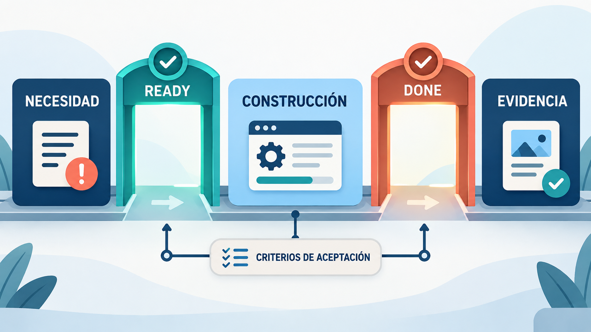
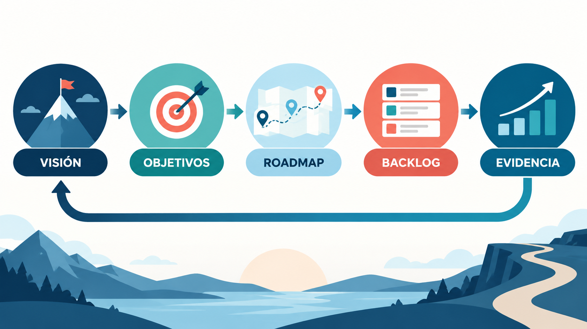

Un equipo puede dominar Scrum a la perfección, cumplir cada evento a tiempo, entregar en cada Sprint... y aun así construir algo que nadie usa. Pasa más seguido de lo que parece. El problema no está en *cómo* trabaja el equipo, sino en *qué* decidió construir.

En el Módulo 2 viste cómo se organiza el trabajo. En este módulo vas a ver cómo se decide **qué** trabajo hacer: cómo pasar de una idea general a un **Product Backlog** ordenado, cómo escribir necesidades que todo el equipo entienda igual, cómo decidir qué va primero y cómo comprobar, con el menor esfuerzo posible, si una idea realmente funciona.

:::clave Seguimos con el asistente universitario
En los módulos anteriores, el equipo del **asistente con IA** para consultas de estudiantes eligió trabajar con Scrum en Sprints de dos semanas. Ahora enfrenta la pregunta más difícil: con decenas de ideas sobre la mesa (becas, horarios, recordatorios, WhatsApp, consultas de notas), ¿qué construye primero? Todo este módulo gira alrededor de esa decisión.
:::

:::clave Al terminar este módulo vas a poder
- Formular la visión y los objetivos de un producto, distinguiendo métricas técnicas de beneficios reales.
- Organizar un Product Backlog en épicas, historias y tareas.
- Escribir historias de usuario con criterios de aceptación verificables.
- Distinguir criterios de aceptación, Definition of Done y Definition of Ready.
- Aplicar técnicas de priorización: MoSCoW, Kano, WSJF y matriz de valor y esfuerzo.
- Diseñar un producto mínimo viable, un roadmap y un plan de lanzamiento.
:::

## 1. La visión del producto

Alguien de la universidad le dice al equipo: "Queremos un chat con inteligencia artificial". ¿Es un buen punto de partida? No del todo. Eso describe una **solución**, no el **problema**. Antes de discutir pantallas o modelos de IA, conviene responder otra pregunta: ¿qué debería dejar de pasar, o empezar a pasar, gracias a este producto?

:::clave Visión del producto
La **visión del producto** describe el futuro que el producto busca crear: para quién existe, qué problema resuelve y qué lo hace distinto. Es la brújula que permite decir que sí o que no a cada idea.
:::

Una forma muy usada de escribirla es el formato propuesto por Geoffrey Moore:

*Para* [usuario] *que* [necesidad], *el* [producto] *es un* [tipo de producto] *que* [beneficio principal]. *A diferencia de* [alternativa actual], *nuestro producto* [diferencia clave].

Aplicado al asistente:

> Para estudiantes que necesitan resolver dudas sobre inscripciones y trámites, el Asistente UBP es un servicio de consultas en la web que responde al instante con información oficial y actualizada. A diferencia de escribir un correo a la oficina de alumnos y esperar días, nuestro asistente responde en segundos, indica de dónde sale cada respuesta y deriva a una persona cuando no está seguro.

Fijate lo que la visión **no** dice: qué modelo de IA se usará, en qué lenguaje se programará ni cómo serán las pantallas. Esas son decisiones de implementación que vienen después.

Una buena visión sirve para **descartar** ideas, no solo para inspirar. Si alguien propone que el asistente cuente chistes para ser más simpático, la visión ayuda a responder: eso no acerca a los estudiantes a resolver sus trámites. Si cualquier idea se puede justificar con la visión, todavía está demasiado vaga.

:::real Caso real: en Amazon, primero se escribe el comunicado de prensa
En Amazon, antes de construir un producto nuevo, el equipo tiene que escribir el **comunicado de prensa** que anunciaría el lanzamiento, como si el producto ya existiera, junto con una lista de preguntas frecuentes de clientes e internas. Al método lo llaman ***Working Backwards***: trabajar hacia atrás, desde el cliente hasta la solución.

La lógica es simple: si el equipo no puede explicar en una página, con palabras de cliente, por qué el producto le cambiaría la vida a alguien, no vale la pena construirlo. Según Colin Bryar y Bill Carr, dos ex vicepresidentes de la empresa, así nacieron productos como Kindle, Prime, AWS y Alexa. Muchas ideas, en cambio, se descartan en esta etapa, cuando descartarlas todavía es barato.

Fuente: [Colin Bryar, "Working Backwards: How to Write an Amazon PR/FAQ"](https://docs.superhuman.com/@colin-bryar/working-backwards-how-write-an-amazon-pr-faq)
:::

### 1.1 De la visión a los objetivos

La visión da dirección, pero no dice si vamos bien. Para eso hacen falta **objetivos**: resultados observables que muestran si el producto se acerca a su visión.

En un producto con IA conviene pensar los objetivos en tres niveles, porque es muy fácil quedarse solo con el técnico:

| Nivel | Qué mide | En el asistente |
|---|---|---|
| **Beneficio** | Qué cambia para las personas | Los estudiantes resuelven sus trámites sin información desactualizada |
| **Comportamiento** | Qué hacen los usuarios | Porcentaje de consultas que se resuelven sin derivar a la oficina |
| **Calidad técnica** | Cómo funciona el sistema | Porcentaje de respuestas correctas y con fuente en un conjunto de prueba |
Tabla: Tres niveles de objetivos para un producto con IA

Los tres se complementan. Un asistente puede tener un 95 % de respuestas correctas en las pruebas y, aun así, ser tan lento o confuso que los estudiantes prefieren seguir mandando correos. Mejorar la precisión del modelo es un medio; el fin es que los estudiantes resuelvan sus trámites.

:::caso Ejemplo resuelto: porcentajes y puntos porcentuales
Hoy, 40 de cada 100 consultas que recibe el asistente terminan derivadas a la oficina: la tasa de derivación es del **40 %**. El equipo se propone "reducir la derivación un 25 %". ¿Qué significa eso?

**Si es una reducción relativa**, se calcula sobre el valor actual: 40 % × 0,75 = **30 %**. La tasa baja 10 puntos porcentuales.

**Si fueran 25 puntos porcentuales**, la tasa tendría que llegar a 40 % − 25 = **15 %**. Es una meta muchísimo más exigente.

La diferencia parece un detalle, pero cambia por completo lo que el equipo promete. Por eso un buen objetivo aclara siempre cómo se calcula, en qué período y sobre qué población.
:::

### 1.2 Una métrica que resuma el valor

Muchos equipos de producto eligen una **North Star Metric** ("métrica estrella del norte"): un único número que resume el valor central que el producto entrega. Para el asistente podría ser *"consultas resueltas correctamente y sin derivación, por semana"*. Combina uso (que los estudiantes consulten) con resultado (que la consulta quede resuelta).

Esa métrica protege contra los **indicadores de vanidad**: números que crecen y se ven bien en una presentación, pero no dicen nada sobre el valor. "Cantidad de mensajes intercambiados" es un ejemplo: si sube, puede ser porque el asistente responde tan mal que los estudiantes tienen que preguntar tres veces lo mismo.

## 2. Comprender las necesidades

¿La autoridad que encarga el asistente sabe qué preguntan realmente los estudiantes? Probablemente no del todo. Y los estudiantes, ¿saben explicar lo que necesitan? Tampoco siempre. Por eso comprender las necesidades no es tomar nota de pedidos: es investigar.

### 2.1 Cómo se descubren las necesidades

- **Analizar lo que ya existe.** Los correos que recibe hoy la oficina de alumnos son una mina de oro: muestran qué se pregunta, con qué palabras y en qué épocas.
- **Entrevistar a usuarios.** Conversar con estudiantes de distintas carreras y años: ¿qué trámite les cuesta más?, ¿dónde buscan información hoy?
- **Observar.** Pasar una mañana en la oficina de alumnos durante las inscripciones enseña más que diez reuniones.
- **Mostrar prototipos.** Frente a algo concreto, aunque sea un boceto, la gente descubre lo que realmente quiere.

### 2.2 Del pedido a la necesidad

Los interesados suelen llegar con **soluciones** ya pensadas. El trabajo de producto es descubrir la **necesidad** que hay detrás, porque puede haber una solución mejor.

| Lo que piden | La necesidad que hay detrás |
|---|---|
| "Que el asistente esté en WhatsApp" | Poder consultar desde el celular, en cualquier momento, sin instalar nada |
| "Usar un modelo de IA más grande" | Que responda bien las preguntas ambiguas que hoy se derivan |
| "Agregar un botón para hablar con una persona" | No quedarse trabado cuando el asistente no sabe la respuesta |
Tabla: Reformular pedidos como necesidades

### 2.3 Comunicación con los interesados

En el Módulo 1 identificaste a los interesados y viste cómo priorizarlos con la matriz de poder e interés. En un producto, además, hay que decidir **qué** información recibe cada uno, **cada cuánto** y **por qué canal**. Un plan de comunicación simple evita dos problemas opuestos: saturar a quien no lo necesita y dejar sin información a quien decide.

| Interesado | Qué recibe | Frecuencia | Canal |
|---|---|---|---|
| Autoridad que patrocina el piloto | Resumen de avance y métricas principales | Mensual | Reunión breve e informe de una página |
| Oficina de alumnos | Participación en pruebas y validación de documentos | Cada Sprint | Sprint Review y conversaciones directas |
| Estudiantes | Novedades del asistente y canal para opinar | Cuando hay cambios visibles | Aviso en la web y encuesta breve |
Tabla: Plan de comunicación del asistente

En Scrum, el equipo puede y debe hablar directamente con usuarios e interesados. Pero escuchar un pedido no significa meterlo en el Sprint: todo pedido va al Product Backlog y compite por su lugar. La decisión sobre el orden es del Product Owner.

## 3. El Product Backlog: una sola lista, bien ordenada

:::contexto Contexto: Scrum
En esta sección trabajamos con el Product Backlog, un artefacto de Scrum que presentamos en el Módulo 2. Acá vemos cómo se organiza y se mantiene sano.
:::

Imaginate que el Product Owner tiene las ideas de producto en una planilla, los errores en un sistema de tickets y las mejoras técnicas en la cabeza de los programadores. Tres listas que compiten en secreto por el tiempo del mismo equipo. Nadie sabe qué va primero, y cada uno empuja la suya.

Por eso Scrum exige **un único Product Backlog**: la lista ordenada de todo lo que se sabe que se necesita para el producto. Contiene tipos de trabajo muy distintos:

- **Funcionalidades nuevas:** responder consultas sobre becas.
- **Mejoras:** que las respuestas sean más breves.
- **Errores:** el asistente confunde dos trámites con nombres parecidos.
- **Trabajo técnico:** actualizar la forma en que se cargan los documentos.
- **Investigaciones y experimentos:** probar si un modelo distinto responde mejor las preguntas ambiguas.

### 3.1 Cómo es un buen backlog

Un backlog sano cumple cuatro condiciones, que suelen recordarse con la sigla **DEEP** (en inglés):

- **Detallado adecuadamente:** lo de arriba, que se va a hacer pronto, está bien detallado; lo de abajo puede seguir siendo una idea general.
- **Estimado:** los elementos tienen un tamaño aproximado (vas a ver cómo se estima en el Módulo 4).
- **Emergente:** cambia todo el tiempo, a medida que se aprende.
- **Priorizado:** está ordenado. No hay dos elementos "igual de importantes" arriba de todo.

El error más común es el **backlog cementerio**: una lista de cientos de ideas que nadie ordena pero nadie se anima a borrar. Un backlog de miles de elementos es, en la práctica, un backlog que nadie gestiona. Conviene revisarlo periódicamente y eliminar sin culpa lo que perdió sentido.

## 4. Del tamaño grande al chico: épicas, historias y tareas

:::contexto Prácticas complementarias
Desde acá hasta la sección 8 vemos técnicas muy usadas para escribir y preparar el trabajo del backlog. Scrum no las exige: son prácticas que la mayoría de los equipos suma porque les resultan útiles.
:::

Mirá estos dos elementos del backlog del asistente: "responder consultas sobre inscripciones" y "mostrar la fecha de cierre de inscripción de una materia". Los dos son válidos, pero no se parecen en nada. El primero lleva meses de trabajo y contiene decenas de cosas distintas; el segundo se resuelve en un par de días. Si los dos conviven en la misma lista, como si fueran equivalentes, es imposible planificar: no sabés qué entra en un Sprint ni cuánto falta para terminar.

Por eso los equipos organizan el backlog en **niveles**, del más grande al más chico. Cada nivel responde a una pregunta distinta y lo usa gente distinta.

### 4.1 Épica: el gran objetivo

Una **épica** es un bloque grande de trabajo, demasiado grande para terminarlo en un solo Sprint. Describe un objetivo amplio que se va a alcanzar a lo largo de varias semanas o meses. Nadie empieza a programar una épica directamente: primero hay que dividirla.

- **Pregunta que responde:** ¿en qué grandes objetivos estamos trabajando?
- **Quién la usa:** el Product Owner y los interesados, para conversar sobre el rumbo del producto y armar el roadmap (lo vas a ver en la sección 11).
- **Ejemplo:** *Consultas sobre inscripciones.*

### 4.2 Funcionalidad: una capacidad concreta

Una **funcionalidad** (en inglés, *feature*) es una capacidad concreta del producto, que forma parte de una épica. Ya se puede imaginar cómo la usaría alguien, pero todavía agrupa varias necesidades pequeñas. Suele llevar uno o dos Sprints. Es un nivel opcional: los equipos chicos muchas veces lo saltean, y en organizaciones grandes con muchos equipos se vuelve muy útil.

- **Pregunta que responde:** ¿qué va a poder hacer el producto?
- **Quién la usa:** el Product Owner y el equipo, para organizar las entregas.
- **Ejemplo:** *Fechas y plazos de inscripción.*

### 4.3 Historia de usuario: una necesidad que se puede entregar

Una **historia de usuario** es una necesidad pequeña, escrita desde el punto de vista de quien la tiene. Es la unidad que el equipo elige para cada Sprint: se termina en pocos días y, al terminarla, alguien obtiene algo útil. Esa es su diferencia clave con los niveles de arriba: una historia **se puede entregar y usar por sí sola**. La vas a estudiar en detalle en la sección 5.

- **Pregunta que responde:** ¿qué necesidad concreta resolvemos en este Sprint?
- **Quién la usa:** todo el Scrum Team, en la planificación y durante el Sprint.
- **Ejemplo:** *Como estudiante, quiero saber cuándo cierra la inscripción a una materia, para no quedarme afuera.*

### 4.4 Tarea: el trabajo técnico

Una **tarea** es una pieza del trabajo técnico necesario para completar una historia. Dura horas, no días. A diferencia de la historia, una tarea **sola no le sirve a ningún usuario**: tiene sentido solo cuando, junto con las demás tareas, completa la historia.

- **Pregunta que responde:** ¿qué tenemos que hacer, paso a paso, para terminar la historia?
- **Quién la usa:** los Developers, para organizar su trabajo diario.
- **Ejemplos:** *Cargar el calendario académico vigente. Escribir las pruebas de las fechas de cierre. Revisar la respuesta con la oficina de alumnos.*

### 4.5 Los cuatro niveles juntos

Así se ve un pedazo del backlog del asistente organizado en niveles:

- **Épica:** Consultas sobre inscripciones
    - **Funcionalidad:** Fechas y plazos de inscripción
        - **Historia:** Como estudiante, quiero saber cuándo cierra la inscripción a una materia, para no quedarme afuera
            - **Tarea:** Cargar el calendario académico vigente
            - **Tarea:** Escribir las pruebas de las fechas de cierre
        - **Historia:** Como estudiante, quiero saber si existe inscripción fuera de término, para no perder la cursada
    - **Funcionalidad:** Documentación requerida para inscribirse
- **Épica:** Consultas sobre becas

| | Épica | Funcionalidad | Historia de usuario | Tarea |
|---|---|---|---|---|
| **Tamaño típico** | Varios Sprints | Uno o dos Sprints | Unos días | Horas |
| **Nivel de detalle** | Una idea general | Una capacidad descrita | Criterios de aceptación claros | Pasos técnicos concretos |
| **Quién la usa más** | Product Owner e interesados | Product Owner y equipo | Todo el Scrum Team | Developers |
Tabla: Diferencias entre los niveles de trabajo

La regla práctica es simple: **los elementos grandes se mantienen con poco detalle mientras están lejos, y se dividen a medida que se acerca el momento de trabajarlos**. La épica "consultas sobre becas" puede quedar como una sola línea durante meses; recién cuando vaya a trabajarse, se divide en funcionalidades e historias.

Los nombres de los niveles cambian según la organización y la herramienta. **Jira**, una de las herramientas de gestión de backlog más usadas hoy (la vas a conocer en el Módulo 4), trabaja con épicas, historias, tareas y subtareas. Otros equipos usan solo épicas e historias. Lo importante no es el nombre, sino tener claro qué se puede entregar y qué hay que seguir dividiendo.

## 5. Historias de usuario

:::historia Una tarjeta, una conversación, una confirmación
Las historias de usuario nacieron en Extreme Programming, a fines de los años noventa. Se escribían en tarjetas de cartulina, a propósito: no había lugar para especificar todo. En 2001, **Ron Jeffries**, uno de los creadores de XP, explicó que una historia tiene tres partes, las **tres C**: la **tarjeta** (*card*), que registra la idea en pocas palabras; la **conversación**, donde el equipo y los usuarios aclaran los detalles; y la **confirmación**, los criterios que permiten comprobar que está bien hecha.

Fuente: [Agile Alliance, "Three C's"](https://agilealliance.org/glossary/three-cs/)
:::

Una **historia de usuario** describe una necesidad desde el punto de vista de quien la tiene. Su formato más conocido es:

**Como** [tipo de usuario], **quiero** [algo], **para** [beneficio].

Por ejemplo: *"Como estudiante que se inscribe por primera vez, quiero saber qué documentos necesito y de dónde sale esa información, para no completar el trámite con datos vencidos"*.

:::ejemplo Como el titular de un diario
Una historia de usuario funciona como el titular de una noticia: te dice de qué se trata y te dan ganas de leer más, pero no es la nota completa. Los detalles aparecen en la conversación y quedan fijados en los criterios de aceptación.
:::

Cada parte del formato cumple una función. El **quién** obliga a pensar en una persona concreta, no en "el sistema". El **qué** describe la capacidad, sin decir cómo se implementa. El **para qué** es la parte más importante y la que más se olvida: explica el valor y permite buscar mejores soluciones.

### 5.1 INVEST: seis preguntas para revisar una historia

En 2003, **Bill Wake** propuso una sigla para revisar si una historia está bien planteada: **INVEST**. Funciona mejor como una lista de preguntas que como un examen:

- **Independiente:** ¿se puede hacer sin depender de que otra historia se termine antes?
- **Negociable:** ¿deja espacio para conversar la mejor solución, o ya viene con todo decidido?
- **Valiosa:** ¿aporta algo concreto a un usuario o reduce un riesgo importante?
- **Estimable:** ¿sabemos lo suficiente para calcular su tamaño aproximado?
- **Pequeña** (*small*): ¿se puede terminar en unos pocos días?
- **Testeable:** ¿podemos comprobar si quedó bien?

Podés leer el [artículo original de Wake](https://xp123.com/invest-in-good-stories-and-smart-tasks/), breve y muy claro.

### 5.2 Dividir historias sin perder valor

Una historia demasiado grande hay que dividirla. El error clásico es dividirla por capas técnicas: "hacer la base de datos", "hacer la interfaz". Ninguna de esas piezas le sirve a nadie por separado. Conviene dividir de forma que cada parte siga teniendo valor:

- **Por tipo de usuario:** primero, estudiantes de grado; después, de posgrado.
- **Por caso:** primero, inscripciones normales; después, inscripciones fuera de término.
- **Por regla:** primero, materias sin correlativas; después, materias con correlativas.
- **Por calidad:** primero, una respuesta correcta; después, una respuesta correcta y personalizada.

:::mito
**Mito:** todo elemento del backlog tiene que escribirse como historia de usuario.

**Realidad:** el formato sirve para necesidades de usuarios. Un error, una investigación técnica o la preparación de datos pueden registrarse tal como son. No hace falta inventar frases forzadas como "como sistema, quiero actualizar la base de datos". Lo que sí hace falta es explicar para qué sirve ese trabajo.
:::

## 6. Criterios de aceptación

Dos personas del equipo prueban la misma historia. Una dice que funciona; la otra, que no. ¿Quién tiene razón? Probablemente las dos: probaron situaciones distintas. Para evitarlo existen los criterios de aceptación.

:::clave Criterios de aceptación
Los **criterios de aceptación** son las condiciones concretas y verificables que una historia tiene que cumplir para considerarse correcta. Son la tercera "C" de Jeffries: la confirmación.
:::

Un formato muy usado es **Dado, Cuando, Entonces** (en inglés, *Given, When, Then*), que proviene del desarrollo guiado por comportamiento (BDD):

**Dado** [una situación inicial], **cuando** [el usuario hace algo], **entonces** [pasa esto].

Este formato tiene una ventaja extra: se puede convertir en pruebas automáticas.

| Elemento | Contenido |
|---|---|
| **Historia** | Como estudiante, quiero saber cuándo cierra la inscripción a una materia, para no quedarme afuera |
| **Criterio 1** (caso normal) | Dado que la inscripción a una materia está abierta, cuando pregunto cuándo cierra, entonces el asistente responde la fecha y hora de cierre e indica el documento oficial del que sale |
| **Criterio 2** (caso alternativo) | Dado que la inscripción ya cerró, cuando pregunto cuándo cierra, entonces el asistente me informa que cerró y me explica si existe inscripción fuera de término |
| **Criterio 3** (caso límite) | Dado que el calendario oficial todavía no está publicado, cuando pregunto, entonces el asistente me dice que la fecha aún no se conoce, en lugar de inventar una |
| **Criterio 4** (caso negativo) | Dado que pregunto por una materia que no existe, cuando consulto, entonces el asistente me avisa que no la encuentra y me sugiere revisar el nombre |
Tabla: Una historia con sus criterios de aceptación

Fijate que el ejemplo no cubre solo el "camino feliz" (criterio 1). Los casos alternativos, límite y negativos suelen ser los que más errores producen. El criterio 3 es especialmente importante en un producto con IA: un sistema que inventa una fecha cuando no la sabe es peor que uno que admite no saberla.

## 7. Criterios de aceptación, Definition of Done y Definition of Ready

Estos tres conceptos se confunden muchísimo. Los tres responden a la pregunta "¿esto está bien?", pero en momentos distintos y con alcances distintos.

- Los **criterios de aceptación** son propios de **cada historia**: describen el comportamiento esperado de esa funcionalidad en particular.
- La **Definition of Done**, que viste en el Módulo 2, es **una sola para todo el producto**: los criterios de calidad que todo incremento tiene que cumplir (revisión de código, pruebas, documentación). Es una regla obligatoria de Scrum.
- La **Definition of Ready** es un acuerdo **opcional** sobre cuándo una historia está suficientemente clara para empezar a trabajarla. No forma parte de Scrum.

| | Criterios de aceptación | Definition of Done | Definition of Ready |
|---|---|---|---|
| **A qué se aplica** | A una historia en particular | A todo incremento del producto | A las historias antes de empezarlas |
| **Pregunta que responde** | ¿Hace lo que tiene que hacer? | ¿Está terminado con la calidad acordada? | ¿Entendemos lo suficiente para empezar? |
| **En Scrum** | Práctica complementaria | Obligatoria | Práctica opcional |
| **Ejemplo en el asistente** | Si el calendario no está publicado, no inventa una fecha | Pasa todas las pruebas y cita su fuente | La historia tiene criterios y el documento oficial ya está disponible |
Tabla: Tres acuerdos distintos sobre la calidad

Una historia está realmente terminada cuando cumple **sus** criterios de aceptación **y** la Definition of Done.

La Definition of Ready puede ser útil, pero tiene un riesgo: convertirse en una aduana. Si el equipo exige que cada historia llegue perfectamente especificada antes de tocarla, vuelve el viejo esquema de "otro escribe los requisitos y nosotros ejecutamos". La incertidumbre razonable no desaparece antes de empezar: se resuelve trabajando.

## 8. Refinamiento del backlog

A mitad de un Sprint, el equipo descubre que una historia depende de un documento que la oficina de alumnos todavía no aprobó. Esa sorpresa era evitable: bastaba con haber mirado la historia con un poco de anticipación.

El **refinamiento** es la actividad continua de preparar el backlog: dividir elementos grandes, agregar detalle, escribir criterios de aceptación, detectar dependencias, estimar su tamaño y reordenar. En Scrum no es un evento formal: es una actividad que el equipo organiza como le resulte útil, con sesiones periódicas o conversaciones cuando hace falta.

¿Quién participa? El Product Owner aporta el contexto y las prioridades; los Developers aportan la mirada técnica y las estimaciones. A veces se suma alguien de diseño o un usuario clave. Un error frecuente es que el Product Owner refine solo y "entregue" historias terminadas al equipo: se pierde la comprensión compartida.

¿Cuánto refinar? Lo suficiente para los próximos uno o dos Sprints. Detallar hoy lo que se va a hacer dentro de seis meses es trabajo que probablemente se tire, porque para entonces todo habrá cambiado.

:::caso Ejemplo: una sesión de refinamiento del asistente
**Primeros 10 minutos.** El Product Owner repasa el backlog y confirma las tres historias más importantes para refinar hoy.

**Siguientes 30 minutos.** El equipo divide la épica "consultas sobre correlatividades" en historias más chicas. Aparece una pregunta difícil: ¿qué pasa si el plan de estudios cambió y un estudiante cursa con el plan anterior? Escriben un criterio de aceptación para ese caso y anotan que hay que pedir los dos planes a la oficina de alumnos.

**Últimos 20 minutos.** Vuelven a estimar dos historias cuyo tamaño cambió después de hablar con el área de sistemas.

**Resultado.** El Product Owner reordena el backlog. Tres historias quedan claras para el próximo Sprint Planning, y la dependencia con la oficina de alumnos se detectó a tiempo.
:::

## 9. Priorizar: decidir qué va primero

Cuando todo parece urgente, el backlog termina ordenado según quién insiste más fuerte. Priorizar con criterios explícitos es, probablemente, la habilidad más importante de un Product Owner.

:::real Dato real: la mayoría de las funciones casi no se usan
La empresa Pendo, que mide cómo se usan las aplicaciones de sus clientes, analizó en 2019 el uso de funciones en 615 productos de software. Encontró que, en promedio, el **80 % de las funciones se usa rara vez o nunca**. Estimó que las empresas de software en la nube habían invertido hasta **29.500 millones de dólares** en desarrollar funciones que casi nadie aprovecha.

La conclusión para la gestión de producto es directa: construir más no es construir mejor. Elegir bien qué hacer, y qué no hacer, es donde se gana o se pierde el valor.

Fuente: [Pendo, "The 2019 Feature Adoption Report"](https://www.pendo.io/resources/the-2019-feature-adoption-report/)
:::

Existen muchas técnicas de priorización. Vamos a ver las cuatro más usadas. Ninguna reemplaza el criterio: todas sirven para ordenar la conversación.

### 9.1 MoSCoW

**MoSCoW** clasifica cada elemento en cuatro categorías:

- **Must have** (imprescindible): sin esto, la entrega no tiene sentido.
- **Should have** (importante): valioso, pero se puede lanzar sin esto si no queda otra.
- **Could have** (deseable): suma, pero su ausencia casi no se nota.
- **Won't have this time** (no esta vez): queda explícitamente afuera de esta entrega.

:::ejemplo Pensá en armar una valija
Te vas una semana de viaje con una valija chica. Imprescindible: documento y cargador del celular. Importante: un abrigo, por si refresca. Deseable: un libro. No esta vez: la plancha. Si la valija no cierra, sabés exactamente qué sacar primero.
:::

| Categoría | Funcionalidad del asistente | Por qué |
|---|---|---|
| Must have | Responder consultas de inscripción con documentos oficiales | Es el núcleo del piloto |
| Should have | Recordatorios de fechas de inscripción | Muy útil, pero el piloto funciona sin esto |
| Could have | Responder en tono más cercano según la carrera | Agradable, de bajo impacto |
| Won't have this time | Consultar notas y deudas personales | Requiere acceso a datos personales y controles de seguridad adicionales |
Tabla: MoSCoW aplicado al piloto del asistente

El riesgo de MoSCoW es que todo termine en "Must have". Una práctica frecuente es que los imprescindibles no ocupen más del 60 % del esfuerzo disponible, para tener margen si algo se complica.

### 9.2 El modelo de Kano

A principios de los años ochenta, el profesor japonés **Noriaki Kano** observó que no todas las funcionalidades afectan la satisfacción de la misma manera. Su modelo distingue tres tipos principales:

- **Básicas:** el usuario las da por sentadas. Si faltan, se enoja; si están, ni lo nota.
- **De desempeño:** cuanto más y mejor, más satisfacción.
- **De entusiasmo:** el usuario no las espera, pero si aparecen, lo sorprenden gratamente.

:::ejemplo Pensá en un hotel
Que haya agua caliente es **básico**: nadie te felicita por eso, pero si no hay, la estadía se arruina. La velocidad del wifi es de **desempeño**: cuanto más rápido, mejor. Un chocolate sobre la almohada es de **entusiasmo**: no lo esperabas y te alegra el día.
:::

En el asistente: que no invente fechas es **básico**; la rapidez de respuesta es de **desempeño**; que avise solo, antes de que cierre una inscripción que el estudiante todavía no hizo, sería de **entusiasmo**. Con el tiempo, lo que entusiasma se vuelve desempeño y después básico: hoy nadie se sorprende de que una app avise por notificación.

El modelo también reconoce funciones **indiferentes** (a nadie le importan) e **inversas** (molestan, como el exceso de notificaciones). Para aplicarlo en serio se usan encuestas específicas a usuarios.

### 9.3 WSJF: el costo de esperar

**WSJF** (*Weighted Shortest Job First*, "primero el trabajo más corto, ponderado") viene de SAFe (*Scaled Agile Framework*, un marco para coordinar muchos equipos ágiles a la vez, que vas a ver en el Módulo 5) y agrega una pregunta clave: ¿cuánto perdemos por **esperar**?

**WSJF = Costo de la demora ÷ Tamaño del trabajo**

El **costo de la demora** suma tres valores, estimados en una escala relativa (por ejemplo, 1, 2, 3, 5, 8, 13, 20): el valor para el usuario y la organización, la urgencia temporal y la reducción de riesgo u oportunidad que habilita.

| | Recordatorios de fechas de inscripción | Consultas sobre becas |
|---|---|---|
| Valor | 8 | 13 |
| Urgencia temporal | 13 (la inscripción es en tres semanas) | 3 |
| Reducción de riesgo | 2 | 5 |
| **Costo de la demora** | **23** | **21** |
| Tamaño | 5 | 13 |
| **WSJF** | **23 ÷ 5 = 4,6** | **21 ÷ 13 ≈ 1,6** |
Tabla: WSJF aplicado a dos funcionalidades del asistente

Las becas tienen más valor en términos absolutos, pero los recordatorios ganan: son más urgentes y mucho más chicos. WSJF evita el error de elegir siempre "lo que más impacto parece tener" sin mirar cuánto cuesta ni cuánto se pierde por esperar.

### 9.4 Matriz de valor y esfuerzo

Es la técnica más simple y visual. Cada elemento se ubica en una matriz de dos ejes:

| | Poco esfuerzo | Mucho esfuerzo |
|---|---|---|
| **Mucho valor** | **Victorias rápidas:** hacerlas primero | **Proyectos grandes:** planificarlos y dividirlos |
| **Poco valor** | **Relleno:** solo si sobra tiempo | **Descartar** o postergar |
Tabla: Matriz de valor y esfuerzo

Es ideal para talleres con personas no técnicas, porque no requiere cálculos. Su debilidad es que "mucho" y "poco" significan cosas distintas para cada participante.

| Técnica | Cuándo conviene | Limitación principal |
|---|---|---|
| MoSCoW | Definir el alcance de una entrega con interesados no técnicos | Todo tiende a terminar en "Must have" |
| Kano | Entender qué genera satisfacción y qué se da por sentado | Requiere investigar a los usuarios |
| WSJF | Muchos elementos de tamaño y urgencia muy distintos | Exige disciplina para estimar |
| Valor y esfuerzo | Talleres rápidos y visuales | Las escalas son subjetivas |
Tabla: Cuándo usar cada técnica de priorización

:::preguntas Preguntas para priorizar
- ¿Qué pasa si esto no se hace en los próximos tres meses?
- ¿A cuántos usuarios afecta y cuánto?
- ¿Es urgente de verdad, o solo lo pide alguien con mucho poder?
- ¿Cuánto esfuerzo requiere comparado con las alternativas?
- ¿Qué aprendemos al hacerlo? ¿Reduce un riesgo importante?
:::

## 10. Producto mínimo viable: aprender antes de invertir

En el Módulo 1 viste la idea: la patineta antes que el auto, y el video de Dropbox que comprobó el interés antes de construir el producto. Ahora vamos a ver cómo se diseña un producto mínimo viable.

:::clave Producto mínimo viable (MVP)
Según Eric Ries, el **producto mínimo viable** (*Minimum Viable Product*, MVP) es la versión de un producto nuevo que permite obtener la mayor cantidad de **aprendizaje validado** sobre los clientes con el menor esfuerzo posible.
:::

La palabra clave es **aprendizaje**. Un MVP no es "la versión barata" ni "la primera parte hecha a las apuradas": es un **experimento** diseñado para responder una pregunta. Por eso se diseña al revés: primero se define qué hipótesis queremos comprobar, y después cuál es la forma más barata de hacerlo.

:::real Caso real: Zappos vendió zapatos sin tener ni uno (1999)
En 1999, **Nick Swinmurn** tenía una idea: vender zapatos por internet. En esa época, casi nadie creía que la gente compraría calzado sin probárselo. En lugar de alquilar un depósito y comprar mercadería, Swinmurn fue a las zapaterías de su barrio, fotografió los zapatos y los publicó en una página web simple.

Cuando alguien compraba, él mismo iba a la zapatería, compraba el par a precio de lista y lo enviaba por correo. Perdía dinero en cada venta, pero no importaba: estaba comprobando la hipótesis más riesgosa, que la gente sí compraría zapatos online. Una vez validada, recién entonces tuvo sentido invertir en stock y logística. Zappos terminó siendo comprada por Amazon en 2009.

Fuente: [Fortune, "Nick Swinmurn: Zappos' silent founder"](https://fortune.com/2012/09/05/nick-swinmurn-zappos-silent-founder/)
:::

### 10.1 Tipos de MVP

No todos los MVP son iguales, porque no todos buscan aprender lo mismo:

| Tipo | En qué consiste | Ejemplo |
|---|---|---|
| **Página de interés** (*landing page*) | Se describe el producto antes de construirlo y se mide cuánta gente se anota | El video de Dropbox (Módulo 1) |
| **Conserje** (*concierge*) | Una persona presta el servicio a mano, y el usuario lo sabe | Una persona de la oficina de alumnos responde por chat durante un piloto, para ver qué se pregunta |
| **Mago de Oz** (*Wizard of Oz*) | El usuario ve una interfaz que parece automática, pero detrás hay personas | Zappos: la tienda parecía normal, pero detrás estaba Swinmurn comprando cada par |
Tabla: Tipos de producto mínimo viable

### 10.2 El MVP del asistente universitario

La hipótesis central del asistente no es "podemos conectar un modelo de IA" (eso casi seguro se puede). Es: *"los estudiantes van a resolver sus consultas de inscripción con el asistente, en lugar de escribir a la oficina"*.

Un MVP razonable:

- Solo consultas de **inscripción**, con documentos oficiales aprobados.
- Una interfaz muy simple en la web.
- Derivación a una persona cuando el asistente no está seguro.
- Disponible para **una sola carrera** durante un período de inscripción.

Antes incluso de usar IA, el equipo podría probar una versión **conserje**: una persona responde por el chat durante una semana, para descubrir qué preguntan realmente los estudiantes y con qué palabras. Si se usa esta variante, hay que avisar a los estudiantes que están participando de un piloto y proteger sus datos.

Después del MVP, la decisión puede ser **ampliar**, **cambiar** el enfoque o **detener** la inversión. Las tres son resultados válidos de un buen experimento.

:::mito
**Mito:** el MVP es la versión barata e incompleta del producto final.

**Realidad:** es el experimento más chico que permite comprobar una hipótesis con usuarios reales. Puede ni siquiera tener software, como el conserje. Lo que no puede faltar es una pregunta clara y una forma de medir la respuesta.
:::

## 11. Roadmap: comunicar hacia dónde va el producto

Los interesados quieren saber qué viene. El problema es que, si se les da una lista de funciones con fechas exactas para todo el año, la van a tomar como una promesa, aunque nadie pueda garantizarla.

El **roadmap** (hoja de ruta) comunica la dirección del producto y la secuencia probable de su evolución. No es un cronograma detallado: cuanto más lejano es el horizonte, menos precisión promete.

### 11.1 Tipos de roadmap

| Tipo | Qué muestra | Ventaja | Riesgo |
|---|---|---|---|
| **Por fechas** | Funciones ubicadas en un calendario | Da sensación de certeza | Genera compromisos difíciles de cumplir |
| **Ahora, próximo, después** (*Now, Next, Later*) | Bloques de trabajo por horizonte, sin fechas exactas | Honesto con la incertidumbre | Puede parecer vago a quien necesita fechas |
| **Por resultados** | Los resultados que se buscan, no las funciones | Deja al equipo encontrar la mejor solución | Requiere confianza y madurez |
| **Por versiones** | Funciones agrupadas por lanzamiento | Útil con lanzamientos formales, como apps en tiendas | Fomenta el "todo o nada" en cada versión |
Tabla: Tipos de roadmap

En contextos ágiles, el más recomendado es **ahora, próximo, después**, combinado con resultados. Así podría verse el del asistente:

| Ahora | Próximo | Después |
|---|---|---|
| Consultas de inscripción para una carrera piloto, con fuentes oficiales | Todas las carreras; recordatorios de fechas | Consultas sobre becas y correlatividades; posible acceso desde el celular |
| **Resultado buscado:** que la mitad de las consultas de inscripción de la carrera piloto se resuelva sin derivar | **Resultado buscado:** reducir los correos a la oficina en época de inscripción | **Resultado buscado:** a definir según lo aprendido |
Tabla: Roadmap del asistente universitario

El roadmap se revisa periódicamente con lo aprendido. Revisarlo no obliga a cambiarlo, pero cambiarlo cuando la evidencia lo pide es exactamente lo que se espera de un roadmap ágil.

:::mito
**Mito:** un roadmap ágil es un cronograma con fechas menos precisas.

**Realidad:** comunica dirección, resultados buscados e hipótesis. Su valor está en alinear las decisiones de todos, no en fijar fechas.
:::

## 12. Planificar los lanzamientos

Terminar un incremento y ponerlo en manos de todos los usuarios no siempre ocurren al mismo tiempo. Decidir **cuándo** y **cómo** se lanza es una decisión de producto en sí misma.

Un **plan de lanzamiento** (*release*) define qué se pone a disposición de los usuarios, con qué objetivo, bajo qué condiciones y con qué fecha aproximada. Un buen plan incluye:

- El **objetivo** del lanzamiento: qué problema resuelve.
- Las **funcionalidades** incluidas, ordenadas por prioridad.
- Una **fecha estimada**, idealmente como rango y basada en la velocidad real del equipo (vas a ver cómo calcularla en el Módulo 4).
- Los **criterios de éxito** que se van a medir después del lanzamiento.
- Los **riesgos y dependencias**, como la aprobación de un área o un proveedor externo.

:::real Caso real: HealthCare.gov y el riesgo de lanzar todo de golpe (2013)
El 1 de octubre de 2013, el gobierno de Estados Unidos lanzó HealthCare.gov, el sitio donde millones de personas debían contratar un seguro de salud. Se habilitó para todo el país el mismo día, sin un lanzamiento gradual. El sitio colapsó: errores, caídas y demoras impidieron que la mayoría completara el trámite. Ese primer día, **solo seis personas** lograron inscribirse en un plan.

La auditoría de la Oficina de Rendición de Cuentas del gobierno (GAO) concluyó que el organismo responsable pospuso hasta semanas antes del lanzamiento la revisión que debía comprobar si el sistema estaba listo, y que salió a producción sin verificar que cumpliera los requisitos de rendimiento. El sitio necesitó meses de trabajo intensivo para funcionar de manera aceptable.

Fuente: [GAO, "Healthcare.gov: Ineffective Planning and Oversight Practices"](https://www.gao.gov/products/gao-14-694)
:::

La lección es la inversa del MVP: lanzar **de a poco** reduce el riesgo. Para el asistente, el plan podría ser: primero, una carrera piloto durante una inscripción; si los resultados son buenos, todas las carreras en la inscripción siguiente. Cada etapa tiene sus criterios para decidir si se avanza.

Hoy muchos equipos van más allá, con la **entrega continua**: el software está siempre listo para salir, y la decisión de lanzar es de negocio, no técnica. Lo vas a ver en el Módulo 5.

## 13. El alcance y los cambios en el backlog

En el Módulo 1 viste cómo se decide un cambio de alcance en cualquier proyecto. En un producto gestionado con Scrum, esa lógica toma una forma concreta.

Que el backlog crezca **no es un problema**: es la señal de que el equipo está aprendiendo. Cada idea nueva entra al backlog y compite por su lugar con todas las demás. El problema aparece cuando un pedido se salta ese filtro y entra directo al Sprint en curso, sin que nadie evalúe qué se desplaza. Eso sí es la expansión descontrolada del alcance de la que hablamos en el Módulo 1.

Durante el Sprint se protege el **objetivo**. El detalle del trabajo puede renegociarse entre los Developers y el Product Owner, pero sin poner en riesgo el objetivo ni bajar la calidad. Y si un cambio vuelve obsoleto el objetivo, el Product Owner puede cancelar el Sprint.

:::caso Caso resuelto: una nueva exigencia sobre datos personales
**La situación.** A mitad del piloto, el área legal de la universidad informa que, antes de guardar cualquier conversación, el asistente tiene que explicar cómo se usan los datos y pedir consentimiento a los estudiantes. La exigencia rige desde el próximo período de inscripción, dentro de seis semanas. (Escenario didáctico.)

**Paso 1: convertir el pedido en un resultado.** No es "agregar un cartel". Es que ninguna conversación se guarde sin un consentimiento registrado y comprobable.

**Paso 2: escuchar a quienes saben.** El Product Owner consulta al área legal, a sistemas y a un grupo de estudiantes. Aparecen requisitos que nadie había pensado: qué pasa si un estudiante no acepta, cómo revocar el consentimiento después, cómo demostrar ante una auditoría que se pidió.

**Paso 3: dividir la épica en historias.** Mostrar la explicación, registrar la aceptación, permitir usar el asistente sin guardar la conversación si el estudiante no acepta, y permitir revocar el consentimiento. Cada una con sus criterios de aceptación.

**Paso 4: priorizar con el costo de la demora.** Si no está listo a tiempo, el asistente no puede funcionar en la próxima inscripción. La urgencia supera a cualquier funcionalidad nueva: sube al tope del backlog.

**Paso 5: proteger el Sprint en curso.** Como faltan seis semanas (tres Sprints), no hace falta interrumpir el Sprint actual. La épica se refina ahora y entra completa en el próximo Sprint Planning. El Product Owner avisa a los interesados que los recordatorios de fechas se postergan un Sprint.

**Paso 6: definir cómo se medirá el éxito.** Además de cumplir la Definition of Done, se mide qué porcentaje de estudiantes completa el consentimiento sin ayuda y si alguien quedó sin poder usar el asistente.

**Resultado.** El cambio subió de prioridad, pero no se saltó el sistema: pasó por el backlog, se refinó, se hizo visible qué se postergaba y tiene criterios para comprobar el resultado.
:::

## Recursos audiovisuales sugeridos

- [An Introductory Video Series to Scrum: Product Backlog & Product Goal](https://www.scrum.org/resources/introductory-video-series-scrum-product-backlog-product-goal), de Scrum.org. Explica la relación entre el objetivo de producto y el backlog.
- [Facilitating Product Backlog Refinement](https://www.scrum.org/resources/product-backlog-refinement), de Scrum.org. Muestra cómo facilitar el refinamiento para lograr entendimiento compartido, sin convertirlo en una especificación exhaustiva.

## Para profundizar

- [La Guía de Scrum](https://scrumguides.org/scrum-guide.html): Product Goal, Product Backlog, refinamiento y Definition of Done.
- Bill Wake, ["INVEST in Good Stories, and SMART Tasks"](https://xp123.com/invest-in-good-stories-and-smart-tasks/): el artículo original de INVEST.
- Colin Bryar, ["Working Backwards: How to Write an Amazon PR/FAQ"](https://docs.superhuman.com/@colin-bryar/working-backwards-how-write-an-amazon-pr-faq): cómo se escribe el comunicado de prensa antes del producto.
- [Pendo, "The 2019 Feature Adoption Report"](https://www.pendo.io/resources/the-2019-feature-adoption-report/): el estudio sobre funciones que casi no se usan.

## Síntesis del módulo

Construir bien lo equivocado es uno de los errores más caros de un proyecto. La gestión de producto existe para evitarlo.

- **Visión y objetivos:** la visión dice para quién y para qué existe el producto; los objetivos, en tres niveles (beneficio, comportamiento y calidad técnica), dicen si vamos bien.
- **Necesidades:** se investigan, no se anotan. Detrás de cada pedido hay una necesidad que puede tener una solución mejor.
- **Product Backlog:** una sola lista, ordenada, viva y sin elementos que nadie defiende.
- **Historias y criterios:** una historia es una tarjeta, una conversación y una confirmación. Los criterios de aceptación cubren también los casos difíciles.
- **Done y Ready:** la Definition of Done es obligatoria y única para todo el producto; la Definition of Ready es opcional.
- **Priorizar:** MoSCoW, Kano, WSJF y la matriz de valor y esfuerzo ordenan la conversación, pero no reemplazan el criterio.
- **MVP, roadmap y lanzamientos:** aprender con el menor esfuerzo, comunicar la dirección sin prometer fechas imposibles y lanzar de a poco para reducir el riesgo.

**Próximo paso.** Ya sabés qué construir y en qué orden. En el Módulo 4 vas a ver cómo se planifica y se sigue ese trabajo día a día: cómo se estima, cuánto puede hacer un equipo, cómo se mide el avance y qué herramientas se usan, como Jira y Trello.
