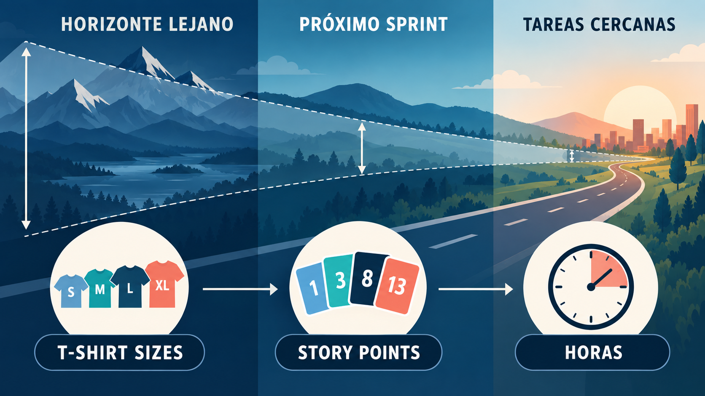
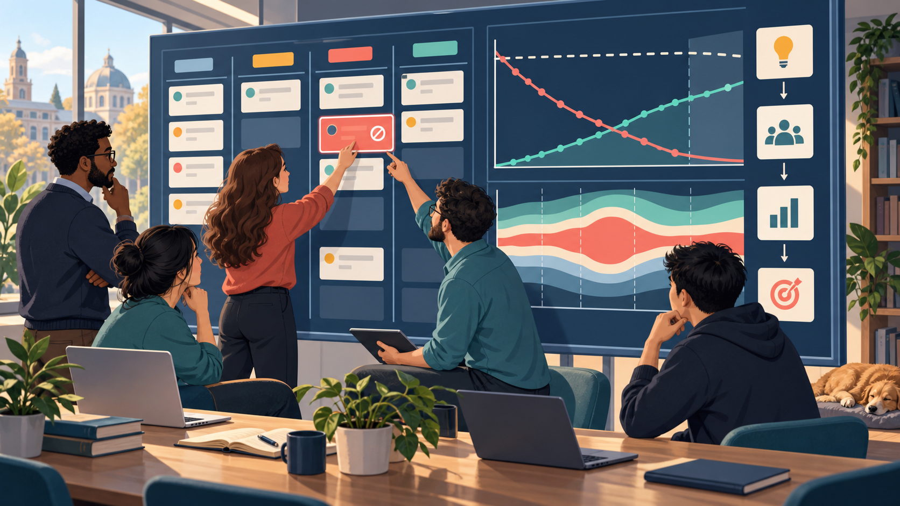
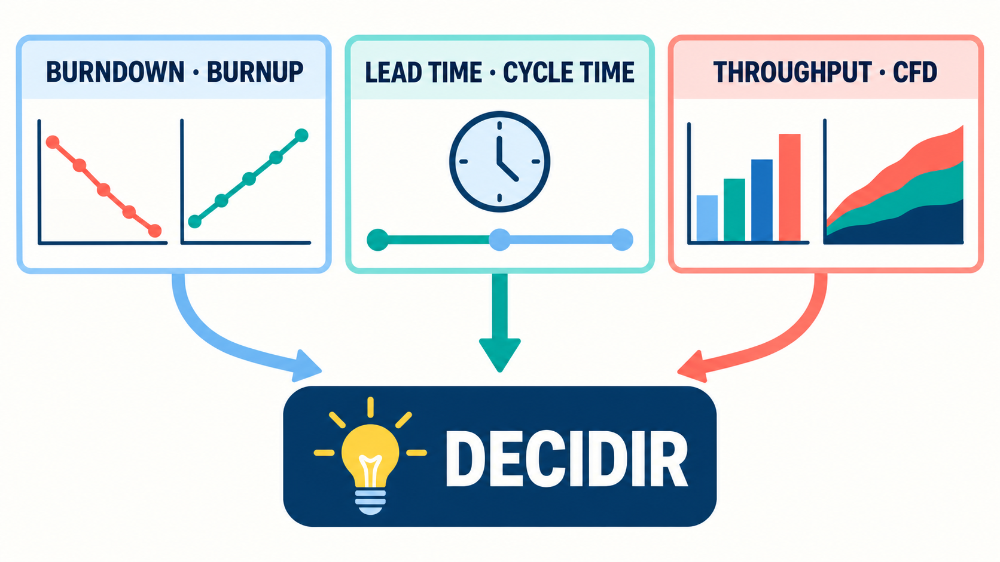
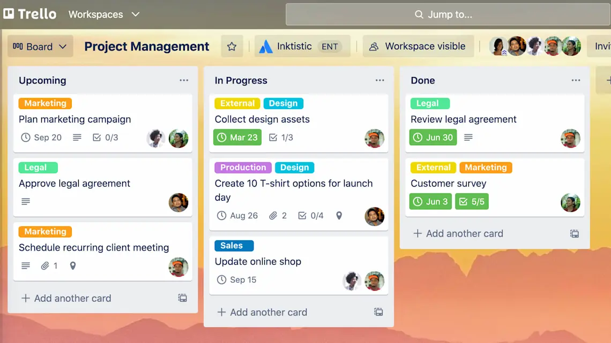
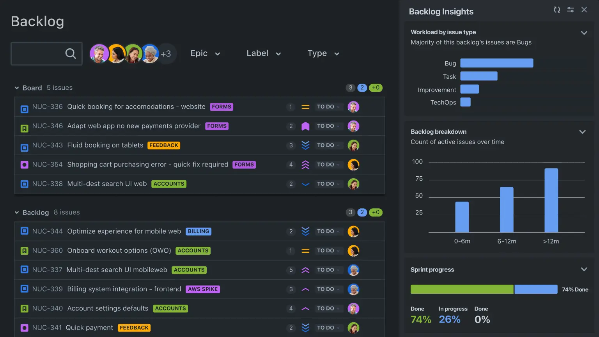

"¿Cuándo va a estar listo?" Es la pregunta que todo equipo escucha y que casi nadie sabe responder bien. Si decís una fecha exacta, probablemente te equivoques. Si decís "no sé", nadie puede planificar nada. En este módulo vas a aprender a responderla de manera profesional: con estimaciones honestas, datos reales del equipo y rangos en lugar de promesas.

También vas a ver cómo se sigue el trabajo día a día, tanto en Scrum como en Kanban: qué gráficos y métricas se usan, cómo se leen y qué decisiones permiten tomar. Y al final vas a conocer las herramientas que usan hoy los equipos, como Jira y Trello, y cómo la inteligencia artificial y los agentes están empezando a cambiar la forma de gestionar proyectos.

:::clave Seguimos con el asistente universitario
El equipo del **asistente con IA** ya tiene un Product Backlog ordenado (Módulo 3). Ahora la universidad quiere saber cuándo va a estar listo el piloto para todas las carreras, y el equipo necesita organizar su trabajo diario. Además, el asistente ya funciona para una carrera y empiezan a llegar pedidos de soporte. Vamos a seguir los dos frentes.
:::

:::clave Al terminar este módulo vas a poder
- Distinguir estimación, pronóstico y compromiso.
- Estimar con tallas de remera, puntos de historia y Planning Poker.
- Calcular la capacidad de un equipo, usar su velocidad para pronosticar y leer gráficos de avance.
- Medir y leer métricas de flujo en Kanban: lead time, cycle time, throughput y diagrama de flujo acumulado.
- Gestionar impedimentos, riesgos y dependencias.
- Conocer las principales herramientas de gestión y cómo la IA se usa hoy para gestionar proyectos.
:::

## 1. Estimar no es adivinar

Pensá en la última vez que calculaste cuánto ibas a tardar en un trabajo práctico de la facultad. ¿Terminaste en el tiempo que habías pensado? Si sos como la mayoría de las personas, probablemente no.

:::real Caso real: la falacia de la planificación (1994)
En 1994, los psicólogos Roger Buehler, Dale Griffin y Michael Ross pidieron a 37 estudiantes que estimaran cuánto tardarían en terminar su tesis. El promedio de las estimaciones fue de **34 días**. También les pidieron una estimación para el peor caso posible: en promedio, **49 días**.

¿Cuánto tardaron realmente? **56 días** en promedio. Más que el peor escenario que ellos mismos habían imaginado. Solo el 30 % terminó en el plazo que había estimado.

Este sesgo tiene nombre: **falacia de la planificación**. Las personas imaginan cómo debería salir todo y subestiman los imprevistos, aunque tengan experiencia de haberse equivocado antes. Es el mismo fenómeno que viste en la Ópera de Sídney del Módulo 1.

Fuente: [Buehler, Griffin y Ross, *Journal of Personality and Social Psychology*, 1994](https://web.mit.edu/curhan/www/docs/Articles/biases/67_J_Personality_and_Social_Psychology_366,_1994.pdf)
:::

Si hasta la gente que se equivocó muchas veces sigue subestimando, ¿cómo se estima bien? Primero, separando tres cosas que suelen confundirse:

| Concepto | Qué es | Ejemplo en el asistente |
|---|---|---|
| **Estimación** | Una aproximación del tamaño o del esfuerzo de un trabajo | "Esta historia es mediana, más o menos el doble que aquella" |
| **Pronóstico** | Una previsión de cuándo podría terminarse algo, basada en datos y supuestos | "Con el ritmo actual, el piloto para todas las carreras estaría en 6 a 8 Sprints" |
| **Compromiso** | Una meta que el equipo asume como propia | "En este Sprint vamos a lograr que el asistente responda sobre fechas de inscripción" |
Tabla: Estimación, pronóstico y compromiso

El error más común es tratar una estimación como si fuera un compromiso: alguien dice "creo que tarda dos semanas" y eso se convierte en una fecha firmada. Una estimación es una hipótesis, y como toda hipótesis se revisa cuando aparece evidencia nueva.

### 1.1 El cono de la incertidumbre

Al principio de un proyecto se sabe muy poco, y cualquier estimación tiene mucho margen de error. A medida que se trabaja, se aprende, se prueban las partes riesgosas y el margen se achica. Esa idea se representa con el **cono de la incertidumbre**: amplio al principio, cada vez más angosto.

Pero ojo: el cono no se achica solo porque pasa el tiempo. Se achica porque el equipo **toma decisiones y comprueba cosas**. Si la integración más riesgosa del asistente todavía no se probó, la incertidumbre sigue ahí, aunque el proyecto esté avanzado.

La consecuencia práctica es clara: **cuanto más lejano es el trabajo, más grande es el margen de la estimación**. Para algo que se hará en seis meses alcanza con "grande" o "chico"; para lo que se hará la semana que viene, conviene más detalle.

## 2. Estimar en Scrum: tallas, puntos y Planning Poker

:::contexto Contexto: Scrum
Desde acá hasta la sección 5 trabajamos dentro de Scrum. Las técnicas de estimación que vamos a ver son prácticas complementarias: Scrum no exige tallas de remera, puntos de historia ni Planning Poker. Son muy usadas porque ayudan a planificar los Sprints.
:::

:::ejemplo Pensá en dos edificios
Si te pregunto cuántos metros mide un edificio, probablemente te equivoques por mucho. Pero si te pregunto si ese edificio es más alto que el de al lado, y cuánto más, vas a acertar casi siempre: "el doble", "un poco más". A las personas nos cuesta estimar en valores absolutos, pero somos muy buenas **comparando**.
:::

Esa es la idea central de la estimación ágil: en lugar de calcular cuántas horas lleva algo, se compara el trabajo nuevo con trabajo ya conocido. Es la **estimación relativa**.

### 2.1 Tallas de remera

Para el trabajo lejano o todavía poco definido, como las épicas del roadmap, alcanza con clasificar por talla: **XS, S, M, L, XL**. No hace falta discutir números: solo el orden de magnitud. En una hora, un equipo puede clasificar veinte o treinta épicas.

| Talla | Ejemplo en el asistente |
|---|---|
| XS | Corregir el texto de un mensaje de error |
| S | Agregar una pregunta frecuente con su respuesta |
| M | Responder consultas sobre fechas de exámenes |
| L | Consultas sobre correlatividades, con los distintos planes de estudio |
| XL | Acceso desde WhatsApp (conviene dividirla antes de trabajarla) |
Tabla: Tallas de remera para el backlog del asistente

### 2.2 Puntos de historia

Cuando el trabajo se acerca, muchos equipos usan **puntos de historia** (*story points*): un número que expresa el tamaño relativo de una historia. Un punto **no equivale a una cantidad de horas**. Combina tres factores:

- **Volumen:** cuánto trabajo hay que hacer.
- **Complejidad:** qué tan difícil es resolverlo.
- **Incertidumbre:** cuánto no sabemos todavía.

Por eso dos historias con la misma cantidad de trabajo pueden tener puntos distintos: la que depende de una integración que el equipo nunca hizo vale más, porque tiene más incertidumbre.

La mayoría de los equipos usa una escala basada en la sucesión de Fibonacci: **1, 2, 3, 5, 8, 13, 20, 40, 100**. Los saltos crecen a propósito: entre 1 y 2 se puede distinguir, pero nadie puede justificar si algo grande vale 21 o 22. Si una historia recibe 20 o más, la señal es clara: es una épica y hay que dividirla.

Para empezar, el equipo elige una o dos **historias de referencia** ya conocidas ("esta vale 3") y compara todo lo demás contra ellas. En el asistente: si "agregar una pregunta frecuente" vale 2, entonces "responder sobre fechas de exámenes, conectando el calendario oficial por primera vez" podría valer 8, por el volumen y porque la conexión con el calendario nunca se hizo.

Como cada equipo construye su propia escala, **los puntos no se pueden comparar entre equipos**. Un 5 de un equipo puede ser un 8 de otro.

:::mito
**Mito:** un punto de historia equivale a una cantidad fija de horas.

**Realidad:** expresa tamaño relativo, combinando volumen, complejidad e incertidumbre. Cuánto tiempo lleva realmente surge del ritmo histórico del equipo, que se mide con la velocidad (sección 3).
:::

### 2.3 Planning Poker

:::historia Cartas para que nadie domine la conversación
En 2002, **James Grenning**, uno de los firmantes del Manifiesto Ágil, notó que en las reuniones de estimación siempre hablaban los mismos y los demás se acoplaban. Inventó una dinámica con cartas para que todos opinaran a la vez y la llamó **Planning Poker**. Mike Cohn la popularizó en 2005 en su libro *Agile Estimating and Planning*, y hoy es la técnica de estimación más conocida.

Fuente: [Wikipedia, "Planning poker"](https://en.wikipedia.org/wiki/Planning_poker)
:::

Así funciona una ronda:

1. Cada Developer tiene un mazo de cartas con los valores de la escala (1, 2, 3, 5, 8, 13...), más una carta "?" para "no sé".
2. El Product Owner lee la historia y sus criterios de aceptación, y el equipo pregunta lo que necesite.
3. Cada persona elige su carta **en secreto**.
4. Todos las dan vuelta **al mismo tiempo**.
5. Si hay mucha diferencia, quienes votaron el valor más alto y el más bajo explican por qué. Se vuelve a votar.

Mostrar las cartas a la vez evita dos sesgos: el de **anclaje** (el primer número que se dice condiciona a los demás) y el de **autoridad** (todos repiten lo que dice la persona más experimentada).

El verdadero valor está en la diferencia de votos. Supongamos que tres personas votan 5 y una vota 13. La que votó 13 explica: "Esta historia necesita el calendario de exámenes, y la oficina de alumnos nos avisó que lo publica tarde y en un formato distinto cada año". Nadie más lo sabía. Con esa información, la segunda ronda probablemente converja en 8. Planning Poker no sirve solo para llegar a un número: sirve para que todo el equipo comparta lo que sabe **antes** de empezar.

## 3. Capacidad y velocidad

Para planificar un Sprint, el equipo necesita dos datos distintos: cuánto tiempo tiene **disponible** en el Sprint que viene (capacidad) y cuánto suele **terminar** por Sprint (velocidad).

### 3.1 Capacidad: el tiempo real disponible

Un Sprint de dos semanas tiene diez días hábiles, pero nadie trabaja diez días completos en las historias del Sprint. Hay reuniones, licencias, consultas de otras áreas. La **capacidad** es el tiempo realmente disponible.

:::caso Ejemplo resuelto: la capacidad del equipo del asistente
El equipo tiene cinco personas y el Sprint dura diez días hábiles de ocho horas: 80 horas por persona. Cada persona dedica cerca de una hora por día a reuniones y coordinación. Además, la especialista en datos tiene tres días de licencia en este Sprint.
:::

| Integrante | Horas brutas | Descuentos | Capacidad neta |
|---|---|---|---|
| Programador A | 80 | 10 h de reuniones | 70 |
| Programadora B | 80 | 10 h de reuniones | 70 |
| Especialista en datos | 80 | 24 h de licencia y 7 h de reuniones (solo los días que está) | 49 |
| Diseñadora de experiencia | 80 | 10 h de reuniones | 70 |
| Evaluador de calidad | 80 | 10 h de reuniones | 70 |
| **Total** | **400** | | **329 horas** |
Tabla: Capacidad del equipo para un Sprint de dos semanas

Muchos equipos reservan además un margen para imprevistos, de entre el 10 % y el 20 %. Con un 15 %, la capacidad para planificar queda en 329 × 0,85 ≈ **280 horas**.

### 3.2 Velocidad: lo que el equipo realmente termina

La **velocidad** (*velocity*) es la cantidad de puntos de historia que el equipo **terminó** en cada Sprint. Solo cuentan las historias que cumplen la Definition of Done: una historia al 90 % suma cero. La velocidad mide entrega, no esfuerzo.

| Sprint | Puntos seleccionados al inicio | Puntos terminados |
|---|---|---|
| 1 | 32 | 28 |
| 2 | 30 | 31 |
| 3 | 35 | 25 |
| 4 | 28 | 30 |
| 5 | 32 | 32 |
Tabla: Velocidad del equipo del asistente en sus primeros cinco Sprints

La velocidad promedio es (28 + 31 + 25 + 30 + 32) ÷ 5 = **29,2 puntos por Sprint**. En el Sprint 2 se terminó más de lo seleccionado: durante el Sprint, el equipo sumó una historia con acuerdo del Product Owner. El Sprint 3 merece atención: se seleccionaron 35 puntos y se terminaron 25. Ese desvío es un buen tema para la retrospectiva: ¿una historia más difícil de lo estimado?, ¿una interrupción?, ¿se sobreestimó la capacidad?

### 3.3 Pronosticar con la velocidad

Con la velocidad se puede pronosticar. El backlog que falta para el piloto en todas las carreras suma **180 puntos**. Si el equipo termina entre 25 y 32 puntos por Sprint (su peor y su mejor Sprint):

- En el mejor caso: 180 ÷ 32 ≈ 5,6, es decir, **6 Sprints**.
- En el peor caso: 180 ÷ 25 = 7,2, es decir, **8 Sprints**.

La respuesta profesional a "¿cuándo va a estar listo?" no es "en 6 Sprints". Es: **"Con el alcance actual y el ritmo que venimos teniendo, entre 6 y 8 Sprints. Lo vamos a recalcular después de cada Sprint."**

:::mito
**Mito:** una velocidad más alta demuestra que un equipo es más productivo.

**Realidad:** la escala de puntos es propia de cada equipo y puede inflarse sin que se entregue más valor. Si la velocidad se convierte en una meta, los equipos empiezan a estimar más alto para "cumplir". La velocidad sirve para pronosticar el trabajo del propio equipo, nunca para comparar equipos ni personas.
:::

## 4. Seguir el avance de un Sprint

Si todo el equipo está ocupado pero nadie puede decir qué está por terminar, algo falla. El seguimiento en Scrum se apoya en dos cosas: un tablero que muestra el estado real y gráficos que muestran la tendencia.

### 4.1 El tablero del Sprint

El tablero muestra el Sprint Backlog con columnas que representan estados reales: por ejemplo, **Por hacer**, **En progreso**, **En revisión** y **Terminado**. Scrum no exige un tablero, pero casi todos los equipos lo usan. Una tarjeta bloqueada se marca de forma visible, y el trabajo que no se terminó al final del Sprint vuelve al Product Backlog para decidir qué hacer con él: no pasa automáticamente al Sprint siguiente.

### 4.2 Burndown: cuánto falta

El **gráfico de trabajo pendiente** (*burndown chart*) muestra, día a día, cuánto trabajo queda por terminar en el Sprint. Tiene una línea de referencia que baja en forma pareja desde el total hasta cero, y la línea real, que muestra lo que efectivamente falta.

| Día | Pendiente de referencia | Pendiente real | Cómo leerlo |
|---|---|---|---|
| 0 | 40 | 40 | Inicio del Sprint |
| 2 | 32 | 38 | Arranque lento: el equipo termina de entender las historias |
| 4 | 24 | 30 | Sigue por encima de la referencia |
| 6 | 16 | 15 | Varias historias se terminan juntas y el equipo se pone al día |
| 8 | 8 | 10 | Levemente por encima |
| 10 | 0 | 2 | Quedan 2 puntos sin terminar |
Tabla: Burndown de un Sprint de 40 puntos y diez días

La línea real casi nunca es una recta, y no hace falta que lo sea. Lo que importa es la **tendencia**. Si la distancia con la referencia crece día tras día, el objetivo del Sprint está en riesgo y conviene reaccionar cuanto antes, por ejemplo renegociando el alcance con el Product Owner. Si la línea **sube**, entró trabajo nuevo o una historia resultó más grande de lo pensado: hay que conversarlo en el Daily Scrum.

### 4.3 Burnup: separar el avance del alcance

El **gráfico de trabajo completado** (*burnup chart*) muestra lo contrario: cuánto se terminó, acumulado. Tiene dos líneas: la de trabajo completado, que sube, y la del **alcance total**, que sube en escalones cuando se agrega trabajo.

Su gran ventaja es que separa dos problemas que el burndown mezcla. Si el pronóstico de fecha se aleja, el burnup muestra si es porque el equipo avanza lento o porque **el alcance sigue creciendo**. Por eso se usa mucho para seguir lanzamientos de varios Sprints, como el piloto del asistente.

| | Burndown | Burnup |
|---|---|---|
| **Qué muestra** | Lo que falta | Lo completado y el alcance total |
| **Dirección** | Baja hacia cero | Sube hacia el total |
| **Cambios de alcance** | Se mezclan con el avance | Se ven como una línea aparte |
| **Uso más habitual** | Dentro de un Sprint | Un lanzamiento de varios Sprints |
Tabla: Burndown y burnup

:::caso Caso resuelto: planificar y seguir un Sprint del asistente
**Planificación.** El objetivo del Sprint es que los estudiantes de primer año encuentren los requisitos de inscripción vigentes y sepan de qué documento sale cada respuesta. Con una capacidad de 280 horas y una velocidad cercana a 29 puntos, el equipo selecciona 37 puntos. Es demasiado para ambas referencias: retira una historia de 13 puntos que no es esencial para el objetivo y queda en 24.

**Seguimiento.** Al quinto día, el burnup muestra un escalón hacia arriba: apareció una nueva fuente de información (el reglamento de ingreso) que no estaba prevista.

**Decisión.** En el Daily Scrum, los Developers conversan con el Product Owner. Protegen el objetivo, dejan fuera del Sprint una mejora visual de la interfaz y prueban primero la fuente nueva, que es la más riesgosa.

**Cierre.** En la Sprint Review, estudiantes y personal de la oficina prueban las respuestas. En la retrospectiva, el equipo decide pedir las fuentes a la oficina antes de cada Sprint Planning.
:::

## 5. Métricas de flujo en Kanban

:::contexto Contexto: Kanban
Cambiamos de sistema. En Kanban no hay Sprints ni velocidad: el trabajo fluye de forma continua. En el Módulo 2 viste el tablero, los límites de trabajo en curso y la Ley de Little. Acá vemos cómo se mide y se pronostica ese flujo.
:::

El asistente ya funciona para una carrera y el soporte recibe pedidos todos los días: documentos vencidos, respuestas incorrectas, pedidos de la oficina de alumnos. El equipo los gestiona con Kanban. ¿Cómo sabe si lo está haciendo bien?

### 5.1 Carriles y clases de servicio

Además de las columnas, un tablero Kanban puede tener **carriles** (en inglés, *swimlanes*): filas horizontales que agrupan tarjetas por tipo. Uno de los más usados es el **carril urgente** (*expedite*), ubicado arriba de todo, para lo que tiene que atenderse de inmediato. En el soporte del asistente, una respuesta con una fecha de inscripción incorrecta en plena época de inscripciones va a ese carril: se atiende antes que todo lo demás, y solo se permite una tarjeta urgente a la vez.

Esas reglas sobre cómo se atiende cada tipo de pedido se llaman **clases de servicio**. Hacerlas explícitas evita que "todo sea urgente".

### 5.2 Lead time y cycle time

:::ejemplo Pensá en un pedido de delivery
Pedís una pizza a las 21:00. El local empieza a prepararla a las 21:15 y te llega a las 21:45. Desde tu punto de vista, esperaste **45 minutos**. Desde el punto de vista de la cocina, el pedido tardó **30 minutos**. Los dos datos son ciertos y sirven para cosas distintas.
:::

- El **lead time** mide desde que alguien **pide** algo hasta que lo **recibe**. Es la experiencia del cliente.
- El **cycle time** mide desde que el equipo **empieza** a trabajar hasta que **termina**. Es el tiempo del proceso interno.

La diferencia entre los dos es tiempo de espera antes de empezar. Si el lead time es mucho mayor que el cycle time, el problema no es que el equipo trabaje lento: es que los pedidos esperan demasiado en la fila.

A diferencia de los puntos de historia, estas métricas se miden en **días reales**, así que se entienden fácilmente fuera del equipo y se pueden comparar a lo largo del tiempo.

### 5.3 Throughput y antigüedad

El **throughput** (rendimiento) es la cantidad de elementos terminados por período: por ejemplo, "cerramos ocho pedidos esta semana". No usa puntos ni estimaciones: solo cuenta. Su limitación es que trata igual un pedido chico que uno grande, por eso conviene que los elementos tengan tamaños parecidos.

La **antigüedad** (*work item age*) mide cuánto tiempo lleva abierta una tarjeta que todavía no se terminó. Es la métrica que más rápido avisa de un problema: una tarjeta que lleva diez días en "En validación" cuando lo normal son dos, necesita atención hoy, no cuando finalmente se cierre.

Veamos un ejemplo con tres pedidos de soporte del asistente, medidos en días:

| Pedido | Llegó | Se empezó | Se terminó | Lead time | Cycle time |
|---|---|---|---|---|---|
| A | Día 1 | Día 2 | Día 5 | 4 días | 3 días |
| B | Día 1 | Día 3 | Día 7 | 6 días | 4 días |
| C | Día 2 | Día 4 | Día 8 | 6 días | 4 días |
Tabla: Tiempos de tres pedidos de soporte

:::caso Ejemplo resuelto: leer tiempos y salidas juntos
**Lead time promedio:** (4 + 6 + 6) ÷ 3 ≈ **5,3 días**. **Cycle time promedio:** (3 + 4 + 4) ÷ 3 ≈ **3,7 días**. La diferencia, 1,6 días, es espera antes de empezar. **Throughput:** entre los días 5 y 8 se terminaron tres pedidos.

**Lectura.** Casi un tercio del tiempo que esperan los usuarios, los pedidos están quietos en la fila. Antes de pedir que el equipo trabaje más rápido, conviene revisar cómo se eligen los pedidos y si entran más de los que se pueden atender. Y tres pedidos son pocos: hacen falta más datos antes de prometer plazos.
:::

## 6. Ver el flujo y pronosticar sin puntos

### 6.1 El diagrama de flujo acumulado

El **diagrama de flujo acumulado** (*Cumulative Flow Diagram*, CFD) muestra en un solo gráfico cuántos elementos hubo en cada columna del tablero a lo largo del tiempo. Cada columna es una banda de color apilada sobre las demás. Se lee así:

- **El grosor de una banda** indica cuántos elementos hay en esa etapa. Si la banda de "En validación" se ensancha semana a semana, ahí se está acumulando trabajo: es un cuello de botella.
- **La pendiente de la banda de "Terminado"** indica el ritmo de entrega. Si se aplana, el equipo dejó de entregar, aunque siga ocupado.
- **Un flujo sano** muestra bandas de grosor parejo, que suben de forma paralela.

### 6.2 Pronosticar con datos de flujo

Kanban permite pronosticar sin estimar nada: alcanza con registrar cuándo empieza y cuándo termina cada elemento. Con ese historial, en lugar de promedios, se usan **percentiles**:

> "El 85 % de los pedidos de soporte de las últimas doce semanas se resolvió en 6 días o menos."

Es una afirmación probabilística y honesta: no promete que el próximo pedido tardará 6 días, pero dice qué es lo esperable. Para pronosticar cuántos elementos se terminarán en un período, muchos equipos usan **simulaciones de Monte Carlo**: el sistema repite miles de veces el futuro usando el throughput histórico y devuelve rangos de probabilidad ("hay un 85 % de probabilidad de terminar al menos 30 pedidos este mes"). Varias herramientas actuales lo calculan automáticamente.

:::caso Caso resuelto: el soporte del asistente con Kanban
**El tablero.** El equipo dibuja el flujo real: Solicitado, En análisis, En corrección, Validación académica y Terminado, con un carril urgente arriba.

**Las políticas.** Límite de 3 tarjetas en corrección y 2 en validación. Ningún cambio de documento se termina sin registrar su vigencia, quién lo aprobó y una prueba de la respuesta.

**Las métricas.** Cada mañana revisan la antigüedad de las tarjetas. A las tres semanas, el diagrama de flujo acumulado muestra que la banda de validación se ensancha: la oficina de alumnos no alcanza a revisar todo.

**La decisión.** Acuerdan con la oficina una guardia rotativa: cada día, una persona dedica una hora a validar. Dos semanas después, la banda se normaliza.

**La comunicación.** Con los datos de doce semanas, informan a la universidad: "El 85 % de los pedidos se resuelve en 6 días o menos; los urgentes, en el día". Sin Sprints ni puntos.
:::

## 7. Impedimentos, riesgos y dependencias

:::contexto Aplicación transversal
Lo que sigue vale tanto para Scrum como para Kanban. Cambian quiénes se ocupan y cómo, pero todos los equipos necesitan gestionarlo.
:::

### 7.1 Impedimentos: lo que ya está frenando el trabajo

Un **impedimento** (o bloqueo) es algo que **ya** está impidiendo avanzar: un ambiente de pruebas caído, una aprobación pendiente, una persona clave ausente. Se gestiona con tres reglas:

- **Hacerlo visible de inmediato:** marcar la tarjeta en el tablero apenas aparece, sin esperar a la reunión del día siguiente.
- **Asignar quién se ocupa:** en Scrum, el Scrum Master ayuda a removerlo, aunque no tiene que resolver cada bloqueo en persona. En Kanban, lo definen las políticas del equipo.
- **Escalar rápido** cuando el equipo no puede resolverlo solo.

Muchos equipos llevan un **registro de impedimentos** con la fecha, la descripción, el responsable y la fecha de resolución. Su mayor utilidad es encontrar patrones: si "esperando aprobación de la oficina de alumnos" aparece Sprint tras Sprint, no es mala suerte. Es un problema del proceso que hay que resolver de raíz.

### 7.2 Riesgos: lo que podría pasar

En el Módulo 1 viste qué es un riesgo y las cuatro respuestas posibles. En el seguimiento diario, la diferencia con un impedimento es simple: el impedimento **ya pasó**; el riesgo **podría pasar**.

La regla práctica más importante: **atacar primero lo más riesgoso**. Si una historia depende de algo que nadie sabe si funciona, conviene hacerla al principio del Sprint, cuando todavía hay tiempo para reaccionar. Y si la incertidumbre es muy grande, se hace un ***spike***: una investigación corta, con tiempo limitado, que responde una pregunta concreta antes de comprometerse. Por ejemplo: "dedicar dos días a probar si el calendario de exámenes se puede leer de forma automática".

Un sistema con IA agrega riesgos propios:

| Riesgo | Señal temprana | Respuesta posible |
|---|---|---|
| Documento desactualizado | Cambia la fecha de vigencia de una fuente | Versionar las fuentes y repetir las evaluaciones |
| Respuesta sin respaldo | El asistente no puede mostrar una fuente aprobada | Derivar la consulta a una persona y registrar el caso |
| Costo imprevisible | Sube el costo por consulta del servicio de IA | Medirlo, fijar alertas y comparar alternativas |
| Respuestas que empeoran | Bajan los resultados de la evaluación semanal | Volver a la versión anterior e investigar el cambio |
Tabla: Riesgos propios del asistente con IA

### 7.3 Dependencias

Una **dependencia** existe cuando un trabajo no puede avanzar hasta que otro equipo, área o proveedor haga su parte. El asistente depende de que la oficina de alumnos publique el calendario y de que el área de sistemas habilite los accesos. Las dependencias se marcan en el tablero, se conversan temprano con quien corresponde y, cuando hay varios equipos, se coordinan en reuniones específicas (lo vas a ver en el Módulo 5).

## 8. Las herramientas que usan hoy los equipos

:::contexto Herramientas
Una herramienta hace visible el sistema de trabajo que el equipo ya acordó. No lo define: usar Jira no convierte a nadie en Scrum, y un tablero de Trello no es Kanban si no tiene políticas y límites.
:::

Los equipos ágiles de hoy trabajan casi siempre con alguna herramienta digital. Hay decenas, pero la mayoría se agrupa en unas pocas familias:

| Herramienta | Para qué se destaca | Ideal para |
|---|---|---|
| **Jira** (Atlassian) | Backlog, Sprints, tableros Scrum y Kanban, reportes y automatizaciones | Equipos de desarrollo de software; una de las más usadas en proyectos ágiles |
| **Trello** (Atlassian) | Tableros simples de listas y tarjetas | Empezar, equipos chicos, proyectos simples |
| **Asana**, **Monday.com**, **ClickUp** | Gestión de proyectos y tareas en general, con varias vistas | Equipos de negocio, marketing o proyectos mixtos |
| **Notion** | Documentos, bases de datos y tareas en un mismo lugar | Documentar decisiones y combinar conocimiento con tareas |
| **Linear** | Seguimiento de trabajo rápido y minimalista | Equipos de producto digital y startups |
| **GitHub Projects**, **Azure DevOps** | Gestión integrada con el código | Equipos que quieren todo junto al repositorio |
Tabla: Las principales herramientas de gestión de proyectos

Vamos a mirar de cerca las dos más usadas en proyectos ágiles de software: Trello, para entender el tablero, y Jira, para gestionar un producto completo.

### 8.1 Trello: el tablero en su forma más simple

**Trello** organiza el trabajo en **tableros**, **listas** (las columnas) y **tarjetas** (los elementos de trabajo). Cada tarjeta puede tener responsable, fecha, lista de verificación, etiquetas y comentarios. Es fácil de aprender y tiene una versión gratuita, por eso es ideal para dar los primeros pasos.

Para leer un tablero, primero mirá dónde se acumulan tarjetas; después, cuáles están bloqueadas o llevan demasiado tiempo en la misma lista. Así podría verse una tarjeta del asistente:

| Campo | Contenido |
|---|---|
| Título | Mostrar la fuente de una respuesta sobre inscripción |
| Resultado esperado | El estudiante puede abrir el documento oficial y ver su vigencia |
| Criterio clave | Si no hay fuente aprobada, el asistente deriva la consulta |
| Evidencia | Pruebas con casos correctos, con documentos vencidos y sin fuente |
Tabla: Una tarjeta de Trello del asistente

### 8.2 Jira: gestionar un producto completo

**Jira** es una de las herramientas de gestión de proyectos ágiles más usadas en equipos de software. Agrega todo lo que un tablero simple no tiene: un backlog priorizable, Sprints, tableros Scrum y Kanban, tipos de elementos (épicas, historias, tareas, errores y subtareas, como viste en el Módulo 3), flujos de trabajo configurables y reportes automáticos, como el burndown, la velocidad y el diagrama de flujo acumulado.

Para el asistente, una épica en Jira podría ser "Consultas de inscripción"; una historia, "Citar la fuente vigente en cada respuesta"; y sus subtareas, "Conectar el calendario" y "Escribir las pruebas". Un error encontrado en validación se carga como tipo *bug*.

Un consejo importante: configurá primero las columnas para que representen los estados reales, mantené las tarjetas actualizadas y recién después mirá los reportes. Un burndown calculado sobre tarjetas desactualizadas muestra una precisión que no existe.

### 8.3 ¿Cuál elegir?

- **Para aprender o para un equipo chico:** Trello o incluso un tablero en la pared.
- **Para un producto de software con backlog, Sprints y reportes:** Jira.
- **Para documentar decisiones y experimentos junto con las tareas:** Notion, como complemento.

La marca importa menos de lo que parece. Lo que realmente importa es que los acuerdos del equipo estén claros y los datos estén al día.

## 9. La inteligencia artificial en la gestión de proyectos

Hasta ahora, en esta materia, la IA fue el **producto** que construye el equipo: el asistente universitario. Pero hay una segunda relación, igual de importante para tu carrera: la IA como **herramienta para gestionar** el trabajo.

### 9.1 Lo que la IA ya hace hoy

Las principales herramientas de gestión ya incorporan IA en el trabajo diario. Estas son algunas de las tareas más comunes:

- **Resumir:** convertir un hilo de cincuenta comentarios en un párrafo con las decisiones tomadas.
- **Redactar y dividir:** proponer una historia de usuario a partir de una idea, sugerir criterios de aceptación o dividir una épica en historias.
- **Detectar problemas:** marcar tarjetas estancadas, dependencias que se repiten o Sprints con más trabajo que capacidad.
- **Preparar informes:** armar el resumen del Sprint para los interesados a partir de los datos del tablero.
- **Buscar:** responder preguntas como "¿qué decidimos sobre el acceso desde WhatsApp?" buscando en tareas, documentos y conversaciones.

### 9.2 De asistentes a agentes

El salto más reciente es el paso de **asistentes** a **agentes**. Un asistente responde cuando le preguntás. Un **agente de IA** recibe un objetivo y trabaja para lograrlo por su cuenta: planifica los pasos, usa herramientas, revisa el resultado y ajusta.

:::real Caso real: los agentes ya son "compañeros de equipo" en Jira y Notion (2025 y 2026)
En 2025, Atlassian habilitó en Jira los **agentes de Rovo**, su plataforma de IA: a un agente se le puede **asignar una tarea igual que a una persona del equipo**, mencionarlo en los comentarios e integrarlo en el flujo de trabajo. Los agentes respetan los permisos y los flujos configurados, y todo lo que hacen queda registrado en el historial de la tarea. En mayo de 2026, Atlassian sumó un modo en el que la IA divide un pedido complejo en un plan de varios pasos y lo ejecuta entre distintas herramientas, pidiendo intervención humana solo cuando hace falta una decisión.

En septiembre de 2025, Notion presentó su versión 3.0 con **agentes** capaces de trabajar más de veinte minutos seguidos en tareas de varios pasos: por ejemplo, armar un plan de lanzamiento, dividirlo en tareas, asignarlas y redactar los primeros documentos.

Fuentes: [Atlassian, "Introducing agents in Jira"](https://www.atlassian.com/blog/rovo/ai-agents-in-jira) y [Notion, "Notion 3.0: Agents"](https://www.notion.com/releases/2025-09-18)
:::

### 9.3 ¿Se parecen un agente de IA y un equipo ágil?

Mirá cómo funciona por dentro un agente de IA moderno. En 2022, un grupo de investigadores de Princeton y Google publicó un trabajo muy influyente, llamado **ReAct**, que mostró que un modelo de lenguaje resuelve mejor las tareas cuando alterna tres pasos en un ciclo: **pensar** qué hacer, **actuar** (usar una herramienta, buscar un dato) y **observar** el resultado, para volver a pensar con esa información nueva. Buena parte de los agentes actuales se basa en esa idea.

¿Te suena? Es el mismo ciclo que recorrió toda esta materia:

| Un equipo ágil | Un agente de IA |
|---|---|
| Planifica un Sprint con un objetivo | Arma un plan para cumplir el objetivo que recibió |
| Construye un incremento | Ejecuta una acción con una herramienta |
| Inspecciona el resultado en la Review | Observa el resultado de la acción |
| Adapta el plan para el próximo Sprint | Ajusta el plan y decide el siguiente paso |
| Mejora su forma de trabajar en la retrospectiva | Registra lo aprendido para las próximas tareas |
Tabla: El ciclo de un equipo ágil y el de un agente de IA

La agilidad y los agentes comparten la misma intuición de fondo: cuando no se puede saber todo de antemano, lo mejor es avanzar en pasos cortos, mirar qué pasó y corregir. Por eso, entender la agilidad te va a servir también para diseñar, supervisar y trabajar con agentes.

Pero hay una diferencia que importa mucho: un equipo ágil tiene **responsabilidad**. Decide qué es valioso, responde por la calidad y rinde cuentas ante los usuarios. Un agente ejecuta dentro de los permisos que le dieron, pero no es responsable de las consecuencias. Esa responsabilidad sigue siendo de las personas.

:::real Caso real: Klarna y el límite de la automatización (2024 y 2025)
En febrero de 2024, la empresa financiera Klarna anunció que su asistente de IA había atendido en su primer mes **2,3 millones de conversaciones**, dos tercios de todas las consultas de atención al cliente, el trabajo equivalente a **700 personas**. El tiempo de resolución bajó de 11 minutos a menos de 2.

Un año después, la empresa corrigió el rumbo. En mayo de 2025, su CEO reconoció que habían ido demasiado lejos al reemplazar personas y que la calidad se había resentido en los casos complejos. Klarna volvió a contratar personas para las situaciones que requieren criterio (reclamos, reembolsos complicados, clientes con dificultades financieras) y pasó a un modelo mixto: la IA resuelve lo simple y las personas, lo delicado.

La lección vale también para la gestión de proyectos: los agentes pueden hacer mucho trabajo, pero medir solo la cantidad puede ocultar problemas de calidad, y las decisiones con consecuencias importantes necesitan una persona responsable.

Fuentes: [Klarna, comunicado de febrero de 2024](https://www.klarna.com/international/press/klarna-ai-assistant-handles-two-thirds-of-customer-service-chats-in-its-first-month/) y [Forbes, mayo de 2025](https://www.forbes.com/sites/quickerbettertech/2025/05/18/business-tech-news-klarna-reverses-on-ai-says-customers-like-talking-to-people/)
:::

### 9.4 Cómo trabajar con IA en la gestión

Para usar la IA como apoyo sin perder el control, conviene seguir un circuito simple:

1. **Una persona define el objetivo** y le da a la IA el contexto necesario, sin datos que no debería ver.
2. **La IA propone:** un resumen, una división de historias, un informe o una acción.
3. **Una persona revisa** que sea correcto, que respete los permisos y que no tenga efectos no deseados.
4. **Queda registrado** qué hizo la IA y quién lo aprobó.

:::preguntas Preguntas antes de delegar una tarea en un agente
- ¿Qué pasa si el agente se equivoca? ¿Es fácil de detectar y de corregir?
- ¿A qué datos y sistemas tiene acceso? ¿Necesita todos esos permisos?
- ¿Quién revisa su trabajo, y cada cuánto?
- ¿La tarea requiere decidir prioridades o aceptar un resultado? Entonces la decisión final es de una persona.
- ¿Cómo vamos a medir la calidad, y no solo la cantidad, de lo que hace?
:::

¿Hacia dónde va esto? Todo indica que los equipos van a trabajar cada vez más con agentes que preparan el backlog, actualizan tableros, detectan riesgos y redactan informes. Las tareas repetitivas de la gestión se van a automatizar. Lo que no se automatiza es lo que estudiaste en esta materia: decidir qué vale la pena construir, conversar con los usuarios, cuidar la calidad y hacerse responsable del resultado. Esas habilidades se vuelven más valiosas, no menos.

## 10. Scrum y Kanban: comparar y combinar

:::contexto Comparación e integración
Estudiaste la planificación y el seguimiento de Scrum y de Kanban por separado. Ahora sí los comparamos.
:::

| Pregunta | Scrum | Kanban |
|---|---|---|
| ¿Cómo organiza el tiempo? | Sprints de duración fija | Flujo continuo; las revisiones se acuerdan |
| ¿Qué orienta el trabajo? | El Product Goal y el Sprint Goal | El propósito del servicio y sus políticas |
| ¿Cómo se estima? | Tallas de remera, puntos de historia, Planning Poker (opcionales) | No hace falta estimar: se usan datos de flujo |
| ¿Cómo se pronostica? | Con la velocidad del equipo | Con percentiles de cycle time y throughput |
| ¿Qué gráficos se usan? | Burndown y burnup | Diagrama de flujo acumulado |
| ¿Cómo se limita el trabajo? | Con la selección del Sprint (y opcionalmente límites WIP) | Con límites WIP explícitos |
Tabla: Planificación y seguimiento en Scrum y en Kanban

Un producto puede usar los dos a la vez. Es lo que le pasa al asistente universitario: el desarrollo de nuevas capacidades (consultas sobre correlatividades) se gestiona con **Scrum**, porque necesita un objetivo compartido, validación con estudiantes y un incremento integrado. El soporte de lo que ya funciona se gestiona con **Kanban**, porque llega de forma continua.

Para que la combinación funcione, el equipo acuerda cuatro cosas:

- **Separar:** cada tipo de trabajo entra al sistema que le corresponde. El soporte no se esconde dentro del Sprint.
- **Reservar capacidad:** queda claro quién atiende el soporte cada semana y cuánto tiempo le dedica.
- **Conectar:** si el mismo problema aparece una y otra vez en soporte, se convierte en un elemento del Product Backlog para resolverlo de raíz.
- **Definir las urgencias:** qué pedido justifica interrumpir el trabajo del Sprint, y quién lo decide.

## Recursos audiovisuales sugeridos

- [Story points & the evolution of agile estimation](https://www.youtube.com/watch?v=_N5gj9gzOjg), de Atlassian. Una conversación entre especialistas sobre por qué se estima en forma relativa y cuáles son sus límites.
- [Agile Estimating: How Teams Estimate with Story Points](https://learn.mountaingoatsoftware.com/agile/agile-estimation-estimating-with-story-points), de Mike Cohn. Explica la comparación, los puntos y Planning Poker con ejemplos (en inglés).

## Para profundizar

- [Scrum.org, "Myth 9: Story Points are Required in Scrum"](https://www.scrum.org/resources/blog/myth-9-story-points-are-required-scrum): por qué los puntos de historia son opcionales.
- [Trello 101](https://trello.com/en/guide/trello-101) y la [guía de inicio de Jira](https://www.atlassian.com/software/jira/guides/getting-started/basics): las guías oficiales para empezar a usar cada herramienta.
- [Atlassian, "Introducing agents in Jira"](https://www.atlassian.com/blog/rovo/ai-agents-in-jira): cómo funcionan los agentes de IA dentro de Jira.
- Yao y otros, ["ReAct: Synergizing Reasoning and Acting in Language Models"](https://arxiv.org/pdf/2210.03629): el trabajo que describe el ciclo de pensar, actuar y observar de los agentes.

## Síntesis del módulo

La pregunta "¿cuándo va a estar listo?" se responde con datos y rangos, no con promesas.

- **Estimar, pronosticar y comprometerse** son cosas distintas. Las personas tendemos a subestimar: por eso las estimaciones se revisan con evidencia.
- **En Scrum**, se estima en forma relativa (tallas, puntos, Planning Poker), se calcula la capacidad disponible y se pronostica con la velocidad real del equipo. El burndown muestra lo que falta; el burnup separa el avance del alcance.
- **En Kanban**, no hace falta estimar: lead time, cycle time, throughput y antigüedad miden el flujo, el diagrama de flujo acumulado muestra dónde se acumula el trabajo y los percentiles permiten pronosticar.
- **Impedimentos, riesgos y dependencias** se hacen visibles temprano y se atacan primero los más riesgosos.
- **Las herramientas**, como Jira y Trello, hacen visible el sistema de trabajo, pero no lo reemplazan.
- **La IA y los agentes** ya ayudan a gestionar: resumen, proponen, detectan y ejecutan tareas. Comparten con la agilidad el ciclo de planificar, actuar, observar y ajustar, pero la responsabilidad sigue siendo de las personas.

**Próximo paso.** Los datos y las herramientas solo sirven si las personas pueden interpretarlos y actuar. En el Módulo 5 vas a ver cómo se forman los equipos ágiles, cómo se lidera, cómo se mejora de forma continua y qué enseñan los casos reales de proyectos exitosos y fallidos.
