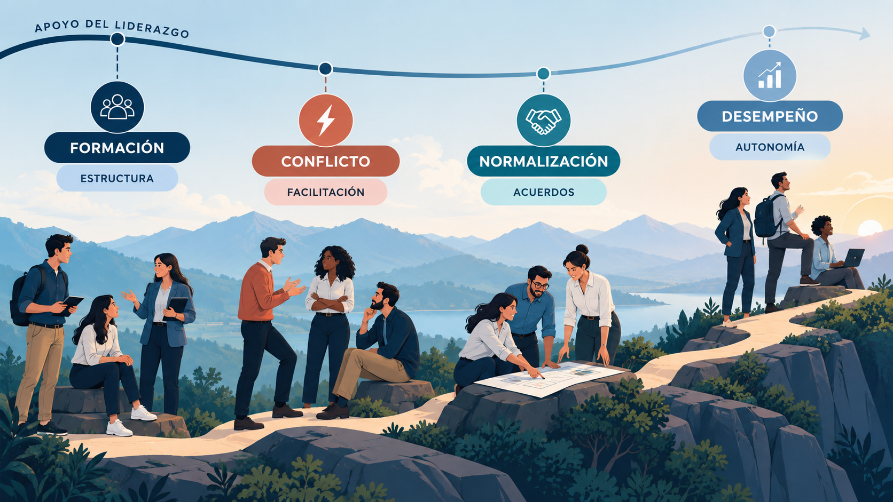
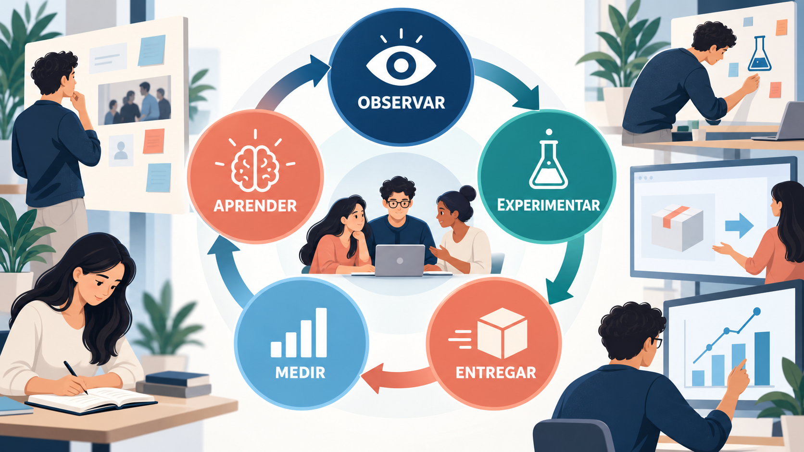
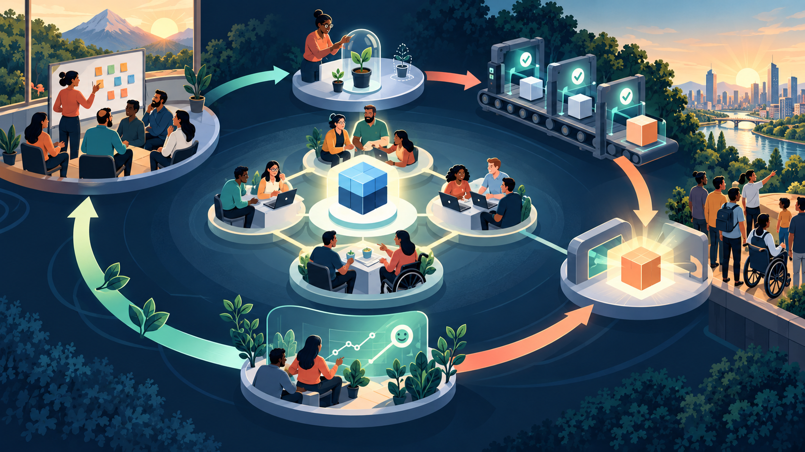

Podés tener el mejor backlog, el tablero más prolijo y las métricas perfectas, y aun así fracasar. Porque, al final, los proyectos los hacen personas. Si nadie se anima a decir que algo está mal, si el líder controla cada tarea, si cada cambio en producción es una apuesta o si la organización castiga los errores, ningún marco de trabajo va a salvar el proyecto.

Este último módulo trata sobre eso: cómo se forman y se lideran los equipos ágiles, cómo mejoran de forma continua, cómo sostienen la calidad y cómo se coordinan cuando son muchos. Y cierra con lo que pide el programa de la materia: **casos reales de proyectos exitosos y de desafíos comunes**, para ver todo lo aprendido funcionando (y fallando) en el mundo real.

:::clave El asistente universitario, en su etapa final
El **asistente con IA** ya funciona para varias carreras. El equipo creció, trabaja en parte a distancia, convive con la oficina de alumnos y con el área de sistemas, y la universidad evalúa extenderlo a otras sedes. Los desafíos ya no son de planificación: son de personas, calidad y organización. Al final del módulo vamos a recorrer el proyecto completo, de principio a fin.
:::

:::clave Al terminar este módulo vas a poder
- Explicar cómo se forma un equipo ágil y qué significa la autogestión.
- Reconocer el liderazgo de servicio y la importancia de la seguridad psicológica.
- Hacer que una Sprint Review y una retrospectiva produzcan cambios reales.
- Relacionar la agilidad con la calidad, la deuda técnica, la entrega continua y DevOps.
- Comparar formas de coordinar varios equipos: Scrum of Scrums, SAFe y LeSS.
- Analizar casos reales de adopción ágil, con sus logros y sus límites.
:::

## 1. El equipo ágil

:::contexto Concepto general
Las secciones 1 a 5 tratan sobre equipos, liderazgo y colaboración. Valen para cualquier enfoque ágil; cuando algo sea propio de Scrum, lo vamos a aclarar.
:::

Un equipo ágil no es un grupo de personas que trabajan cerca: es un grupo que **comparte un resultado**. Esa diferencia cambia todo. En un grupo, cada uno hace su parte y la pasa al siguiente. En un equipo, todos responden juntos por que el resultado funcione.

### 1.1 Multifuncional: todas las habilidades necesarias

Un equipo **multifuncional** reúne, entre todos sus integrantes, las habilidades necesarias para crear un resultado utilizable. No significa que cada persona sepa hacer todo. Significa que el equipo no depende de otros para terminar su trabajo.

| Capacidad | Pregunta que aporta al asistente |
|---|---|
| Producto y conocimiento universitario | ¿Qué consulta importa y qué fuente está vigente? |
| Datos e IA | ¿Qué información usa el sistema y cómo se evalúa? |
| Programación y operación | ¿Cómo se integra, se protege y se mantiene funcionando? |
| Experiencia de usuario | ¿El estudiante entiende la respuesta y sabe qué hacer? |
| Calidad | ¿Qué puede fallar y cómo lo comprobamos? |
Tabla: Las capacidades del equipo del asistente

### 1.2 Tamaño y estabilidad

La Guía de Scrum habla de equipos de **diez personas o menos**. La razón es simple: cuanta más gente, más canales de comunicación. Con 5 personas hay 10 pares posibles de conversación; con 10 personas, 45; con 15, 105. Más allá de cierto tamaño, el equipo pasa más tiempo coordinándose que trabajando. Es otra cara de la ley de Brooks del Módulo 1.

La **estabilidad** también importa. Un equipo que trabaja junto durante meses desarrolla confianza, conocimiento compartido y formas de trabajo propias. Armar y desarmar equipos para cada proyecto hace perder todo eso. Por eso las organizaciones ágiles prefieren equipos estables que reciben trabajo, en lugar de mover personas de un proyecto a otro.

## 2. Autogestión: qué es y qué no es

La Guía de Scrum describe al equipo como **autogestionado**: decide internamente quién hace qué, cuándo y cómo. El Manifiesto hablaba de equipos **autoorganizados**. La idea de fondo es la misma, y tiene una justificación muy práctica: quienes están más cerca del trabajo tienen la mejor información para decidir cómo hacerlo.

Pero pocas ideas ágiles se malinterpretan tanto. Estos son los malentendidos más comunes:

| Lo que se cree | Lo que realmente significa |
|---|---|
| "Autogestionado" significa "sin líder" | El liderazgo no desaparece: cambia de forma. Distintas personas lideran según el tema, y hay roles que sostienen al equipo, como el Scrum Master |
| El equipo elige qué producto construir | El Product Owner decide las prioridades del producto. El equipo decide cómo trabajar y participa en definir el objetivo de cada Sprint |
| Un equipo autogestionado no necesita reglas | Todo lo contrario: suele tener reglas más claras, porque las definió él mismo (la Definition of Done, los acuerdos de trabajo) |
| La autogestión se declara de un día para el otro | Es una capacidad que se desarrolla con el tiempo, a medida que el equipo gana experiencia y confianza |
Tabla: Malentendidos sobre la autogestión

Una herramienta muy útil son los **acuerdos de trabajo**: reglas que el equipo define en conjunto sobre cómo quiere trabajar. Por ejemplo, en el equipo del asistente: "respondemos los mensajes del equipo dentro del día hábil", "ninguna respuesta del asistente se publica sin que la vea alguien de la oficina de alumnos" o "las reuniones empiezan puntuales y terminan con acuerdos escritos". Cuando surge un desacuerdo sobre cómo hacer algo, los acuerdos son una referencia neutral.

## 3. Liderazgo de servicio

:::ejemplo Pensá en el director técnico de un equipo de fútbol
El DT prepara al equipo durante la semana, elige la estrategia, corrige, motiva y consigue lo que los jugadores necesitan. Pero cuando empieza el partido, no puede entrar a la cancha: son los jugadores quienes deciden cada jugada, en tiempo real, con la información que solo ellos tienen. Un buen DT no juega por su equipo: crea las condiciones para que su equipo juegue bien.
:::

Esa es la idea del **liderazgo de servicio** (*servant leadership*), formulada por **Robert Greenleaf** en 1970 y adoptada después por la comunidad ágil. Invierte la pirámide tradicional: el líder no está arriba dando órdenes, sino abajo, sosteniendo al equipo. Su pregunta no es "¿qué necesito que este equipo haga?", sino "¿qué necesita este equipo de mí para hacer su mejor trabajo?".

| | Liderazgo tradicional | Liderazgo de servicio |
|---|---|---|
| **De dónde viene su autoridad** | Del cargo | De la confianza y la competencia |
| **En qué se concentra** | En controlar que se cumpla el plan | En que el equipo pueda decidir y entregar valor |
| **Quién decide** | El líder | Quien tiene la mejor información |
| **Frente al error** | Se busca un culpable | Se busca qué aprender |
| **Frente a un obstáculo** | Lo informa hacia arriba y espera | Lo remueve o ayuda al equipo a removerlo |
| **Cómo se mide su éxito** | Cumplimiento de plazos y presupuesto | Que el equipo entregue valor de forma sostenida y con cada vez más autonomía |
Tabla: Liderazgo tradicional y liderazgo de servicio

En concreto, un líder de servicio remueve obstáculos, protege al equipo de interrupciones, desarrolla a las personas, escucha antes de proponer, facilita decisiones colectivas y, sobre todo, mantiene clara la visión de hacia dónde va el equipo. Servir no es lo mismo que no dirigir.

En Scrum, el **Scrum Master** es un líder de servicio del equipo y de la organización. Un error muy frecuente es que termine actuando como un jefe de proyecto disfrazado: asigna tareas, controla horarios y reporta el avance de cada persona. Cuando eso pasa, el equipo deja de sentirlo "de su lado".

### 3.1 Liderar según el momento del equipo

El liderazgo también se adapta a la madurez del equipo. Un equipo recién formado necesita más guía y estructura; uno maduro puede autogestionarse casi por completo. El desafío es no caer en ninguno de los dos extremos: ni abandonar al equipo antes de tiempo ("son autogestionados, que se arreglen"), ni controlarlo para siempre.

Un modelo clásico para pensar esa evolución es el de **Bruce Tuckman** (1965), que describe cuatro etapas: **formación** (todos son cordiales, pero nadie se anima a discrepar), **conflicto** (aparecen las diferencias), **normalización** (el equipo encuentra sus formas de trabajar) y **desempeño** (el equipo funciona con autonomía). Es una orientación, no una secuencia obligatoria: un equipo puede volver a etapas anteriores cuando cambia un integrante o el objetivo. Lo importante es entender que la etapa de conflicto es esperable, no una señal de fracaso.

## 4. Seguridad psicológica, comunicación y feedback

¿Qué hace que un equipo funcione mejor que otro? Durante años se pensó que la respuesta era juntar a las personas más talentosas. Google decidió averiguarlo con datos.

:::real Caso real: Google y el Proyecto Aristóteles (2012 a 2015)
En 2012, Google inició una investigación interna, llamada **Proyecto Aristóteles**, para descubrir qué hace efectivo a un equipo. Estudió más de **180 equipos** durante dos años, analizando desde la formación académica de sus integrantes hasta cuánto tiempo compartían fuera del trabajo.

El resultado sorprendió: **quiénes** integraban el equipo importaba mucho menos que **cómo** trabajaban juntos. De los cinco factores que encontraron, uno se destacó muy por encima del resto: la **seguridad psicológica**, es decir, que las personas sientan que pueden equivocarse, preguntar o discrepar sin ser castigadas ni humilladas. Los otros cuatro factores fueron confiabilidad, estructura y claridad, sentido del trabajo e impacto.

Fuente: [Google re:Work, "Understand team effectiveness"](https://rework.withgoogle.com/intl/en/guides/understand-team-effectiveness)
:::

La **seguridad psicológica** es la base de todo lo demás. Sin ella, nadie dice "no entiendo este requisito", "esto no llego a terminarlo" o "creo que esta respuesta del asistente está mal". Y entonces los problemas quedan ocultos hasta que explotan. Toda la agilidad, que se basa en la transparencia, depende de que decir la verdad sea seguro.

### 4.1 Comunicación: cuándo hablar y cuándo escribir

El Manifiesto prioriza la conversación cara a cara, y tiene sentido: resuelve dudas al instante. Pero con equipos remotos o en distintos horarios, hay que combinar dos formas de comunicarse:

- **Sincrónica** (videollamada, reunión, conversación): para decisiones complejas, conflictos y temas ambiguos.
- **Asincrónica** (mensajes, documentos, comentarios en las tarjetas): para informar, dejar registro y permitir que cada uno lea cuando puede.

La regla práctica: **se conversa para decidir y se escribe para que la decisión no se pierda**. Una decisión tomada en una videollamada que nadie registró no existe para quien no estuvo.

Los tableros y gráficos visibles funcionan como **radiadores de información**: cualquiera puede ver el estado del trabajo sin preguntar. Un buen radiador ahorra muchísimas reuniones de "¿cómo vamos?".

### 4.2 Feedback que sirve

"Tenés que comunicar mejor" no le dice a nadie qué cambiar. Un feedback útil es **concreto**, **cercano en el tiempo** y habla de **conductas**, no de la persona. Una técnica muy usada es **SBI** (Situación, Comportamiento, Impacto):

> "En la Review de ayer (situación), cuando interrumpiste dos veces a la persona de la oficina de alumnos (comportamiento), ella dejó de dar su opinión y perdimos información sobre las inscripciones fuera de término (impacto)."

El feedback también vale para el trabajo con IA. "El asistente alucina" es demasiado general para actuar. Un reporte útil incluye la consulta exacta, la respuesta, la fuente que debería haber usado y el impacto del error.

## 5. Conflictos y equipos distribuidos

### 5.1 Gestionar el conflicto

Un equipo que nunca discrepa probablemente no está discutiendo lo suficiente. El desacuerdo sobre **ideas** mejora las decisiones; el problema aparece cuando se convierte en ataque **personal**. Algunas técnicas que ayudan:

- **Separar la posición del interés.** Dos especialistas del asistente discuten: uno quiere usar un modelo más grande, el otro quiere mejorar los documentos. Si preguntan *por qué* (el interés), descubren que los dos buscan lo mismo: menos respuestas incorrectas. Con eso pueden probar ambas opciones y medir.
- **Apoyarse en los acuerdos de trabajo** como referencia neutral.
- **Facilitación neutral:** alguien que no toma partido, muchas veces el Scrum Master, ordena la conversación.
- **Usar la retrospectiva** como espacio regular para plantear tensiones antes de que crezcan.
- **Escalar** cuando corresponde: los problemas graves de conducta no se resuelven solo dentro del equipo.

### 5.2 Equipos distribuidos

Hoy muchos equipos trabajan total o parcialmente a distancia. Eso trae desafíos concretos: se pierde la charla informal de pasillo, hay pocas horas en que todos coinciden, las videollamadas cansan y es más difícil notar cuando alguien está trabado o desmotivado.

Las prácticas que mejor funcionan:

- **Documentar las decisiones** en un lugar que todos puedan consultar.
- **Priorizar lo asincrónico** y reservar las reuniones en vivo para lo que realmente las necesita.
- **Diseñar los eventos para el formato remoto**, con tableros digitales donde todos participen por igual.
- **Crear espacios informales**, como unos minutos de charla al inicio de las reuniones.
- **Rotar los horarios** de reunión si hay husos horarios distintos, para que el costo no lo pague siempre el mismo grupo.

## 6. Una Sprint Review que sirve

:::contexto Contexto: Scrum
Las secciones 6 y 7 retoman dos eventos de Scrum que presentaste en el Módulo 2. Acá vemos cómo lograr que realmente produzcan cambios.
:::

:::ejemplo Pensá en un partido de fútbol
Al terminar un partido pasan dos cosas distintas. Afuera, el resultado se discute con la hinchada y la dirigencia: ¿ganamos?, ¿cómo quedamos en la tabla?, ¿qué necesitamos para el próximo partido? Adentro, en el vestuario, el equipo analiza cómo jugó: qué funcionó, qué falló, qué vamos a cambiar en los entrenamientos. La **Sprint Review** es la conversación de afuera, sobre el resultado. La **retrospectiva** es la del vestuario, sobre cómo trabajamos.
:::

La **Sprint Review** tiene un propósito claro: **inspeccionar el resultado del Sprint y decidir qué adaptar**. No es una demostración para recibir aplausos: es una sesión de trabajo en la que el equipo, el Product Owner y los interesados conversan sobre el producto, el contexto y lo que conviene hacer después.

Una buena Review sigue más o menos esta dinámica:

1. El Product Owner cuenta qué se logró y qué no, y por qué.
2. El equipo muestra el producto funcionando, idealmente en condiciones reales.
3. Los interesados prueban, preguntan y opinan.
4. Se conversa sobre el contexto: ¿cambió algo en la universidad, en las fechas, en las prioridades?
5. Se actualiza el Product Backlog con lo aprendido.

| | Demostración tradicional | Sprint Review |
|---|---|---|
| **Comunicación** | El equipo muestra, la audiencia mira | Todos participan y opinan |
| **Qué se muestra** | Solo lo que salió bien, pulido | También lo que no se terminó y los cambios de contexto |
| **Resultado esperado** | Aprobación | Cambios concretos en el backlog y las prioridades |
Tabla: Demostración tradicional y Sprint Review

Cuando la Review se convierte en una presentación con diapositivas donde nadie cuestiona nada, se conserva el nombre del evento pero se pierde su propósito. Es una de las señales más claras de lo que se suele llamar **teatro ágil**.

## 7. Retrospectiva y mejora continua

Si la Review mira el producto, la **retrospectiva** mira al equipo: cómo trabajó y qué puede mejorar. Es el evento más directamente ligado a la mejora continua, y su ausencia (o su realización mecánica) es uno de los síntomas más confiables de una agilidad solo de nombre.

### 7.1 Cómo se hace una buena retrospectiva

Esther Derby y Diana Larsen propusieron una estructura de cinco pasos, muy usada:

1. **Preparar el ambiente** para que todos se sientan seguros de hablar.
2. **Reunir datos:** qué pasó durante el Sprint, con hechos y no solo con impresiones.
3. **Entender por qué** pasó lo que pasó.
4. **Decidir qué hacer:** pocas acciones concretas, con responsable.
5. **Cerrar**, confirmando los compromisos.

Antes de empezar, muchos equipos leen el **Acuerdo Primario** que propuso Norman Kerth: *"Independientemente de lo que descubramos, entendemos y creemos sinceramente que todos hicieron el mejor trabajo posible, dado lo que sabían en ese momento, sus habilidades, los recursos disponibles y la situación."* No evita la crítica: la dirige hacia el sistema de trabajo y no hacia la búsqueda de culpables.

| Formato | Cómo funciona | Cuándo conviene |
|---|---|---|
| **Empezar, dejar, seguir** | Qué deberíamos empezar a hacer, qué dejar de hacer y qué seguir haciendo | Equipos nuevos o con poco tiempo |
| **Velero** | El viento impulsa, el ancla frena, las rocas son riesgos y la isla es el objetivo | Para conectar el día a día con el rumbo |
| **Enojado, triste, contento** | Se ordenan los hechos según la emoción que generaron | Después de un Sprint con mucha carga emocional |
| **Línea de tiempo** | Se reconstruye el período en orden cronológico | Períodos largos o con muchos hechos |
Tabla: Formatos de retrospectiva

Dos recomendaciones valen para cualquier formato: variar de vez en cuando para que no se vuelva rutinaria, y terminar con **no más de dos o tres acciones**. Una lista larga que nadie revisa es peor que no hacer retrospectiva.

### 7.2 Kaizen: mejorar de a poco, siempre

La palabra japonesa ***kaizen*** significa "cambio para mejor" y viene, como Lean, del sistema de producción de Toyota. Sus ideas centrales:

- **Pasos pequeños y constantes**, en lugar de grandes reorganizaciones.
- **La mejora es tarea de todos**, no de un área especializada.
- **Mirar el trabajo real**, no discutirlo desde lejos.
- **El ciclo PDCA** (*Plan, Do, Check, Act*): planificar un cambio, probarlo en pequeño, verificar el efecto y decidir si se adopta, se ajusta o se descarta.

Cada retrospectiva es, en pequeño, un ciclo PDCA: se detecta un problema, se prueba un cambio durante el Sprint siguiente y en la próxima retrospectiva se revisa si funcionó.

:::caso Caso resuelto: de una queja repetida a una mejora verificable
**La situación.** Por tercera retrospectiva seguida, el equipo del asistente se queja: "las revisiones de código tardan demasiado". Siempre queda anotado y nunca cambia nada.

**Paso 1: pasar de la opinión a los datos.** Revisan los últimos cinco cambios: esperaron revisión 1, 2, 2, 3 y 7 días. El valor del medio (la mediana) es 2 días, pero uno esperó una semana entera.

**Paso 2: formular una hipótesis.** Los cambios que más esperan son los más grandes: nadie quiere revisar algo enorme.

**Paso 3: diseñar un experimento pequeño.** Durante un Sprint prueban dos reglas: cada mañana alguien revisa las solicitudes pendientes, y ningún cambio puede superar un tamaño acordado.

**Paso 4: asignar responsable y medida.** Una persona registra los días de espera. La meta es que ningún cambio espere más de 2 días, sin que aumenten los errores.

**Paso 5: revisar en la próxima retrospectiva.** Si funciona, la regla pasa a los acuerdos de trabajo. Si la espera baja pero aumentan los errores, se ajusta.

**Por qué funciona.** La queja se convirtió en un ciclo completo: observar, formular, probar, medir y adaptar. Un solo Sprint no demuestra que el cambio sea la causa, pero permite aprender y decidir el siguiente paso.
:::

:::mito
**Mito:** hacer retrospectivas garantiza la mejora continua.

**Realidad:** solo hay mejora cuando una observación se convierte en un experimento concreto, se prueba y se revisa con datos. Una retrospectiva sin acciones es una charla.
:::

## 8. Calidad y deuda técnica

:::contexto Prácticas de ingeniería
Las secciones 8 y 9 conectan la agilidad con la calidad técnica y la forma de poner el software en manos de los usuarios.
:::

:::ejemplo Pensá en una tarjeta de crédito
Pagar solo el mínimo de la tarjeta te da aire este mes. Pero la deuda sigue ahí y genera intereses. Si lo hacés todos los meses, llega un momento en que casi todo lo que pagás son intereses y la deuda no baja nunca.
:::

En 1992, el programador **Ward Cunningham** usó esa comparación para explicar un problema del software: la **deuda técnica**. Cada vez que el equipo toma un atajo para llegar más rápido (se saltea pruebas, duplica código, deja un diseño "provisorio"), gana tiempo hoy pero genera una deuda. Los "intereses" son el esfuerzo extra que cada cambio futuro va a costar. Si la deuda crece sin control, llega un punto en que agregar cualquier funcionalidad se vuelve lento y riesgoso.

La deuda técnica no siempre es mala: a veces tomar un atajo para probar rápido una idea es una decisión razonable. El problema es la deuda **invisible** y **no decidida**. Gestionarla bien significa:

- **Hacerla visible:** registrarla en el Product Backlog, como cualquier otro trabajo.
- **Decidirla conscientemente:** que un atajo sea una elección explícita, no un descuido.
- **Pagarla de forma regular:** dedicar una parte de cada Sprint a reducirla, en lugar de prometer una gran "reescritura" que nunca llega.

La **Definition of Done** es la principal defensa: si "terminado" incluye pruebas, revisión e integración, el equipo no puede acumular deuda sin que se note.

:::real Caso real: la deuda oculta de los sistemas de IA (Google, 2015)
En 2015, un grupo de investigadores de Google, encabezado por D. Sculley, publicó en la conferencia NeurIPS un artículo que se volvió referencia obligada: *"Hidden Technical Debt in Machine Learning Systems"* (La deuda técnica oculta en los sistemas de aprendizaje automático).

Su gráfico más citado muestra que, en un sistema real de IA, **el código del modelo es apenas una caja pequeña** rodeada de piezas mucho más grandes: la recolección y verificación de datos, la configuración, la infraestructura para ponerlo en funcionamiento, el monitoreo. Y la deuda se acumula justamente ahí, en todo lo que rodea al modelo: dependencias de datos que nadie documentó, configuraciones que nadie entiende, sistemas que se retroalimentan sin que nadie lo note.

Para el asistente universitario, la lección es directa: la Definition of Done no puede mirar solo el modelo. Tiene que incluir que las fuentes estén versionadas, que la evaluación esté registrada, que los permisos estén controlados y que haya monitoreo.

Fuente: [Sculley y otros, NeurIPS 2015](https://papers.nips.cc/paper/5656-hidden-technical-debt-in-machine-learning-systems)
:::

## 9. Entrega continua y DevOps

En el Módulo 2 viste la **integración continua**: unir el código de todo el equipo varias veces por día, con pruebas automáticas. Esa práctica es el primer escalón de una escalera:

| Práctica | Qué agrega | ¿Quién decide salir a producción? |
|---|---|---|
| **Integración continua** | El código se integra y se prueba automáticamente varias veces por día | Nadie todavía: el foco es detectar errores rápido |
| **Entrega continua** | El software está **siempre listo** para salir a producción | Una persona, con un clic, cuando conviene al negocio |
| **Despliegue continuo** | Todo cambio que pasa las pruebas sale a producción automáticamente | Nadie: sale solo si pasa todos los controles |
Tabla: De la integración continua al despliegue continuo

No todas las organizaciones necesitan llegar al despliegue continuo. Muchas se quedan en la entrega continua y mantienen una decisión humana sobre el momento de salir. Lo importante es que **lanzar deje de ser un evento riesgoso** y se convierta en algo rutinario.

:::real Caso real: Knight Capital perdió 440 millones de dólares en 45 minutos (2012)
Knight Capital era una de las mayores empresas de operaciones bursátiles de Estados Unidos. En julio de 2012, un técnico instaló a mano una actualización de su sistema de operaciones en ocho servidores. En uno de ellos se olvidó de copiar el código nuevo. No había un procedimiento escrito ni una revisión de otra persona, así que nadie lo notó.

En ese servidor quedó activo un código viejo, de 2003, que ya no debía usarse. El 1 de agosto, al abrir la bolsa de Nueva York, el sistema empezó a enviar millones de órdenes de compra y venta que nadie había pedido. En **45 minutos**, la empresa perdió **440 millones de dólares**. Knight Capital no sobrevivió: meses después fue adquirida por una competidora.

El problema no fue un error de programación exótico. Fue un **despliegue manual, sin automatización ni verificación**. Exactamente lo que la entrega continua y DevOps buscan eliminar.

Fuente: [Knight Capital Group, informe presentado ante la SEC (2012)](https://www.sec.gov/Archives/edgar/data/0001060749/000119312512346917/d361681d10q.htm)
:::

### 9.1 DevOps: quien lo construye, lo opera

Tradicionalmente, el área de **desarrollo** (*Dev*) quería cambiar rápido y el área de **operaciones** (*Ops*) quería estabilidad, así que se resistía a los cambios. El resultado era una paradoja: el equipo ágil terminaba incrementos cada dos semanas, pero esperaban meses para llegar a los usuarios.

**DevOps** es un movimiento cultural y un conjunto de prácticas que une a los dos mundos: quienes desarrollan también se hacen responsables de que el sistema funcione en producción, y quienes operan participan desde el diseño. Se apoya fuertemente en la automatización: pruebas, despliegues, infraestructura y monitoreo.

:::real Dato real: rápido y seguro, al mismo tiempo
Durante años se creyó que había que elegir: o se cambia rápido, o se cambia con seguridad. El programa de investigación **DORA** (*DevOps Research and Assessment*), que hoy forma parte de Google Cloud, estudió durante más de una década a miles de equipos de software y demostró lo contrario. Sus resultados, publicados en el libro *Accelerate* (Nicole Forsgren, Jez Humble y Gene Kim, 2018), mostraron que los equipos de mejor desempeño despliegan varias veces por día **y a la vez** tienen menos fallas y se recuperan más rápido cuando algo sale mal.

DORA propone medir la entrega con cuatro métricas: frecuencia de despliegue, tiempo desde el cambio hasta producción, porcentaje de cambios que fallan y tiempo de recuperación.

Fuente: [DORA, investigación sobre desempeño en la entrega de software](https://dora.dev/research/)
:::

## 10. Cuando hay muchos equipos

:::contexto Escala y organización
Cambiamos de nivel: del equipo a la coordinación entre varios equipos y a la organización completa.
:::

Todo lo visto funciona muy bien con un equipo. Pero ¿qué pasa cuando tres, diez o cincuenta equipos trabajan sobre el mismo producto? Aparecen dependencias, conflictos de prioridades y problemas de integración. Antes de agregar reuniones y roles, conviene preguntarse algo: ¿podemos **eliminar** dependencias reorganizando los equipos o el producto? Coordinar tiene un costo; evitar la dependencia suele ser mejor.

Cuando la coordinación es inevitable, hay tres propuestas conocidas:

- **Scrum of Scrums:** cada equipo sigue funcionando normalmente y un representante de cada uno participa en una reunión periódica para coordinar dependencias y bloqueos. Es simple, liviano y alcanza para pocos equipos.
- **SAFe** (*Scaled Agile Framework*): un marco muy estructurado que agrupa equipos en "trenes" que planifican juntos cada pocos meses, y agrega niveles de programa y de portafolio. Es el más adoptado en grandes empresas y también el más criticado por su complejidad.
- **LeSS** (*Large-Scale Scrum*): busca escalar Scrum con la menor cantidad posible de agregados. Todos los equipos comparten un Product Owner, un Product Backlog, una Definition of Done y un mismo Sprint, con una Sprint Review conjunta.

| | Scrum of Scrums | SAFe | LeSS |
|---|---|---|---|
| **Cuánto prescribe** | Muy poco | Mucho | Poco, a propósito |
| **Roles y eventos nuevos** | Una reunión de representantes | Muchos (niveles de programa y portafolio) | Muy pocos; conserva Scrum |
| **Filosofía** | Coordinación liviana | Alinear equipos con la estrategia corporativa | Escalar sin multiplicar la burocracia |
| **Dificultad de adopción** | Baja | Alta | Media: exige un cambio cultural profundo |
Tabla: Tres formas de coordinar varios equipos

:::real Caso real: el "modelo Spotify" que Spotify nunca usó del todo (2012)
En 2012, dos coaches de Spotify, Henrik Kniberg y Anders Ivarsson, publicaron un documento que describía cómo se organizaba la empresa: equipos pequeños y autónomos llamados ***squads***, agrupados en ***tribus***, con ***chapters*** y ***guilds*** para compartir conocimiento entre equipos. El documento se hizo viral y cientos de empresas empezaron a copiar la estructura.

Pero los propios autores advirtieron desde el principio que era **"una foto de nuestra forma de trabajar actual, un viaje en curso"**, no un modelo para copiar. Con los años, ex integrantes de la empresa contaron que esa estructura era en buena parte una aspiración y que Spotify la fue dejando atrás a medida que creció.

La lección es una de las más importantes de la materia: **copiar la estructura de otra organización no copia su cultura**. Cambiar los nombres de los equipos es fácil; lograr autonomía, confianza y alineación real, no.

Fuente: [Atlassian, "Discover the Spotify model"](https://www.atlassian.com/agile/agile-at-scale/spotify)
:::

## 11. La agilidad en toda la organización

Un equipo puede trabajar en Sprints de dos semanas, pero si el presupuesto se aprueba una vez por año, si Recursos Humanos premia el desempeño individual por sobre el del equipo, o si la dirección exige un plan fijo a doce meses, la agilidad del equipo choca contra un techo.

La **agilidad organizacional** extiende los principios ágiles más allá de los equipos de desarrollo:

- **Presupuestos adaptativos:** financiar iniciativas por etapas y decidir en cada punto si conviene seguir, ajustar o detener, según el valor demostrado.
- **Organización por productos, no por proyectos:** equipos estables alrededor de un producto, en lugar de armarlos y desarmarlos.
- **Recursos Humanos alineado:** evaluaciones e incentivos que reconozcan el logro del equipo.
- **Una dirección que predica con el ejemplo:** tolera la incertidumbre, pide evidencia en lugar de promesas y no castiga los desvíos que surgen de aprender.

No hace falta que todas las áreas usen Scrum. El área legal o finanzas pueden trabajar con sus propias prácticas, siempre que adopten los principios: ciclos de decisión más cortos y capacidad de ajustar sobre la marcha.

:::real Caso real: ING, un banco que se reorganizó entero (2015)
En 2015, la sede central de ING Países Bajos, uno de los bancos más grandes de Europa, reorganizó a sus **3.500 empleados** en equipos ágiles: unos **350 squads** de nueve personas, agrupados en **13 tribus**, inspirados en empresas como Google, Netflix y Spotify. Según sus directivos, la transformación de toda la sede llevó unos ocho o nueve meses desde que se definió la estrategia. En una entrevista con McKinsey en 2017, afirmaron que el cambio mejoró la velocidad para lanzar productos, el compromiso de los empleados y la productividad.

Dos observaciones para leer bien el caso. Primero, los resultados provienen de los propios directivos del banco: son un testimonio, no una medición independiente. Segundo, a diferencia de quienes copian una estructura, ING la acompañó con cambios en su forma de liderar, de evaluar y de financiar el trabajo. Es un ejemplo de agilidad organizacional, no solo de equipos ágiles.

Fuente: [McKinsey, "ING's agile transformation" (2017)](https://www.mckinsey.com/industries/financial-services/our-insights/ings-agile-transformation)
:::

## 12. Casos para aprender: éxitos y desafíos

:::contexto Casos de estudio
Para leer un caso real conviene separar cuatro cosas: el contexto, lo que se hizo, lo que está documentado y lo que no podemos concluir. Un caso muestra lo que pasó en un lugar y un momento; no demuestra que lo mismo vaya a funcionar en cualquier parte.
:::

### 12.1 El FBI, segunda parte: Sentinel

¿Te acordás del Virtual Case File del Módulo 1, el sistema que el FBI abandonó en 2005 después de gastar 170 millones de dólares? La historia continúa.

:::real Caso real: Sentinel, del fracaso a la entrega (2006 a 2012)
En 2006, el FBI lanzó **Sentinel**, un nuevo intento de reemplazar su sistema de expedientes, con un presupuesto de 451 millones de dólares y un gran contratista a cargo, con un enfoque tradicional por etapas. Cuatro años después, la historia parecía repetirse: en agosto de 2010, el FBI había gastado **405 millones de dólares** y solo se había entregado la funcionalidad de **dos de las cuatro etapas** previstas.

En julio de 2010, el FBI detuvo el trabajo del contratista y en octubre cambió de rumbo: tomó la conducción del proyecto con un equipo propio y adoptó un **enfoque ágil**, con entregas frecuentes, prioridades revisadas y usuarios involucrados. El **1 de julio de 2012**, Sentinel entró en funcionamiento en toda la organización, dentro del presupuesto total. Desde entonces lo usan a diario entre 18.000 y 21.000 personas.

**Cómo leer el caso.** Hay un cambio de enfoque y un resultado documentado: el sistema se entregó y se usa. Pero no podemos atribuir el éxito solo a la agilidad: también cambiaron el liderazgo, la forma de contratar y parte del alcance. Lo que sí muestra es que entregar partes utilizables y revisar prioridades con frecuencia permitió terminar un proyecto que, con el enfoque anterior, estaba repitiendo la historia del Virtual Case File.

Fuente: [Wikipedia, "Sentinel (FBI)"](https://en.wikipedia.org/wiki/Sentinel_%28FBI%29)
:::

### 12.2 Un desafío común: la adopción superficial

El caso Spotify mostró un riesgo real. Hay otro que aparece en muchísimas organizaciones y que conviene reconocer:

:::caso Escenario didáctico: "ahora somos ágiles"
Una empresa decide "volverse ágil". Al jefe de proyecto lo renombran Scrum Master; la reunión diaria se usa para que cada uno le informe su avance; las decisiones siguen tomándose arriba; las retrospectivas repiten los mismos problemas sin acciones. Hay Sprints, tableros y post-its de colores, pero nada cambió de fondo. (Escenario didáctico.)

**El diagnóstico** no es "la gente se resiste al cambio". Es que hay incoherencia entre el lenguaje nuevo y la autoridad, los incentivos y la forma de decidir, que siguen siendo los de antes.

**Una intervención razonable** empieza por aclarar quién decide qué, elegir un equipo piloto, formar a las personas, dar autonomía real a ese equipo y medir resultados que importan (valor entregado, calidad, satisfacción de los usuarios), no cantidad de reuniones.
:::

### 12.3 Los desafíos más frecuentes

| Desafío | Cómo se reconoce | Por dónde empezar |
|---|---|---|
| **Adopción superficial** | Hay eventos y tableros, pero nada se adapta | Volver al propósito de cada práctica y medir resultados reales |
| **Copiar modelos ajenos** | Se implanta la estructura de otra empresa tal cual | Entender el problema propio y adaptar, como advirtieron los autores del modelo Spotify |
| **Métricas como castigo** | Se comparan velocidades entre equipos o personas | Aclarar qué decisión apoya cada métrica |
| **Autonomía aparente** | El equipo pide permiso para cada detalle | Hacer explícitos los límites y transferir decisiones |
| **Escalar antes de tiempo** | Se agregan roles y capas antes de entender las dependencias | Aprender primero con pocos equipos y eliminar dependencias |
| **Liderazgo sin cambios** | Se cambian los rituales, pero el jefe sigue controlando cada tarea | Formar a los líderes en liderazgo de servicio |
| **IA sin control** | Nadie sabe qué datos, versión o evaluación produjo un resultado | Registrar trazabilidad, permisos y revisión humana |
Tabla: Desafíos frecuentes en la adopción ágil

## 13. Caso integrador: el asistente universitario, de principio a fin

Este caso recorre toda la materia. Cada paso retoma lo aprendido en un módulo.

:::caso El proyecto completo del asistente universitario
**Módulo 1: definir el proyecto.** La universidad quiere reducir las consultas repetitivas sin dar información incorrecta. Se define el alcance del piloto (qué entra y qué queda afuera), se identifican los interesados y los riesgos, y se elige un enfoque ágil porque la incertidumbre es alta.

**Módulo 2: elegir la forma de trabajo.** El equipo usa Scrum en Sprints de dos semanas para construir capacidades nuevas, con prácticas de XP para cuidar la calidad técnica.

**Módulo 3: decidir qué construir.** La visión orienta las decisiones; el Product Backlog reúne necesidades, calidad, datos e investigaciones. Las historias tienen criterios de aceptación que incluyen el caso "si no sabe, no inventa". El MVP arranca con una sola carrera.

**Módulo 4: planificar y seguir.** El equipo estima en forma relativa, pronostica con rangos y sigue el avance con burnup. El soporte, que llega de forma continua, se gestiona con Kanban. La IA ayuda a preparar resúmenes y detectar tarjetas estancadas, siempre con revisión humana.

**Módulo 5: sostener y mejorar.** El equipo cuida la seguridad psicológica para que cualquiera pueda decir "esta respuesta está mal". Las Reviews incluyen a estudiantes reales; las retrospectivas producen experimentos concretos. La Definition of Done incluye fuentes versionadas y evaluación registrada. La entrega continua permite corregir un documento vencido en horas, no en semanas.

**El cierre.** Se comparan los resultados con la línea de base (el buscador de preguntas frecuentes del Módulo 1), se transfieren responsabilidades a operación y la universidad decide, con evidencia, si amplía el asistente a otras sedes, lo modifica o lo detiene.
:::

La coherencia de un proyecto ágil no está en usar muchas prácticas, sino en que todas se conecten: el propósito orienta el trabajo, las personas deciden con información, la evidencia llega pronto y las decisiones se adaptan con responsabilidad.

## Recursos audiovisuales sugeridos

- [An Introductory Video Series to Scrum: Self-Management](https://www.scrum.org/resources/introductory-video-series-scrum-self-management), de Scrum.org. Explica por qué la autogestión necesita el apoyo de la organización y no es "dejar al equipo solo".
- [How to Facilitate the Sprint Retrospective](https://www.scrum.org/resources/how-facilitate-sprint-retrospective), de Scrum.org. Técnicas concretas para convertir la reflexión en acciones de mejora.

## Para profundizar

- [Google re:Work, "Understand team effectiveness"](https://rework.withgoogle.com/intl/en/guides/understand-team-effectiveness): los resultados del Proyecto Aristóteles.
- [DORA](https://dora.dev/research/): la investigación sobre entrega de software rápida y segura.
- [LeSS Framework](https://less.works/less/framework) y [SAFe](https://framework.scaledagile.com/planning-interval): las fuentes oficiales de dos marcos de escala.
- [McKinsey, "ING's agile transformation"](https://www.mckinsey.com/industries/financial-services/our-insights/ings-agile-transformation): la entrevista completa a los directivos de ING.

## Síntesis del módulo

La agilidad no se sostiene con herramientas, sino con personas, calidad y una organización coherente.

- **Equipos:** multifuncionales, estables, de diez personas o menos, que comparten un resultado y se autogestionan dentro de límites claros.
- **Liderazgo:** de servicio. El líder crea condiciones, remueve obstáculos y transfiere decisiones a medida que el equipo madura.
- **Seguridad psicológica:** el factor que más distingue a los equipos efectivos. Sin ella, la transparencia no existe.
- **Review y retrospectiva:** la primera mira el producto; la segunda, cómo trabajamos. Las dos tienen que producir cambios concretos.
- **Calidad:** la deuda técnica se hace visible y se paga de forma regular. En IA, gran parte de la deuda está alrededor del modelo.
- **Entrega continua y DevOps:** lanzar tiene que ser rutinario y seguro. Los mejores equipos son rápidos y confiables a la vez.
- **Escala y organización:** antes de coordinar, eliminar dependencias. Copiar la estructura de otra empresa no copia su cultura.
- **Casos reales:** Sentinel, Spotify, ING, Knight Capital y Google muestran que las prácticas funcionan cuando se entiende su propósito, y fallan cuando se copian sin entenderlo.

**Cierre de la materia.** Empezaste preguntándote qué es un proyecto y terminaste recorriendo uno completo. Gestionar con agilidad es, en el fondo, una forma de pensar: hacer visibles las decisiones, conseguir evidencia pronto, adaptarse con responsabilidad y nunca perder de vista para quién se construye. En un mundo donde la inteligencia artificial automatiza cada vez más tareas, esas son exactamente las capacidades que más valor van a tener.
